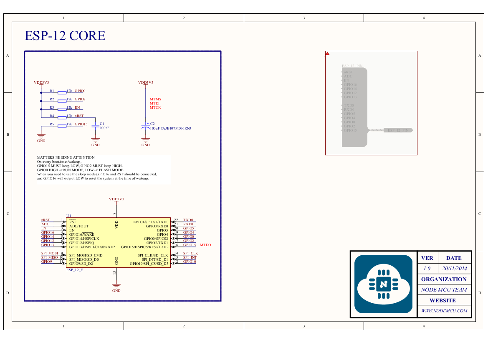
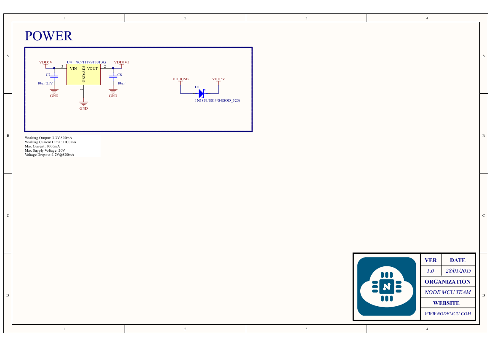
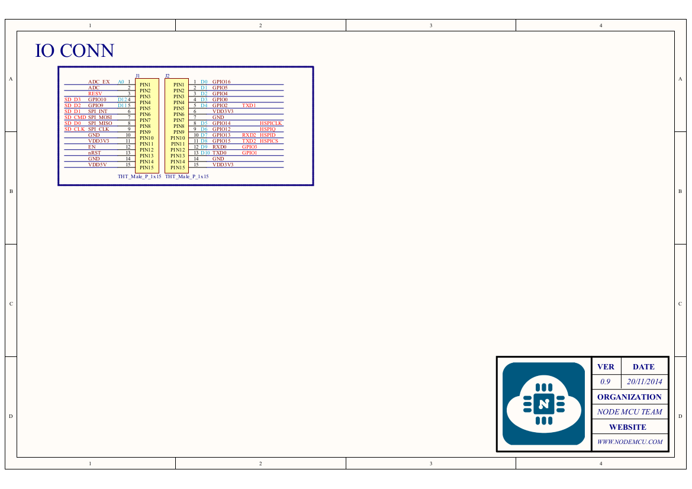
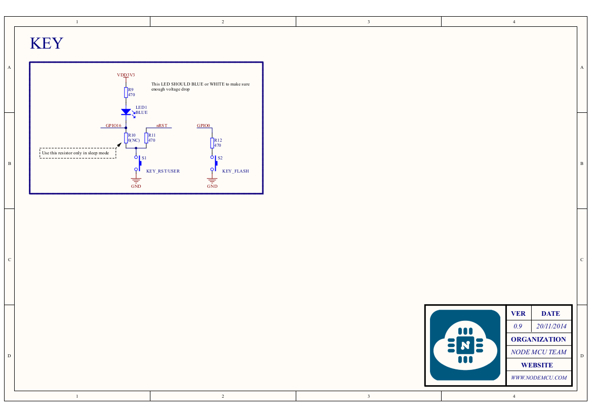
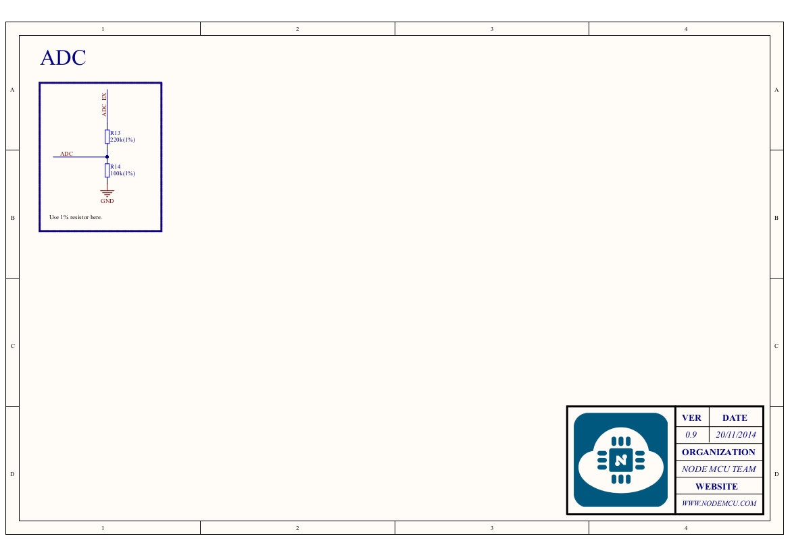

# ESP8266

ESP8266 es un System-on-Chip (SoC) con WiFi de [Espressif Systems](https://www.espressif.com).

## Especificaciones técnicas del SoC ESP8266

Especificaciones técnicas del microcontrolador obtenidas del datasheet. Este microcontrolador cuenta con un modulo WiFi integrado.

- Architecture: Xtensa lx106
- CPU frequency: 80MHz overclockable to 160MHz
- Total RAM available: 96KB (part of it reserved for system)
- BootROM: 64KB
- Internal FlashROM: None
- External FlashROM: code and data, via SPI Flash. Normal sizes 512KB-4MB.
- GPIO: 16 + 1 (GPIOs are multiplexed with other functions, including external FlashROM, UART, deep sleep wake-up, etc.)
- UART: One RX/TX UART (no hardware handshaking), one TX-only UART.
- SPI: 2 SPI interfaces (one used for FlashROM).
- I2C: No native external I2C (bitbang implementation available on any pins).
- I2S: 1.
- Programming: using BootROM bootloader from UART. Due to external FlashROM and always-available BootROM bootloader, ESP8266 is not brickable.

> [Obtenido de la documentación de Micropython](http://docs.micropython.org/en/latest/esp8266/general.html#technical-specifications-and-soc-datasheets)

## Pinout

Primero debemos conocer el *pinout* de nuestra tarjeta, existen alguna variantes de esta placa, pero en general son muy similares.


De base puede traer un LED que esta en el pin 2 (no siempre viene) y 2 botones, uno a cada costado de la entrada USB.

- `RST`: Reset, para reiniciar la placa o la comunicación con la computadora
- `FLASH`: Flasheo de la placa. Es para cargar el firmware, en ocasiones se necesita.


<figcaption>Pinout de la Tarjeta LoLin V3 con el CH340</figcaption>

## Variantes de tarjetas Node MCU

Hay varias versiones de esta placa, no vamos a entrar en detalles con todas solo las mas completas con respecto a componentes.


## Diagrama esquemático del Node MCU

Como ya se vio existen varias placas, sus variaciones son pocas en general, pero de base todos tiene el mismo microcontrolador ESP8266.


<figcaption>Este esquemático V0, viene del <a href="https://github.com/nodemcu/nodemcu-devkit">repositorio oficial</a> </figcaption>

La modificación siguiente con el drive CP2102







<figcaption>Este esquemático V1, viene del <a href="https://github.com/nodemcu/nodemcu-devkit-v1.0">repositorio oficial</a> </figcaption>

> [Ir al PDF completo](https://github.com/nodemcu/nodemcu-devkit-v1.0/blob/master/NODEMCU_DEVKIT_V1.0.PDF)

## Proceso Boot

Proceso de arranque, ejecuta un script llamado `_boot.py`. Este es montado en el sistema de archivos en la FlashROM, o si no esta disponible, crea un un modulo de arranque. 

Una vez montado el sistema de archivos, se ejecuta `boot.py`. Posteriormente de que se ejecuta el script de arranque, ejecuta `main.py`, si existe. 

El script `main.py` siempre que exista sera lo que comenzara a ejecutarse cada vez que se energice la placa. 

El código que se recomienda dentro del script `main.py` es el siguiente:

```python
import my_app
my_app.main()
```

*Esto permite tener una estructura en el código limpio, y también permite multiples aplicaciones en la tarjeta, e ir cambiando entre ellos.*

> [Obtenido de la documentación de Micropython](http://docs.micropython.org/en/latest/esp8266/general.html#boot-process)

