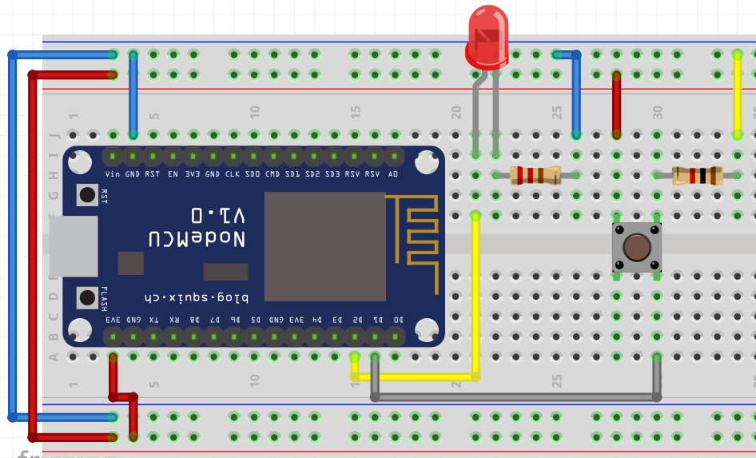

# Ejemplos control de entradas y salida digitales

## Control de salidas
   
!!! example "Encender de LED básico"
    - **Descripción:** Encender el led configurando un pin como salida D1
    - **Material:** 
        - 1 Led
        - 1 R330 
    - **Diagrama:** <br>
    - **Código:** 
        ```python
        
        import machine #Importo el modulo para manejo de pines

        pin = machine.Pin(5, machine.Pin.OUT) #configuro el pin D1 como salida

        pin.on() # Mando un 1 a la salida del pin 0
        ```

!!! example "Encender más LEDs"
    - **Descripción:** Control de más salidas y su configuración, activar D1 y D2
    - **Material:** 
        - 2 Led
        - 2 R330 
    - **Diagrama:** <br> 
    **Código:** 
        ```python
        
        import machine #Importo el modulo para manejo de pines

        pin1 = machine.Pin(5, machine.Pin.OUT) #configuro el pin D1 como salida
        pin2 = machine.Pin(4, machine.Pin.OUT) #configuro el pin D2 como salida
        
        pin1.value(1) # Mando un 1 a la salida del pin D1
        pin2.on() # Mando un 1 a la salida del pin D2
        ```

!!! example "Parpadear un led 3 veces"
    - **Descripción:** Se debe lograr que parpadee un led 3 veces, en un intervalo de tiempo de medio segundo
    - **Material:** 
        - 2 Led
        - 2 R330 
    - **Diagrama:** <br> 
    - **Código:** 
        ```python
        import machine #Importo el modulo para manejo de pines
        import time # importa el modulo para los retardos

        time_wait = 1 # declaro una variable que usare para los retardos
        pin1 = machine.Pin(5, machine.Pin.OUT, value=0) #configuro el pin 0 como salida y lo pongo en bajo

        time.sleep(time_wait) #espero un segundo
        pin1.value(1) # Mando un 1 a la salida del pin D1
        time.sleep(time_wait) #espero un segundo
        pin1.value(0) # Mando un 0 a la salida del pin D1
        time.sleep(time_wait) #espero un segundo
        pin1.value(1) # Mando un 1 a la salida del pin D1
        time.sleep(time_wait) #espero un segundo
        pin1.value(0) # Mando un 0 a la salida del pin D1
        time.sleep(time_wait) #espero un segundo
        pin1.on() # Mando un 1 a la salida del pin D1
        time.sleep(time_wait) #espero un segundo
        pin1.off()# Mando un 0 a la salida del pin D1
        time.sleep(time_wait) #espero un segundo
        ```
!!! example "Blink"
    - **Descripción:** Debe quedar parpadeando un Led por tiempo indefinido, el intervalo sera de 2 segundos.
    - **Material:** 
        - 1 Leds (rojo,verde y ámbar)
        - 1 R330 
    - **Diagrama:** <br> 
    - **Código:** 
        ```python
        import machine #Importo el modulo para manejo de pines
        import time # importa el modulo para los retardos

        time_wait = 2 # declaro una variable que usare para los retardos
        pin1 = machine.Pin(5, machine.Pin.OUT, value=0) #configuro el pin 0 como salida y lo pongo en bajo

        while True: #ciclo infinito
            
            pin1.value(1) # Mando un 1 a la salida del pin D1
            time.sleep(time_wait) #espero un segundo
            pin1.value(0) # Mando un 0 a la salida del pin D1
            time.sleep(time_wait) #espero un segundo
        ```


!!! example "Semáforo"
    - **Descripción:** Se debe lograr que parpadee un led 3 veces, en un intervalo de tiempo de medio segundo
    - **Material:** 
        - 3 Leds (rojo,verde y ambar)
        - 3 R330 
    - **Diagrama:** <br> 
    - **Código:** 
        ```python
        from machine import Pin #Importo el modulo para manejo de pines
        from time import sleep # importa el modulo para los retardos

        time_wait_long = 4 # declaro una variable que usare para los retardos de la luz mas largo
        time_wait_a = 2 # declaro una variable que usare para los retardos para el amarillo
        time_wait_blink = 0.5 # declaro una variable que usare para los retardos para el blink del verde
        led_rojo = machine.Pin(5, machine.Pin.OUT, value=0) #D1 configuro el pin 0 como salida y lo pongo en bajo
        led_ambar = machine.Pin(4, machine.Pin.OUT, value=0) #D2 configuro el pin 0 como salida y lo pongo en bajo
        led_verde = machine.Pin(0, machine.Pin.OUT, value=0) #D3 configuro el pin 0 como salida y lo pongo en bajo

        while True: #ciclo infinito
            
            led_rojo.on() # enciendo el led rojo
            led_ambar.off()  # apago el led ambar
            led_verde.off()  # apago el led verde
            sleep(time_wait_long) #espero un segundo
            
            led_rojo.off() # apago el led rojo
            led_ambar.on()  # enciendo el led ambar
            sleep(time_wait_a) #espero un segundo
            
            led_ambar.off()  # apago el led ambar
            led_verde.on()  # enciendo el led verde
            sleep(time_wait_a) #espero un segundo
            led_verde.off()  # apago el led verde
            
            # Hago el parpadeo de la luz verde
            sleep(time_wait_blink) # hago el primer parpadeo del verde
            led_verde.on()  # enciendo el led verde
            sleep(time_wait_blink) # hago el primer parpadeo del verde
            led_verde.off()  # apago el led verde
            sleep(time_wait_blink) # hago el primer parpadeo del verde
            led_verde.on()  # enciendo el led verde
            sleep(time_wait_blink) # hago el primer parpadeo del verde
            led_verde.off()  # apago el led verde
            sleep(time_wait_blink) # hago el primer parpadeo del verde
            led_verde.on()  # enciendo el led verde
            sleep(time_wait_blink) # hago el primer parpadeo del verde
        ```

## Leyendo entradas

!!! example "Leyendo entrada"
    - **Descripción:** Leer una entrada digital, encenderá el LED mientras se mantenga presionado el push button
    - **Material:** 
        - 1 Led
        - 3 R330 
        - 1 Push button
        - 1 R1k
    - **Diagrama:** <br> 
    - **Código:** 
        ```python
        from machine import Pin
        from time import sleep_ms # importo la función sleep_ms 

        boton = Pin(5, Pin.IN) # configuro D0 como entrada
        pin1 = Pin(4, Pin.OUT,value=0) #configuro D1 como salida

        while True: # ciclo infinito
                
            if boton.value() == 1: # leo el valor del botón, si es 1 entro al bloque de código
                pin1.on() #enciendo mi led
                sleep_ms(10) #doy un tiempo mínimo para no saturar al micro
                
            pin1.off() # apago el led 
        ```

!!! example "Leyendo entrada con blick led"
    - **Descripción:** Mientras se presione el botón los LEDs deben parpadear medio segundo
    - **Material:** 
        - 1 Led
        - 3 R330 
        - 1 Push button
        - 1 R1k
    - **Diagrama:** <br> 
    - **Código:** 
        ```python
        from machine import Pin
        from time import sleep_ms # importo la función sleep_ms 

        boton = Pin(5, Pin.IN) # configuro D0 como entrada
        pin1 = Pin(4, Pin.OUT,value=0) #configuro D1 como salida

        while True: # ciclo infinito
                
            if boton.value() == 1: # leo el valor del botón, si es 1 entro al bloque de código
                pin1.on() #enciendo el led
                sleep_ms(500) #doy un tiempo mínimo para no saturar al micro
                pin1.off() #apago el led
                sleep_ms(500) #doy un tiempo mínimo para no saturar al micro
                
            pin1.off() # apago el led 
        ```

!!! example "Leyendo 2 entradas y blink de 2 leds"
    - **Descripción:** Control de 2 leds, cada uno con su propio push button, mientras sea presionado el push button debe parpadear a 1/4 de segundo, encendido su respectivo LED; en caso que sean presionados ambos push button al mismo tiempo los leds van a parpadear juntos cada 200mS
    - **Material:** 
        - 2 Led
        - 2 R330 
        - 2 Push button
        - 2 R1k
    - **Diagrama:** <br> 
    - **Código:** 
        ```python
        from machine import Pin
        from time import sleep_ms # importo la función sleep_ms 

        pin1 = Pin(4, Pin.OUT, value=0) #configuro D1 como salida
        boton1 = Pin(5, Pin.IN) # configuro D2 como salida
        pin2 = Pin(0, Pin.OUT, value=0) #configuro D3 como salida y lo pongo en bajo
        boton2 = Pin(2, Pin.IN) # configuro D4 como entrada,
        #Nota: Si el pin 2 te da problemas, cambialo a otro pin

        while True: # ciclo infinito
            
            if boton1.value() == 1 and boton2.value() == 1:
                pin1.on() #enciendo el led
                pin2.on() #enciendo el led
                sleep_ms(200) #doy los 200mS
                pin1.off() #apago el led
                pin2.off() #apago el led
                sleep_ms(200) #doy los 200mS
            elif boton1.value() == 1: # leo el valor del botón 1, si es 1 entro al bloque de código
                pin1.on() #enciendo el led
                sleep_ms(250) #enciendo 1/4 de segundo
                pin1.off() #apago el led
                sleep_ms(250) #apago 1/4 de segundo
            elif boton2.value() == 1: # leo el valor del botón 1, si es 1 entro al bloque de código
                pin2.on() #enciendo el led
                sleep_ms(250) #enciendo 1/4 de segundo
                pin2.off() #apago el led
                sleep_ms(250) #apago 1/4 de segundo
            else:            
                pin1.off() # apago el led 1
                pin2.off() # apago el led 2
        ```

!!! example "Toggle"
    - **Descripción:** Al presionar el push button se debe encender el led y mantenerse en ese estado; hasta que se vuelva a presionar el led regresará a su estado anterior; es decir, que se apague
    - **Material:** 
        - 1 Led
        - 3 R330 
        - 1 Push button
        - 1 R1k
    - **Diagrama:** <br> 
    - **Código:** 
        ```python
        # Version de código V1, version fea y larga
        from machine import Pin
        from time import sleep_ms # importo la función sleep_ms 

        pin1 = Pin(4, Pin.OUT, value=0) #configuro D1 como salida
        boton1 = Pin(5, Pin.IN) # configuro D2 como salida

        status = 0

        while True: # ciclo infinito
            
            if boton1.value() and status == 0 : # leo el valor del botón 1, si es 1 entro al bloque de código
                sleep_ms(100) #le doy un tiempo para no saturar 
                pin1.on() #enciendo el led
                status = 1 # cambio el estado de mi variable, con ella se si fue o no presionado el boton
                
            if boton1.value and status == 1: # leo el valor del botón 1, si es 1 entro al bloque de código
                sleep_ms(100) #le doy un tiempo para no saturar 
                pin1.off() # apago el led
                status = 0 # cambio el estado de mi variable, con ella se si fue o no presionado el boton
        ```
        ---

        ```python
        # Version de código V2, version Hacker pro
        from machine import Pin
        from time import sleep_ms # importo la función sleep_ms 

        pin1 = Pin(4, Pin.OUT, value=0) #configuro D1 como salida
        boton1 = Pin(5, Pin.IN) # configuro D2 como entrada

        while True: # ciclo infinito
            
            if boton1.value(): # leo el valor del botón 1, si es 1 entro al bloque de código
                sleep_ms(200) #le doy un tiempo por el rebote del boton
                pin1.value( not pin1.value() ) #tomo el valor actual del pin e invierto su estado y lo asigno al pin, es decir,
                # si esta encendido, invierto ese valor, por ende; se apaga el led, y viceversa
        ```

## Display 7 segmentos

Display de 7 segmentos puede ser de ánodo o cátodo común; existen displays con mayores segmentos, hasta una matriz de puntos de diferentes resoluciones.


!!! example "Display de 7 segmentos"
    - **Descripción:** Creación de un contador básico con un display de 7 segmentos, el cual comenzará en **0** y terminará en **F**, haciendo un conteo hexadecimal, el intervalo de tiempo será de un segundo, una vez que termine se reinicia automáticamente, volviendo a comenzar el conteo.
    - **Material:** 
        - 1 Display 7 segmentos cátodo común
        - 7 R330 
    - **Diagrama:** <br> 
    - **Código:** 
        ```python
        from machine import Pin
        from time import sleep # importo la función sleep_ms 

        def display(A,B,C,D,E,F,G,time=1):
            # segmentos del display
            Pin(5, Pin.OUT, value=a) # segmento A - D1
            Pin(4, Pin.OUT, value=a) # segmento B - D2
            Pin(0, Pin.OUT, value=a) # segmento C - D3
            Pin(2, Pin.OUT, value=a) # segmento D - D4
            Pin(14, Pin.OUT, value=a) # segmento E - D5
            Pin(12, Pin.OUT, value=a) # segmento F - D6
            Pin(13, Pin.OUT, value=a) # segmento G - D7
            sleep(time) # tiempo entre cambio de numero
            
        while True:
            # creo el digito 0
            print('digito 0')
            display(1,1,1,1,1,1,0)
            print('digito 1')
            display(0,1,1,0,0,0,0)
            print('digito 2')
            display(1,1,0,1,1,0,1)
            print('digito 3')
            display(1,1,1,1,0,0,1)
            print('digito F')
            display(1,0,0,0,1,1,1)
        ```

!!! example "Mensaje con Display de 7-seg"
    - **Descripción:** Crear un mensaje que se vaya leyendo en el display de 7 segmentos que diga "HOLA", el intervalo de cada letra será de medio segundo; debe quedar de manera indefinida.
    - **Material:** 
        - 1 Display 7 segmentos cátodo común
        - 7 R330 
    - **Diagrama:** <br> 
    - **Código:** 
        ```python
        from machine import Pin
        from time import sleep # importo la función sleep_ms 

        def display(number_display=tuple(), time=1):
            # segmentos del display
            Pin(5, Pin.OUT, value=number_display[0]) # segmento A - D1
            Pin(4, Pin.OUT, value=number_display[1]) # segmento B - D2
            Pin(0, Pin.OUT, value=number_display[2]) # segmento C - D3
            Pin(2, Pin.OUT, value=number_display[3]) # segmento D - D4
            Pin(14, Pin.OUT, value=number_display[4]) # segmento E - D5
            Pin(12, Pin.OUT, value=number_display[5]) # segmento F - D6
            Pin(13, Pin.OUT, value=number_display[6]) # segmento G - D7
            sleep(time) # tiempo entre cambio de numero

        boton = Pin(16, Pin.IN)
        number = 0

        numbers = [
                (), # H
                (1,1,1,1,1,1,0), # O
                (), # L
                (), # A
            ]

        display(numbers[0]) # para mostrar el 0 desde el inicio
        print('digito ', number)

        while True:
            # creo el digito 0
            
            if boton.value():
                number += 1
                sleep(0.1)
                if number < len(numbers) :
                    print('digito ', number)
                    display(numbers[number])
                else:
                    number=0 # reinicio el contador para que comience mostrando el cero
                    display(numbers[number])
                    print('digito ', number)
        ```

!!! example "Display de 7 segmentos por botón"
    - **Descripción:** Creación de un contador básico con un display de 7 segmentos, el cual comenzará en 0 y terminará en F, el cambio se hará cada vez que sea presionado un push button
    - **Material:** 
        - 1 Display 7 segmentos cátodo común
        - 7 R330 
        - 1 Push button
        - 1 R1k
    - **Diagrama:** <br> 
    - **Código:** 
        ```python
        from machine import Pin
        from time import sleep # importo la función sleep_ms 

        def display(number_display=tuple(), time=1):
            # segmentos del display
            Pin(5, Pin.OUT, value=number_display[0]) # segmento A - D1
            Pin(4, Pin.OUT, value=number_display[1]) # segmento B - D2
            Pin(0, Pin.OUT, value=number_display[2]) # segmento C - D3
            Pin(2, Pin.OUT, value=number_display[3]) # segmento D - D4
            Pin(14, Pin.OUT, value=number_display[4]) # segmento E - D5
            Pin(12, Pin.OUT, value=number_display[5]) # segmento F - D6
            Pin(13, Pin.OUT, value=number_display[6]) # segmento G - D7
            sleep(time) # tiempo entre cambio de numero

        boton = Pin(16, Pin.IN)
        number = 0

        numbers = [
                (1,1,1,1,1,1,0), # 0
                (0,1,1,0,0,0,0), # 1
                (1,1,0,1,1,0,1), # 2
                (1,1,1,1,0,0,1), # 3
                (1,0,0,0,1,1,1)  # 4
            ]

        display(numbers[0]) # para mostrar el 0 desde el inicio
        print('digito ', number)

        while True:
            # creo el digito 0
            
            if boton.value():
                number += 1
                sleep(0.1)
                if number < len(numbers) :
                    print('digito ', number)
                    display(numbers[number])
                else:
                    number=0 # reinicio el contador para que comience mostrando el cero
                    display(numbers[number])
                    print('digito ', number)
        ```

## Control básico de Motores

En esta primera sección vamos realizar un control básico de un motor DC de 5V DC. Recuerda que la salida de señal del ESP8266 en alto es de `3.3V`, por lo tanto, se necesita una fuente adicional.
 
### Driver L293D (Controlador)

Puesto que los microcontroladores son elementos de control, no son capaces para alimentar cargas altas o cargas especiales (como inductivas), debemos utilizar algún elemento que nos ayude a realizar esta tarea. En este caso vamos a usar el Driver L293D por ser el mas común, no es el único (puedes usar el que quieras o necesites en función de tu carga).

Aquí coloco un esquemático de conexión obtenido del [datasheet](https://www.ti.com/lit/ds/slrs008c/slrs008c.pdf).


!!! example "Control ON/OFF para motor DC"
    - **Descripción:** Con un push boton debes encender el motor, y cuando se vuelva a pulsar el motor se debe apagar
    - **Material:** 
        - 1 Push button
        - 1 R1k
        - 1 Motor DC de 5V
        - 1 Puente H L293
        - 1 Fuente de 5V externa
        - 1 Diodo 1N4158 o 1N4001
    - **Diagrama:** <br> 
    - **Código:** 
        ```python
        from machine import Pin
        from time import sleep_ms # importo la función sleep_ms 

        motor = Pin(5, Pin.OUT, value=0) #configuro D1 como salida y el motor comienza apagado
        boton = Pin(4, Pin.IN) # configuro D2 como entrada

        while True: # ciclo infinito
            
            if boton.value(): # leo el valor del botón 1, si es 1 entro al bloque de código
                sleep_ms(200) #le doy un tiempo por el rebote del boton
                motor.value( not motor.value() ) #tomo el valor actual del pin e invierto su estado y lo asigno al pin, es decir,
                # si esta encendido, invierto ese valor, por ende; se apaga el led, y viceversa
        ```
!!! example "Control bidireccional motor DC"
    - **Descripción:** Realizar un control bidireccional de un motor DC, con un boton gira hacia un sentido, presionando el otro boton en sentido inverso. Mientras esta presionado debe funcionar, de lo contrario se mantiene apagado.
    - **Material:** 
        - 1 Push button
        - 1 R1k
        - 1 Motor DC de 5V
        - 1 Puente H L293
        - 1 Fuente de 5V externa
        - 4 Diodo 1N4158 o 1N4001
    - **Diagrama:** <br> 
    - **Código:** 
        ```python
        from machine import Pin
        from time import sleep_ms # importo la función sleep_ms 

        motor_derecha = Pin(5, Pin.OUT, value=0) #configuro D1 como salida y el motor comienza apagado
        motor_izquierda = Pin(4, Pin.OUT, value=0) #configuro D2 como salida y el motor comienza apagado
        boton_derecha = Pin(0, Pin.IN) # configuro D3 como entrada
        boton_izquierda = Pin(2, Pin.IN) # configuro D4 como entrada

        while True: # ciclo infinito
            
            if boton_derecha.value(): # leo el valor del botón para giro hacia la derecha, realiza el giro
                sleep_ms(200) #le doy un tiempo por el rebote del boton
                motor_derecha.on() 
                motor_izquierda.off()
            elif boton_izquierda.value(): # leo el valor del botón para giro hacia la izquierda, realiza el giro
                sleep_ms(200) #le doy un tiempo por el rebote del boton
                motor_derecha.off()
                motor_izquierda.on()
            else: # de lo contrario se queda apagado
                motor_izquierda.off()
                motor_derecha.off()
        ```
### Control básico de Motor PAP

#### Motores Paso a Pasa (PAP) Unipolar vs Bipolar

Existen 2 tipos de motores Paso a Paso, los cuales son muy similares, lo que los diferencia es la cantidad de bobinas y derivaciones. Su control es muy parecido, al final lo que se debe realizar es una conmutación al de las bobinas, con ello se configura su dirección y velocidad, esto consiste en hacer combinación de polos magnéticos en las bobinas del motor.


**Secuencia para controlar motores paso a paso Bipolares**

Un motor paso a paso bipolar necesita invertir la corriente que circula por sus bobinas en una secuencia determinada para provocar el movimiento del eje.

Paso|Bobina 1A|Bobina 1B|Bobina 2A|Bobina 2B
:-:|:-:|:-:|:-:|:-:
Paso 1 |1|0|1|0
Paso 2 |1|0|0|1
Paso 3 |0|1|0|1
Paso 4 |0|1|1|0

Secuencia para controlar motores paso a paso Unipolares

Hay tres secuencias para controlar los motores paso a paso unipolares

**Simple o wave drive**: Es una secuencia donde se activa una bobina a la vez. Esto hace que el motor tenga un paso más suave pero por el contrario tenga menos torque y menos retención.

Paso |Bobina A |Bobina B |Bobina C |Bobina D
:-:|:-:|:-:|:-:|:-:
Paso 1|1|0|0|0
Paso 2|0|1|0|0
Paso 3|0|0|1|0
Paso 4|0|0|0|1

**Normal**: Es la secuencia más usada y la que recomiendan los fabricantes. Con esta secuencia el motor avanza un paso por vez y siempre hay dos bobinas activadas. Con esto se obtiene un mayor torque y retención.

Paso|Bobina A|Bobina B|Bobina C|Bobina D
:-:|:-:|:-:|:-:|:-:
Paso 1|1|1|0|0
Paso 2|0|1|1|0
Paso 3|0|0|1|1
Paso 4|1|0|0|1

**Medio paso**: Se activan primero dos bobinas y después solo una y así sucesivamente. Esto provoca que el motor avance la mitad del paso real.  Esto se traduce en un giro más suave y preciso.

Paso|Bobina A|Bobina B|Bobina C|Bobina D
:-:|:-:|:-:|:-:|:-:
Paso 1|1|0|0|0
Paso 2|1|1|0|0
Paso 3|0|1|0|0
Paso 4|0|1|1|0
Paso 5|0|0|1|0
Paso 6|0|0|1|1
Paso 7|0|0|0|1
Paso 8|1|0|0|1

Documentación recomendada Articulo de Adafruit [Types of Steppers](https://learn.adafruit.com/all-about-stepper-motors/types-of-steppers)


!!! example "Motor PAP a medio paso"
    - **Descripción:** Hacer funcionar en un sentido el motor PAP en medio paso
    - **Material:** 
        - 1 Motor PAP
        - 1 Driver ULN2003
        - Fuente externa
    - **Diagrama:** <br>
    - **Código:** 
        ```python
        ```

!!! example "Motor PAP a paso completo"
    - **Descripción:** Hacer funcionar en un sentido el motor PAP en medio paso
    - **Material:** 
        - 1 Motor PAP
        - 1 Driver ULN2003
        - Fuente externa
    - **Diagrama:** <br>
    - **Código:** 
        ```python
        ```
!!! example "Motor PAP medio y paso completo"
    - **Descripción:** Cuando se presione un boton el motor debe girar en un sentido a medio paso, y cuando se suelte debe detenerse, en caso que presione el otro boton debe girar a paso completo y cuando se deje de presionar que se detenga, en caso que se presionen ambos botones, no debe girar en ningún sentido.
    - **Material:** 
        - 1 Motor PAP
        - 1 Driver ULN2003
        - 2 Push button
        - 2 R1k
        - Fuente externa
    - **Diagrama:** <br>
    - **Código:** 
        ```python
        ```
!!! example "Invertir Motor PAP"
    - **Descripción:** Cuando se presione un boton el motor debe girar hacia un sentido, y cuando se suelte debe detenerse, en caso que presione el otro boton debe girar en sentido contrario y cuando se deje de presionar que se detenga, en caso que se presionen ambos botones, no debe girar en ningún sentido.
    - **Material:** 
        - 1 Motor PAP
        - 1 Driver ULN2003
        - 2 Push button
        - 2 R1k
        - Fuente externa
    - **Diagrama:** <br>
    - **Código:** 
        ```python
        ```

## Control de cargas AC

!!! example "Módulo de Relay"
    - **Descripción:** Encender el modulo del Relay
    - **Material:** 
        - 1 Módulo de Relay
    - **Diagrama:** <br>
    - **Código:** 
        ```python
        from machine import Pin#Importo el modulo para manejo de pines

        relay = Pin(5, Pin.OUT) #configuro el pin D1 como salida

        relay.on() # Mando un 1 a la salida del pin 0
        ```

!!! example "Módulo de Relay con boton"
    - **Descripción:** Encender el modulo del Relay
    - **Material:** 
        - 1 Módulo de Relay
        - 1 R1k
        - 1 Push button
    - **Diagrama:** <br>
    - **Código:** 
        ```python
        from machine import Pin
        from time import sleep_ms # importo la función sleep_ms 

        relay = Pin(5, Pin.OUT,value=0) #configuro D1 como salida
        boton = Pin(0, Pin.IN) # configuro D0 como entrada

        while True: # ciclo infinito
                
            if boton.value(): # leo el valor del botón, si es 1 entro al bloque de código
                sleep_ms(250) #doy un tiempo mínimo para no saturar al micro
                relay.value( not relay.value() ) #enciendo el led
        ```