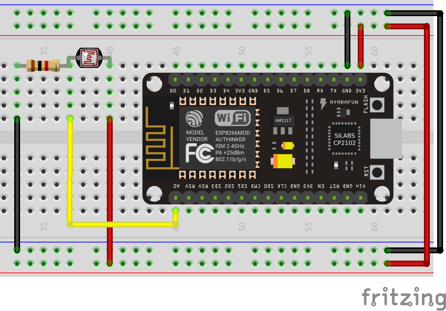

# Ejercicios con ADC

En esta sección estaremos utilizando el ADC del microcontrolador.

## Ejemplos control de entradas analógicas

!!! example "Ver el valor del ADC por la terminal"
    - **Descripción:** Encender el led configurando un pin como salida D1
    - **Material:** 
        - 1 Potenciómetro
    - **Diagrama:** <br>
    - **Código:** 
        ```python
        import machine # importo el modulo para control y configuración de pines
        from time import sleep, sleep_ms

        adc = machine.ADC(0) # configuro el GPIO0 como ADC o entrada analógica
        sleep(1) # esperamos un tiempo de estabilización

        while True:
            valor = adc.read() # esta función nos retorna el valor que existe en la entrada
            
            print(valor) # mando a la terminal el valor del ADC
            sleep_ms(250) # espero un segundo
        ```

!!! example "Voltímetro"
    - **Descripción:** Se desea tener un voltimetro con el ADC, y que la información la mande a la terminal.
    - **Material:** 
        - 1 Potenciómetro
    - **Diagrama:** <br>
    - **Código:** 
        ```python
        # voltimetro
        from machine import ADC # importo el modulo para control y configuración de pines
        from time import sleep, sleep_ms

        adc = ADC(0) # configuro el GPIO0 como ADC o entrada analógica
        sleep(1) # esperamos un tiempo de estabilización

        while True:
            voltaje = adc.read() # esta función nos retorna el valor que existe en la entrada
            
            valor = (voltaje/1024) * 3
            
            print(valor) # mando a la terminal el valor del ADC
            sleep_ms(250) # espero un segundo
        ```

!!! example "Sensor de luz en la terminal"
    - **Descripción:** Mandar el valor que esta recibiendo el sensor de Luz a la terminal
    - **Material:** 
        - 1 LDR
        - 1 R10k
    - **Diagrama:** <br>
    - **Código:** 
        ```python
        import machine # importo el modulo para control y configuración de pines
        from time import sleep, sleep_ms

        sensor_luz = machine.ADC(0) # configuro el GPIO0 como ADC o entrada analógica
        sleep(1) # esperamos un tiempo de estabilización

        while True:
            luz = sensor_luz.read() # esta función nos retorna el valor que existe en la entrada
            
            print(luz) # mando a la terminal el valor del ADC
            sleep_ms(250) # espero un segundo
        ```

!!! example "Encendido secuencial de luces"
    - **Descripción:** Utilizar el potenciómetro para ir enciendo 5 leds, es decir, cuando el potenciómetro este al 0% todos deben estar apagados, con forme vaya subiendo el valor deberán ir encendiendo los leds, hasta que llegue aproximadamente al 100% y deben quedar todos los leds encendidos, dividir todo el rango del ADC y hacerlo proporcional para los 5 leds.
    - **Material:** 
        - 1 Potenciómetro
        - 5 leds
        - 5 R330
    - **Diagrama:** <br>
    - **Código:** 
        ```python
        # Secuencia de luces

        from machine import ADC, Pin # importo el modulo para control y configuración de pines
        from time import sleep

        adc = ADC(0) # configuro el GPIO0 como ADC o entrada analógica
        led_0 = Pin(16,Pin.OUT,value=0)
        led_1 = Pin(5,Pin.OUT,value=0)
        led_2 = Pin(4,Pin.OUT,value=0)
        led_3 = Pin(0,Pin.OUT,value=0)
        led_4 = Pin(2,Pin.OUT,value=0)

        while True:
            valor = adc.read() # esta función nos retorna el valor que existe en la entrada
            
            if valor < 100:
                led_0.off()
                led_1.off()
                led_2.off()
                led_3.off()
                led_4.off()
            elif valor > 100 and valor <= 300:
                led_0.on()
                led_1.off()
                led_2.off()
                led_3.off()
                led_4.off()
            elif valor > 300 and valor <= 500:
                led_0.on()
                led_1.on()
                led_2.off()
                led_3.off()
                led_4.off()
                
            elif valor > 500 and valor <= 700:
                led_0.on()
                led_1.on()
                led_2.on()
                led_3.off()
                led_4.off()
                
            elif valor > 700 and valor < 950:
                led_0.on()
                led_1.on()
                led_2.on()
                led_3.on()
                led_4.off()
            else:        
                led_0.on()
                led_1.on()
                led_2.on()
                led_3.on()
                led_4.on()
                
            sleep(0.25) # espero un segundo
        ```

---

[Ver ejemplos con pyFirmata](https://www.alejandro-leyva.com/micro-21/web/32_salidas_digitales.html)