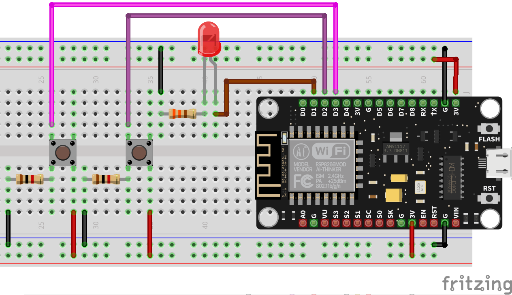
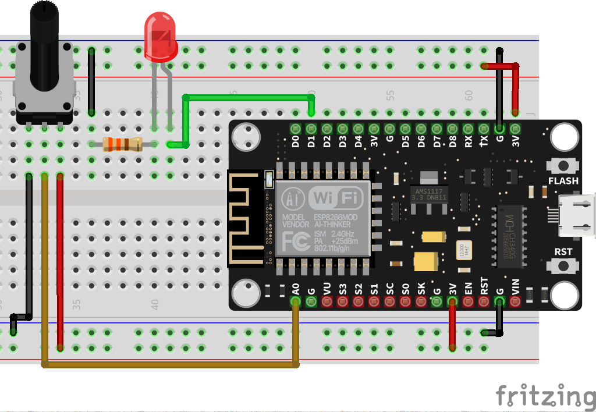
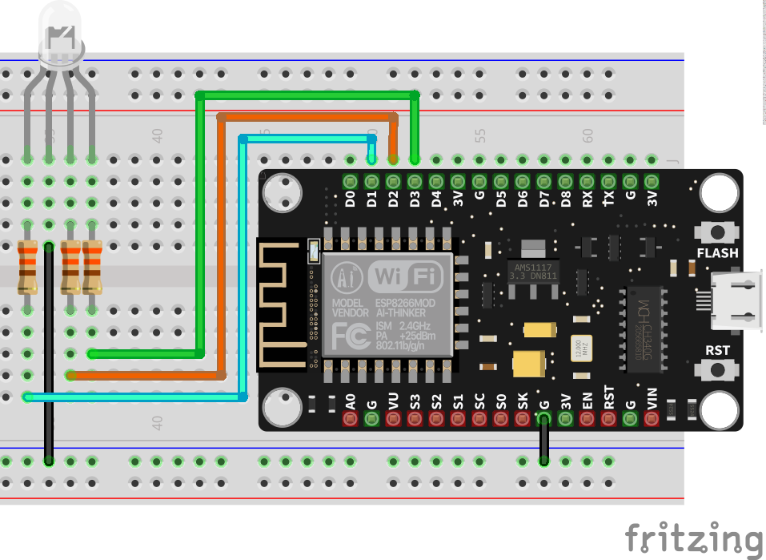
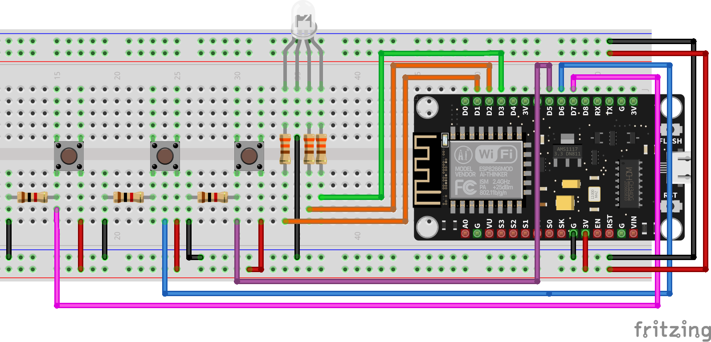
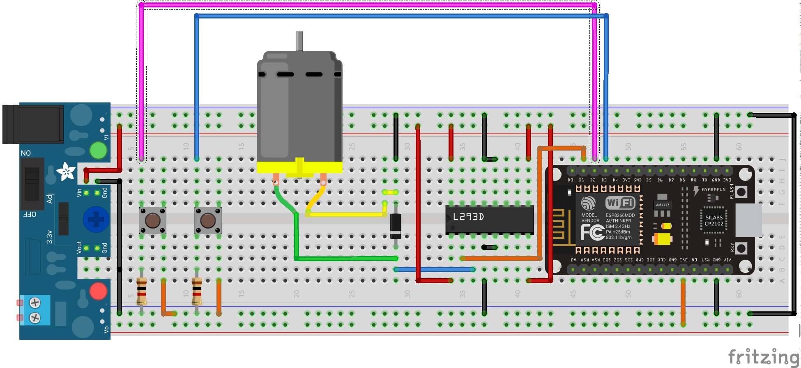
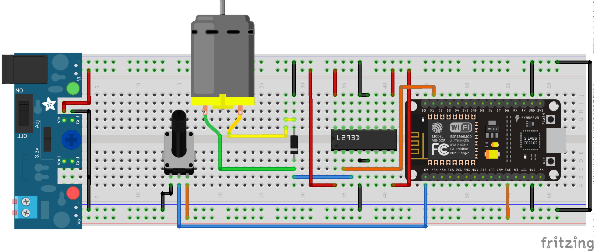
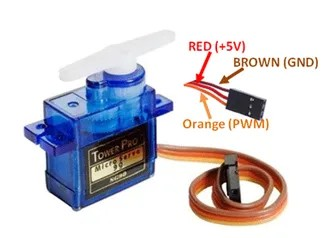
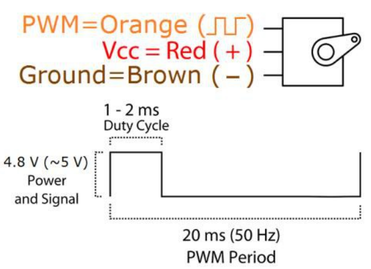
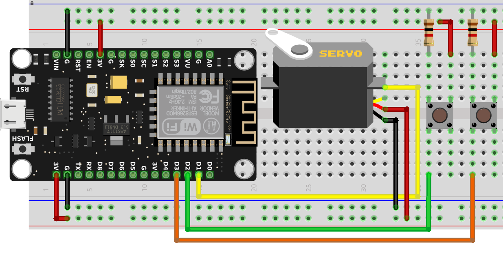
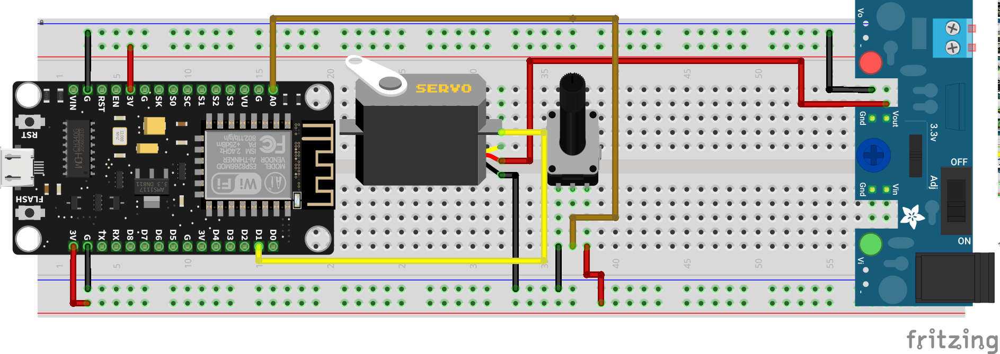

# Ejercicios con PWM

El servomotor se mueve con base a una señal PWM, pero la librería nos ahorra el trabajo para generar el desplazamiento.

## Control básico

!!! example "Cambiando el brillo de un LED automáticamente"
    - **Descripción:** Vamos a controlar la intensidad de un LED con una salida PWM
    - **Material:** 
        - 1 R330
        - 1 Led
    - **Diagrama:** <br>
    - **Código:** 
        ```python
        from machine import Pin, PWM # importo el modulo para PWM y configuración de pines
        from time import sleep

        pin = Pin(5) #Creo el pin 
        led = PWM(pin) # configuro el pin como salida PWM
        
        while True:
            for i in range(0,1024,10):
                led.duty(i) # cargo el valor de 0 a 1023
                print(i) # mando a la terminal el valor
                sleep(0.5) # espero medio segundo
        ```

!!! example "Cambiando el brillo de un LED con botones"
    - **Descripción:** Vamos a controlar el intensidad de un LED con 2 botones, uno que incremente y con otro que decremente la intensidad
    - **Material:** 
        - 1 R330
        - 1 Led
        - 2 Push button
        - 2 R1k
    - **Diagrama:** <br>
    - **Código:** 
        ```python
        from machine import Pin, PWM # importo el modulo para PWM y configuración de pines
        from time import sleep_ms

        pin = Pin(5) #Creo el pin 
        led = PWM(pin) # configuro el pin como salida PWM

        btn_up = Pin(4,Pin.IN)
        btn_down = Pin(0,Pin.IN)

        value = 0
        led.duty(value) #para comenzar apagados desde el principio

        while True:
            
            if btn_up.value() and value <= 1024:
                value += 8
                led.duty(value) # cargo el valor para incrementar el brillo
                print("incrementa", value)
                sleep_ms(250)
                
            if btn_down.value() and value >0:
                value -= 8
                led.duty(value) # cargo el valor para decrementar el brillo
                print("decrementa", value)
                sleep_ms(250)
        ```

!!! example "Cambiando el brillo de un LED con Potenciómetro"
    - **Descripción:** Vamos a controlar el intensidad de un LED con potenciómetro la variar su intensidad.
    - **Material:** 
        - 1 Potenciómetro
        - 1 R330
        - 1 Led
    - **Diagrama:** <br>
    - **Código:** 
        ```python
        from machine import Pin, PWM, ADC# importo el modulo para PWM, ADC y configuración de pines
        from time import sleep_ms

        adc = ADC(0) # configuro el GPIO0 como ADC o entrada analógica

        pin = Pin(5) #Creo el pin 
        led = PWM(pin) # configuro el pin como salida PWM

        value = 0
        led.duty(value) #para comenzar apagados desde el principio

        while True:
            
            value = adc.read()
                
            if value < 1024 and value > 0:
                led.duty(value) # cargo el valor para incrementar el brillo
                print("valor", value)
                sleep_ms(100)
        ```

## LED RGB

Para conocer mas detalles de los Leds RGB [ir a esta documentación](https://www.alejandro-leyva.com/analogica/capitulo2/06_leds_propocito_especial/#led-rgb).

!!! example "Viendo los 16 millones de colores automáticamente"
    - **Descripción:** Realizar un barrido de los colores con un led RGB. 
    - **Material:** 
        - 1 R330
        - 1 Led RGB (cátodo común)
    - **Diagrama:** <br>
    - **Código:** 
        ```python
        from machine import Pin, PWM # importo el modulo para PWM y configuración de pines
        from time import sleep_ms

        led_r = Pin(5) #Creo el pin 
        led_g = Pin(4) #Creo el pin 
        led_b = Pin(0) #Creo el pin 
        red = PWM(led_r) # configuro el pin como salida PWM
        green = PWM(led_g) # configuro el pin como salida PWM
        blue = PWM(led_b) # configuro el pin como salida PWM

        while True:
            for r in range(0,1025,8):
                red.duty(r) # cargo el valor de 0 a 1023
                for g in range(0,1025,8):
                    green.duty(g) # cargo el valor de 0 a 1023
                    for b in range(0,1025,8):
                        print(r,b,g)
                        blue.duty(b) # cargo el valor de 0 a 1023
                        sleep_ms(10) # espero medio segundo
        ```

!!! example "Viendo los 16 millones de colores"
    - **Descripción:** Realizar un barrido de los colores con un led RGB, utilizando un botón para color, al ser presionado debe incrementar el valor de salida y cuando llegue al limite que vuelva a cero, reiniciando el conteo. 
    - **Material:** 
        - 1 R330
        - 1 Led RGB (cátodo común)
        - 1 push button
        - 1 R1k
    - **Diagrama:** <br>
    - **Código:** 
        ```python
        from machine import Pin, PWM # importo el modulo para PWM y configuración de pines
        from time import sleep_ms

        led_r = Pin(5) #Creo el pin 
        led_g = Pin(4) #Creo el pin 
        led_b = Pin(0) #Creo el pin 
        red = PWM(led_r) # configuro el pin como salida PWM
        green = PWM(led_g) # configuro el pin como salida PWM
        blue = PWM(led_b) # configuro el pin como salida PWM

        btn_r = Pin(14, Pin.IN)
        btn_g = Pin(12, Pin.IN)
        btn_b = Pin(13, Pin.IN)

        value_r = 0
        value_g = 0
        value_b = 0

        while True:
            
            if btn_r.value():
                if value_r >= 1024:
                    value_r = 0
                    red.duty(value_r)
                    
                elif value_r < 1025:
                    value_r += 8
                    red.duty(value_r) # cargo el valor de 0 a 1023
                
            
            if btn_g.value() :
                if value_g >= 1024:
                    value_g = 0
                    green.duty(value_g)
                elif value_g < 1025:
                    value_g += 8
                    green.duty(value_g) # cargo el valor de 0 a 1023
                    
            if btn_b.value():
                if value_b >= 1024:
                    value_b = 0
                    blue.duty(value_b)
                elif value_b < 1025:
                    value_b += 8
                    blue.duty(value_b) # cargo el valor de 0 a 1023
                
            
            print(value_r,value_b,value_g)
            sleep_ms(250) # espero medio segundo
        ```
## Control de velocidad de Motor DC

!!! example "Regulador de velocidad motor DC con botones"
    - **Descripción:** Regulador de velocidad motor DC con botones, es decir, con un botón incrementamos y con otro decrementamos su velocidad.
    - **Material:** 
        - 2 Push button
        - 2 R1k
        - 1 Motor DC
        - 1 Puente H L293D
        - Fuente externa
    - **Diagrama:** <br>
    - **Código:** 
        ```python
        from machine import Pin, PWM # importo el modulo para PWM y configuración de pines
        from time import sleep
        ```

!!! example "Regulador de velocidad motor DC con Potenciómetro"
    - **Descripción:** Vamos a controlar la velocidad de un motor con un potenciómetro. Es decir, al 0% del potenciómetro equivale al 0% de velocidad y el máximo del ADC corresponde a la maxima velocidad del motor.
    - **Material:** 
        - 1 Potenciómetro
        - 1 Motor DC
        - 1 Puente H L293D
        - Fuente externa
    - **Diagrama:** <br>
    - **Código:** 
        ```python
        from machine import Pin, ADC, PWM # importo el modulo para PWM y configuración de pines
        from time import sleep
        ```

## Servomotor

El servomotor que utilizaremos el SG-90, es un servomotor básico.



Este motor necesita la siguiente señal para poder generar su desplazamiento:



!!! Warning "Atención"
    Un servomotor solo se puede desplazar desde 0° hasta 180°. Por default siempre esta en 90°. Pero, comúnmente se considera 0°, dado que gira hasta 90° y -90°.

!!! example "Giro del Servomotor automáticamente"
    - **Descripción:** Realizar un barrido del servo de manera indefinida
    - **Material:** 
        - 1 Servomotor
    - **Diagrama:** <br>
    - **Código:** 
        ```python
        from machine import Pin, PWM # importo el modulo para PWM y configuración de pines
        from time import sleep

        pin_servo = Pin(5)
        servo = PWM(pin_servo, freq=50) # configuro el pin como salida PWM

        while True:
            for i in range(50,101):
                for d in range(1000):
                    servo.duty(i)
        ```

!!! example "Giro del Servomotor automáticamente por posiciones"
    - **Descripción:** Controlar un Servomotor, se debe colocar en diversos ángulos y repetir de manera indefinida. Los ángulos a los que se desplazar son 0°,30°,60°,90°,120°,160°,180° y volver al inicio.
    - **Material:** 
        - 1 Servomotor
    - **Diagrama:** <br>
    - **Código:** 
        ```python
        from machine import Pin, PWM # importo el modulo para PWM y configuración de pines
        from time import sleep


        def servo_position(angule): # función para convertir el angulo al valor correspondiente de PWM
            return int(((angule * 5)/18) + 50)
            

        pin_servo = Pin(5)
        servo = PWM(pin_servo, freq=50) # configuro el pin como salida PWM

        while True:
            
            for angulo in ( 0,30,60,90,120,160,180):
                for t in range(800):
                    print("angulo", angulo)
                    servo.duty(servo_position(angulo))
        ```

!!! example "Giro del Servomotor con botones"
    - **Descripción:** Cambiar el angulo de un servomotor con botones, es decir, con uno incrementa su angulo y con el segundo la decrementar.
    - **Material:** 
        - 1 Servomotor
        - 2 Push button
        - 2 R1k
    - **Diagrama:** <br>
    - **Código:** 
        ```python
        ```

!!! example "Giro del Servomotor con potenciómetro"
    - **Descripción:** Hacer girar un servomotor en función de la posición de un potenciómetro. Es decir, si esta en 0 el potenciómetro, sera 0°; en 0.5 sera 90° y al 100% serán 180°.
    - **Material:** 
        - 1 Potenciómetro
        - 1 Servomotor
    - **Diagrama:** <br>
    - **Código:** 
        ```python
        ```

