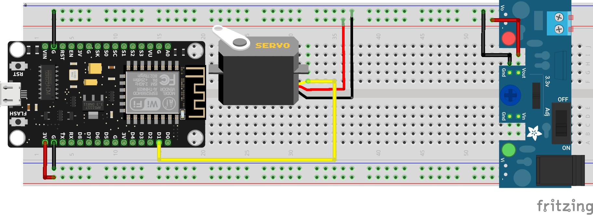
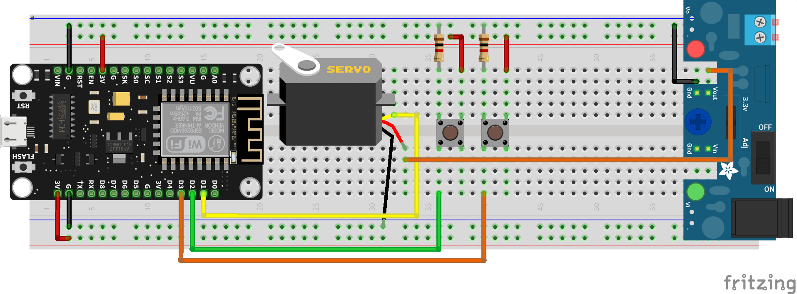

# Ejercicios con PWM

El servomotor se mueve con base a una señal PWM, pero la librería nos ahorra el trabajo para generar el desplazamiento.

## Control básico

!!! example "Cambiando el brillo de un LED automáticamente"
    - **Descripción:** Vamos a controlar la intensidad de un LED con una salida PWM
    - **Material:** 
        - 1 R330
        - 1 Led
    - **Diagrama:** <br>
    - **Código:** 
        ```python
        from machine import Pin, PWM # importo el modulo para PWM y configuración de pines
        from time import sleep

        pin = Pin(5) #Creo el pin 
        led = PWM(pin) # configuro el pin como salida PWM
        
        while True:
            for i in range(0,1024,10):
                led.duty(i) # cargo el valor de 0 a 1023
                print(i) # mando a la terminal el valor
                sleep(0.5) # espero medio segundo
        ```

!!! example "Cambiando el brillo de un LED con botones"
    - **Descripción:** Vamos a controlar el intensidad de un LED con 2 botones, uno que incremente y con otro que decremente la intensidad
    - **Material:** 
        - 1 R330
        - 1 Led
        - 2 Push button
        - 2 R1k
    - **Diagrama:** <br>
    - **Código:** 
        ```python
        from machine import Pin, PWM # importo el modulo para PWM y configuración de pines
        from time import sleep_ms

        pin = Pin(5) #Creo el pin 
        led = PWM(pin) # configuro el pin como salida PWM

        btn_up = Pin(4,Pin.IN)
        btn_down = Pin(0,Pin.IN)

        value = 0
        led.duty(value) #para comenzar apagados desde el principio

        while True:
            
            if btn_up.value() and value <= 1024:
                value += 8
                led.duty(value) # cargo el valor para incrementar el brillo
                print("incrementa", value)
                sleep_ms(250)
                
            if btn_down.value() and value >0:
                value -= 8
                led.duty(value) # cargo el valor para decrementar el brillo
                print("decrementa", value)
                sleep_ms(250)
        ```

!!! example "Cambiando el brillo de un LED con Potenciómetro"
    - **Descripción:** Vamos a controlar el intensidad de un LED con potenciómetro la variar su intensidad.
    - **Material:** 
        - 1 Potenciómetro
        - 1 R330
        - 1 Led
    - **Diagrama:** <br>
    - **Código:** 
        ```python
        from machine import Pin, PWM, ADC# importo el modulo para PWM, ADC y configuración de pines
        from time import sleep_ms

        adc = ADC(0) # configuro el GPIO0 como ADC o entrada analógica

        pin = Pin(5) #Creo el pin 
        led = PWM(pin) # configuro el pin como salida PWM

        value = 0
        led.duty(value) #para comenzar apagados desde el principio

        while True:
            
            value = adc.read()
                
            if value < 1024 and value > 0:
                led.duty(value) # cargo el valor para incrementar el brillo
                print("valor", value)
                sleep_ms(100)
        ```

## LED RGB

Para conocer mas detalles de los Leds RGB [ir a esta documentación](https://www.alejandro-leyva.com/analogica/capitulo2/06_leds_propocito_especial/#led-rgb).

!!! example "Viendo los 16 millones de colores automáticamente"
    - **Descripción:** Realizar un barrido de los colores con un led RGB. 
    - **Material:** 
        - 1 R330
        - 1 Led RGB (cátodo común)
    - **Diagrama:** <br>
    - **Código:** 
        ```python
        from machine import Pin, PWM # importo el modulo para PWM y configuración de pines
        from time import sleep_ms

        led_r = Pin(5) #Creo el pin 
        led_g = Pin(4) #Creo el pin 
        led_b = Pin(0) #Creo el pin 
        red = PWM(led_r) # configuro el pin como salida PWM
        green = PWM(led_g) # configuro el pin como salida PWM
        blue = PWM(led_b) # configuro el pin como salida PWM

        while True:
            for r in range(0,1025,8):
                red.duty(r) # cargo el valor de 0 a 1023
                for g in range(0,1025,8):
                    green.duty(g) # cargo el valor de 0 a 1023
                    for b in range(0,1025,8):
                        print(r,b,g)
                        blue.duty(b) # cargo el valor de 0 a 1023
                        sleep_ms(10) # espero medio segundo
        ```

!!! example "Viendo los 16 millones de colores"
    - **Descripción:** Realizar un barrido de los colores con un led RGB, utilizando un botón para color, al ser presionado debe incrementar el valor de salida y cuando llegue al limite que vuelva a cero, reiniciando el conteo. 
    - **Material:** 
        - 1 R330
        - 1 Led RGB (cátodo común)
        - 1 push button
        - 1 R1k
    - **Diagrama:** <br>
    - **Código:** 
        ```python
        from machine import Pin, PWM # importo el modulo para PWM y configuración de pines
        from time import sleep_ms

        led_r = Pin(5) #Creo el pin 
        led_g = Pin(4) #Creo el pin 
        led_b = Pin(0) #Creo el pin 
        red = PWM(led_r) # configuro el pin como salida PWM
        green = PWM(led_g) # configuro el pin como salida PWM
        blue = PWM(led_b) # configuro el pin como salida PWM

        btn_r = Pin(14, Pin.IN)
        btn_g = Pin(12, Pin.IN)
        btn_b = Pin(13, Pin.IN)

        value_r = 0
        value_g = 0
        value_b = 0

        while True:
            
            if btn_r.value():
                if value_r >= 1024:
                    value_r = 0
                    red.duty(value_r)
                    
                elif value_r < 1025:
                    value_r += 8
                    red.duty(value_r) # cargo el valor de 0 a 1023
                
            
            if btn_g.value() :
                if value_g >= 1024:
                    value_g = 0
                    green.duty(value_g)
                elif value_g < 1025:
                    value_g += 8
                    green.duty(value_g) # cargo el valor de 0 a 1023
                    
            if btn_b.value():
                if value_b >= 1024:
                    value_b = 0
                    blue.duty(value_b)
                elif value_b < 1025:
                    value_b += 8
                    blue.duty(value_b) # cargo el valor de 0 a 1023
                
            
            print(value_r,value_b,value_g)
            sleep_ms(250) # espero medio segundo
        ```
## Control de velocidad de Motor DC

!!! example "Regulador de velocidad motor DC con botones"
    - **Descripción:** Regulador de velocidad motor DC con botones, es decir, con un botón incrementamos y con otro decrementamos su velocidad.
    - **Material:** 
        - 2 Push button
        - 2 R1k
        - 1 Motor DC
        - 1 Puente H L293D
        - Fuente externa
    - **Diagrama:** <br>
    - **Código:** 
        ```python
        from machine import Pin, PWM # importo el modulo para PWM y configuración de pines
        from time import sleep_ms

        btn_down = Pin(4,Pin.IN)
        btn_up = Pin(0,Pin.IN)

        motor = PWM(Pin(5)) # configuro el pin como salida PWM

        value_minimum = 0 # es una referencia, porque para arrancar el motor es un valor mas alto, hacer el ajuste necesario
        value = value_minimum
        motor.duty(value) # apago el motor

        constant = 10 # es una referencia para que vaya incrementando de 10 en 10, se puede cambiar a gusto

        while True:
            
            if btn_down.value() and value > value_minimum:
                value -= constant

            if btn_up.value() and value < 1024:
                value += constant
            
            motor.duty(value) #asigno el valor de pwm 
            print(value)
            sleep_ms(150) # espero por el rebote del botón
        ```

!!! example "Regulador de velocidad motor DC con Potenciómetro"
    - **Descripción:** Vamos a controlar la velocidad de un motor con un potenciómetro. Es decir, al 0% del potenciómetro equivale al 0% de velocidad y el máximo del ADC corresponde a la maxima velocidad del motor.
    - **Material:** 
        - 1 Potenciómetro
        - 1 Motor DC
        - 1 Puente H L293D
        - Fuente externa
    - **Diagrama:** <br>
    - **Código:** 
        ```python
            from machine import Pin, ADC, PWM  # importo el modulo para PWM y configuración de pines
            from time import sleep_ms

            motor = PWM(Pin(5))  # configuro el pin como salida PWM
            adc = ADC(0)

            value = adc.read()

            while True:
                value = adc.read()
                servo.duty(value)
                sleep_ms(100)
        ```

## Servomotor

El servomotor que utilizaremos el SG-90, es un servomotor básico.


Este motor necesita la siguiente señal para poder generar su desplazamiento:


!!! Warning "Atención"
    Un servomotor solo se puede desplazar desde 0° hasta 180°. Por default siempre esta en 90°. Pero, comúnmente se considera 0°, dado que gira hasta 90° y -90°.

!!! Warning "Fuente adicional de 5V"
    Para hacer funcionar el servomotor se debe **implementar una fuente adicional de 5V**, ya que la propia placa NodeMCU no puede dar la suficiente corriente al motor y su sistema para funcionar adecuadamente.

!!! Note Nota
    El dato mínimo que equivale a 0 grados es 25 en el valor de PWM, y para los 180 grados o máximo es de 127. Estos valores los obtuve haciendo experimentos y pruebas con estos elementos.
    |Angulo| PWM
    |:-:|:-:|
    | 0 grados |25 |
    | 90 grados |76 |
    | 180 grados | 127 |

!!! example "Giro del Servomotor automáticamente"
    - **Descripción:** Realizar un barrido del servo de manera indefinida, yendo de 0 a 180 y viceversa
    - **Material:** 
        - 1 Servomotor
        - 1 Fuente de carga
    - **Diagrama:** <br>
    - **Código:** 
        ```python
        from machine import Pin, PWM # importo el modulo para PWM y configuración de pines
        from time import sleep_ms

        servo = PWM(Pin(5), freq=50) # configuro el pin como salida PWM

        while True:
            
            # de 0 a 180
            for value in range(25,129):
                servo.duty(value)
                print(value)
                sleep_ms(100)
                
            # de 180 a 0
            for value in range(128,24,-1):
                servo.duty(value)
                print(value)
                sleep_ms(100)        
        ```

!!! example "Giro del Servomotor automáticamente por posiciones"
    - **Descripción:** Controlar un Servomotor, se debe colocar en diversos ángulos y repetir de manera indefinida. Los ángulos a los que se desplazar son 0°,30°,60°,90°,120°,160°,180° y volver al inicio.
    - **Material:** 
        - 1 Servomotor
        - 1 Fuente de carga
    - **Diagrama:** <br>
    - **Código:** 
        ```python
        from machine import Pin, PWM # importo el modulo para PWM y configuración de pines
        from time import sleep

        def servo_position(angule): # función para convertir el angulo al valor correspondiente de PWM
            return int(((angule * 102)/ 180) + 25)

        pin_servo = Pin(5)
        servo = PWM(pin_servo, freq=50) # configuro el pin como salida PWM

        while True:    
            for angulo in 0,30,60,90,120,160,180:
                servo.duty(servo_position(angulo))
                print("angulo", angulo)
                sleep(1)
        ```

!!! example "Giro del Servomotor con botones"
    - **Descripción:** Cambiar el angulo de un servomotor con botones, es decir, con uno incrementa su angulo y con el segundo la decrementar.
    - **Material:** 
        - 1 Servomotor
        - 1 Fuente de carga
        - 2 Push button
        - 2 R1k
    - **Diagrama:** <br>
    - **Código:** 
        ```python
        from machine import Pin, PWM # importo el modulo para PWM y configuración de pines
        from time import sleep_ms

        btn_down = Pin(4,Pin.IN)
        btn_up = Pin(0,Pin.IN)

        pin_servo = Pin(5)
        servo = PWM(pin_servo, freq=50) # configuro el pin como salida PWM

        value=25 
        servo.duty(value) # para que se coloque en 0 grados

        while True:
            
            if btn_down.value() and value > 25:
                value -=1

            if btn_up.value() and value < 127:
                value +=1
            
            servo.duty(value) #asigno el valor de pwm 
            print(value)
            sleep_ms(250) # espero por el rebote del botón
        ```

!!! example "Giro del Servomotor con potenciómetro"
    - **Descripción:** Hacer girar un servomotor en función de la posición de un potenciómetro. Es decir, si esta en 0 el potenciómetro, sera 0°; en 0.5 sera 90° y al 100% serán 180°.
    - **Material:** 
        - 1 Potenciómetro
        - 1 Servomotor
        - 1 Fuente de carga
    - **Diagrama:** <br>
    - **Código:** 
        ```python
        from machine import Pin,ADC, PWM # importo el modulo para PWM y configuración de pines
        from time import sleep_ms

        def maps(x, min_in, max_in, min_out,max_out): # inspirada de https://www.arduino.cc/reference/en/language/functions/math/map/
            """_summary_

            Args:
                x (number): The value to change range
                min_in (number): Minimum value input
                max_in (number): Maximum value input
                min_out (number): Minimum value output
                max_out (number): Maximum value output

            Returns:
                int: Value mapped
            """    
            return int(( x - min_in) * (max_out - min_out) / (max_in - min_in) + min_in)

        def servo_position(angule): # función para convertir el angulo al valor correspondiente de PWM
            return int(((angule * 102)/ 180) + 25)

        servo = PWM(Pin(5), freq=50) # configuro el pin como salida PWM
        adc = ADC(0)

        value = adc.read()

        while True:
            value = adc.read()
            angule = maps(value, 0, 1024, 0, 180)
            duty = servo_position(angule)
            servo.duty(duty)
            print("angule",angule)
            sleep_ms(250)    
        ```

