# Sensores

Un sensor en es un sistema el cual capta una variable física y reacciona para la activación de un actuador. Las partes generales de un sensor son:

- Transductor
- Acoplamiento de señal del transductor
- Salida (Pasa la señal o acciona un actuador)

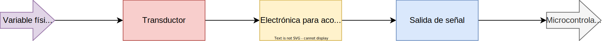

*Un sensor es todo aquello que tiene una propiedad sensible a una magnitud del medio, y al variar esta magnitud también varía con cierta intensidad la propiedad, es decir, manifiesta la presencia de dicha magnitud, y también su medida...[wikipedia](https://es.wikipedia.org/wiki/Sensor)*

## Variable física

Existen 6 variables fundamentales que podemos captar que son:

- Temperatura (Calor, frio)
- Caudal (Flujo)
- Presión (Masa)
- Radiación (Luz,...)
- Velocidad (velocidad, aceleración)
- Nivel

Existen muchas más, pero solo hago mención de las mas básicas en instrumentación.

## Transductor

Un transductor es un elemento que es capaz de captar una variable física (temperatura, presión, flujo, etc..) convirtiéndola en una señal eléctrica (corriente o voltaje). Sin embargo, normalmente la señal generada es muy pequeña, por ende, se debe mandar a una etapa de amplificación. La señal eléctrica o su variación siempre se da por algún efecto químico en su interior por su constitución física.

*Ejemplos:*

- **LDR (Resistencia dependiente de luz)**: En función de la luz que incide por su ventana es el valor ohmico que representa al pasar la corriente

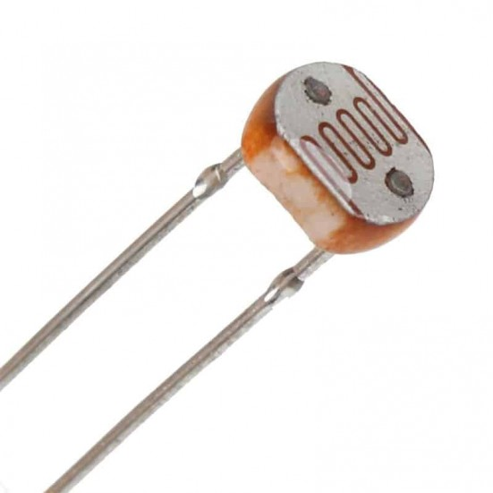

- **Termocupla o termopar**: Es la union de dos conductores de diferente composición química.

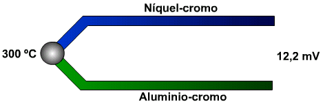

- **Pizoelectrico**: Es una lamina o material que al deformarse genera un nivel de voltaje.

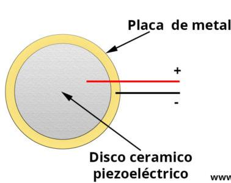

## Transductor Pasivo vs Activo

Existen dos tipos de transductores los cuales pueden ser *pasivos* o *activos* esto significa la forma en cómo vamos a leer su señal o adquirirla, en función de ello vamos a acoplar, qué tipo es y amplificación.

###  Pasivos

Los `transductores pasivos` son aquellos los cuales para poder leer o conocer la variable física, se le debe aplicar un voltaje o corriente constante, para que en función de la variación de este voltaje o corriente que aplicamos podamos calcular su equivalencia o proporción a dicha variable. Es decir, este tipo de transductor no es capaz de generar un voltaje o corriente la cual nos indique el valor de la magnitud física.

El ejemplo más común es una LDR, la cual se debe aplicar en un divisor de tensión, y en función de la variación del luz hará variar el voltaje de la salida del voltaje.

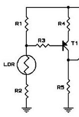

Como se puede observar en el circuito tenemos un divisor de tension dinámico que oscila el voltaje en función de la entrada de luz, esta salida normalmente va a otra etapa de amplificación.

###  Activos

Los `transductores activos` generan energía de forma natural, generando un voltaje o corriente al ser expuesto al contexto. Sin embargo, esta señal es demasiado pequeña para poder ser leído o un elemento digital o cualquier otro elemento.

El ejemplo más común es un termopar o termocupla, la cual esta constituida por 2 alambres de diferentes elementos químicos. Al se expuesto a altas temperatura genera un mili voltaje.

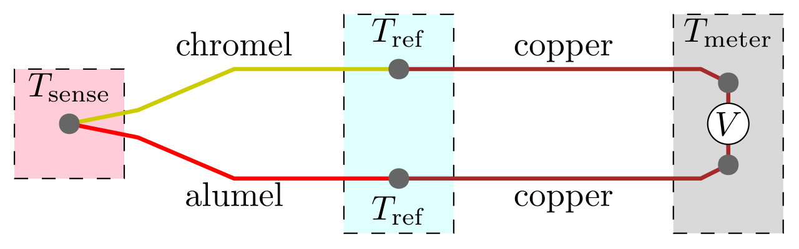

Como podemos observar al unir dos alambres de elementos distintos, al calentarse estos generan una diferencia de potencial.

Aquí tenemos un circuito de ejemplo de acoplamiento de una termocupla con su etapa de amplificación.

## Sensores Digitales vs Analógicos 

En general todos los transductores son analógicos, pero generan una señal muy pequeña, se necesita acoplar una o dos etapas de amplificación para tener un voltaje mayor equivalente. Pero justamente aquí al final de esa etapa la señal se puede enfocar para generar solo `señales digitales`, es decir, `un nivel alto o bajo`, o en su defecto generar un `rango de voltaje`, estos serían los `analógicos`

##  Sensores Digitales

Los sensores digitales solo pueden generar 2 tipos de señal, sea un `1` o un `0`. Existen rangos de voltajes que si están en un rango se consideran `1 lógico` o `0 lógico`. A un rango se le conoce como voltajes TTL.

Nivel lógico|Voltaje|
:-:|:-:|
1|3V a 5V
0|0V a 0.8V

Debemos conocer que tipo de sistema digital estamos empleando y verificar nuestro sensor para asegurar que se puede acoplar directamente o tendremos que acoplar esta señal al nivel que deseamos.

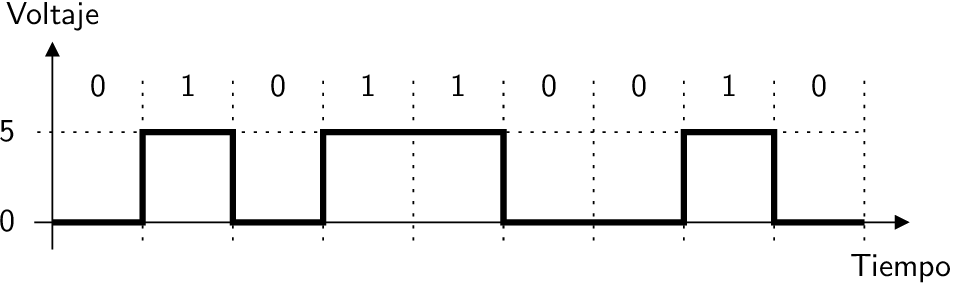

###  Sensores digitales básicos vs protocolos

Los sensores digitales básicos solo nos da una señal lógica, esto significa que tiene 2 estados, indicando si existe o no existe la variable o la magnitud física, si más.

**Sensores básicos** 

*Ejemplo:*

- **Sensor PIR**: Indica si existe presencia o no.

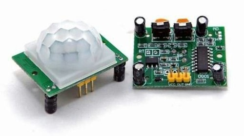

- **Sensor de Flama**: Indica si existe flama o no. Este por su naturaleza da un rango de voltaje, entonces se debe calibrar en que punto se dispara indicando si sobrepasa este punto o no.

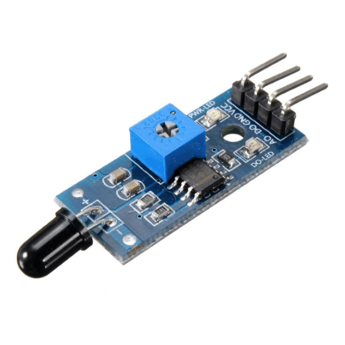

- **Sensor de luz**: Indica si existe luz o no. Este por su naturaleza da un rango de voltaje, entonces se debe calibrar en que punto se dispara indicando si sobrepasa este punto o no.

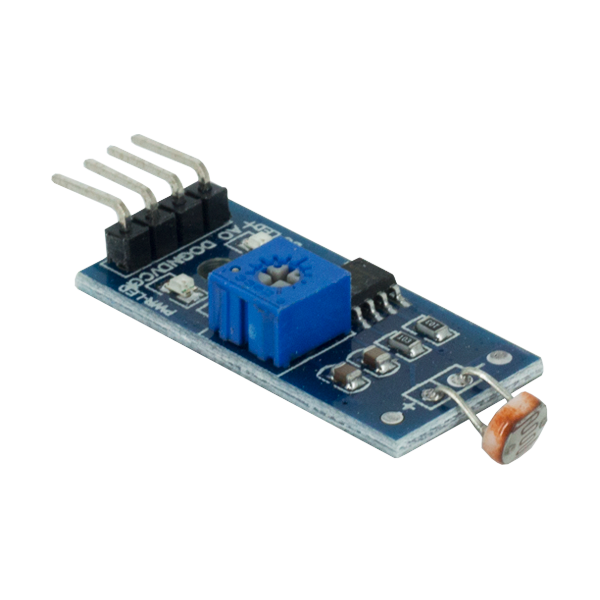

#### Los sensores digitales con comunicación por protocolo

Son sensores que internamente son mas complejos, estos ademas de contener su etapa del transductor, amplificación, acoplamiento, tienen un etapa de comunicación por medio de algún protocolo de comunicación:

**Sensores con protocolo de comunicación:**

- **DS18B20**: Sensor de temperatura con protocolo 1 Wire

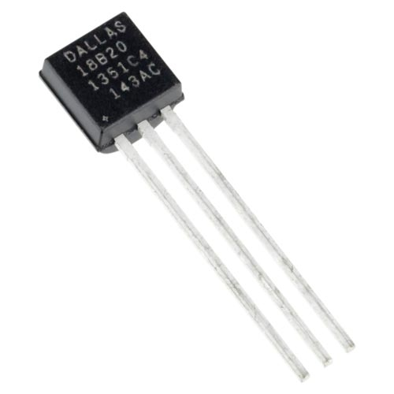

- **BME280:**: Sensor de presión, humedad y temperatura con protocolo I2C.

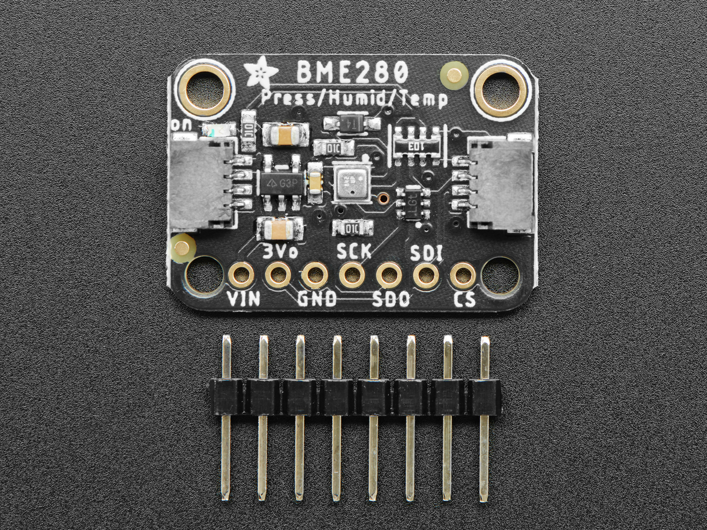

- **MAX31855K**: Sensor de temperatura con protocolo SPI

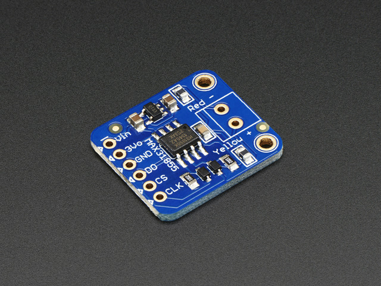

##  Sensores Analógicos

Los sensores analógicos nos proveen un rango de voltaje en el que operan, este voltaje es proporcional la variable o magnitud física que esta censando. Los sensores que son empleados a sistemas digitales trabajan habitualmente en un rango de `0V a 5V` o `0V a 3.3V`, estos rangos son comunes pero no los únicos. En ocasiones tenemos que amplificar este rango para que se pueda aprovechar de mejor manera.

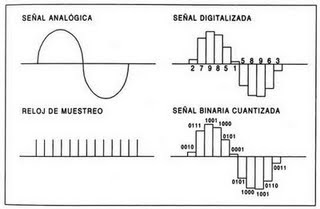

Pero este rango de voltaje no se puede mandar directamente al sistema digital antes debe pasar por otro elemento que haga la conversion a un sistema digital, estos elementos se llaman **[ADC](https://es.wikipedia.org/wiki/Conversor_de_se%C3%B1al_anal%C3%B3gica_a_digital)**, este elemento hace posible que el microcontrolador pueda entender la señal analógica.

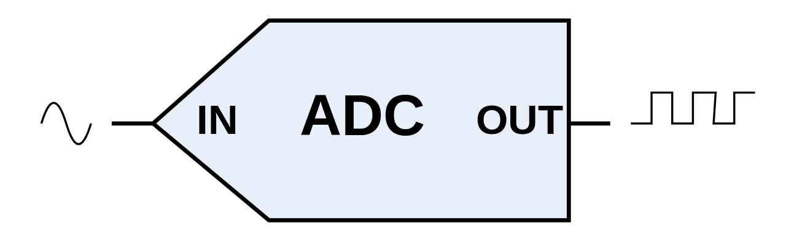

## Actuadores eléctricos o electrónicos

El actuador es el elemento que actuá o realiza una acción a la salida de un sensor, no siempre viene el actuador incorporado al sensor.

Los actuadores más comunes son:

- Relay
- Solenoide
- Bocina
- LED
- Buzzer

Aquí se pueden ver varios circuitos de sensores:

**Sensor crepuscular**

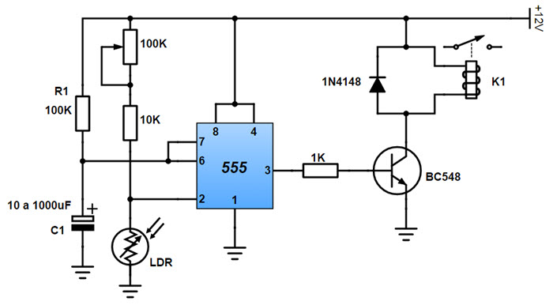

**Sensor de temperatura**

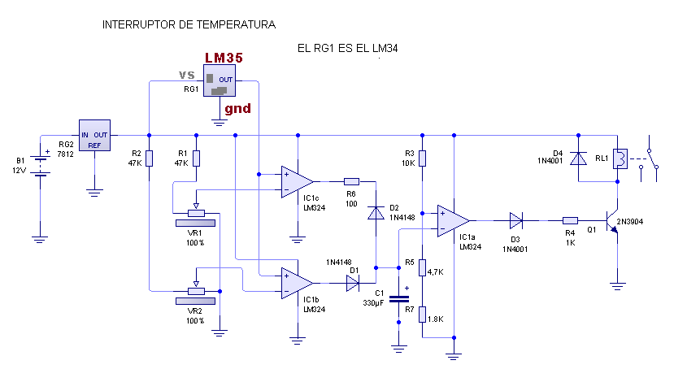

## Lista de sensores comunes

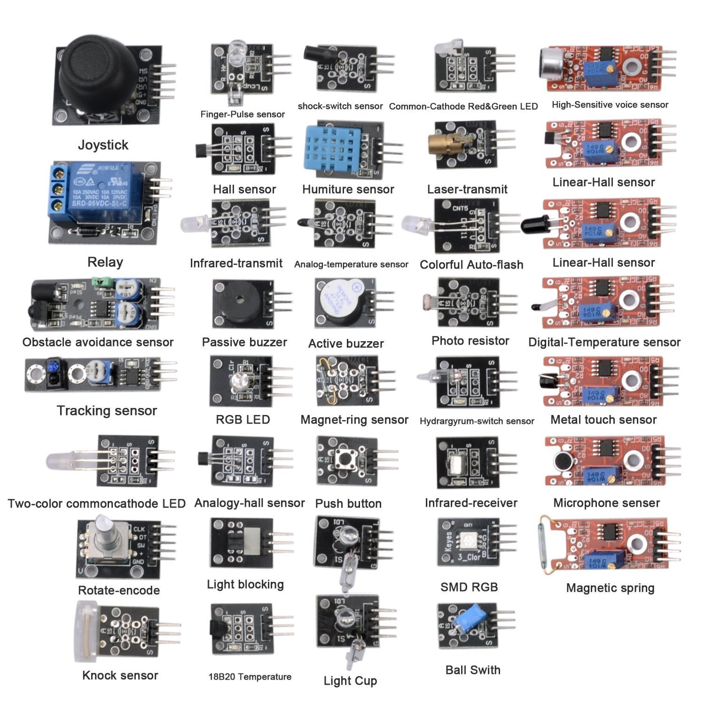

---

Realizado por Docente: [Alejandro Leyva](https://www.alejandro-leyva.com/)

[Mecatrónica 85](https://mecatronica85.com/)

[fb/mecatronica85](https://www.facebook.com/mecatronica85)
