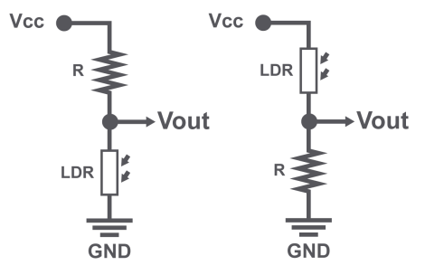
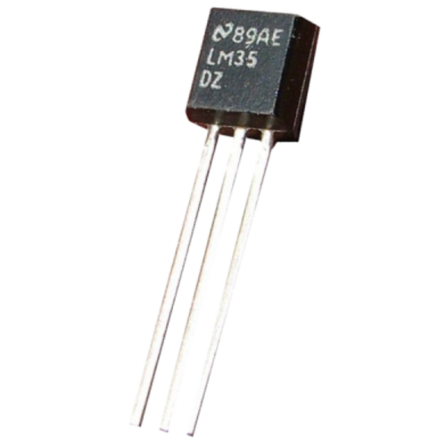
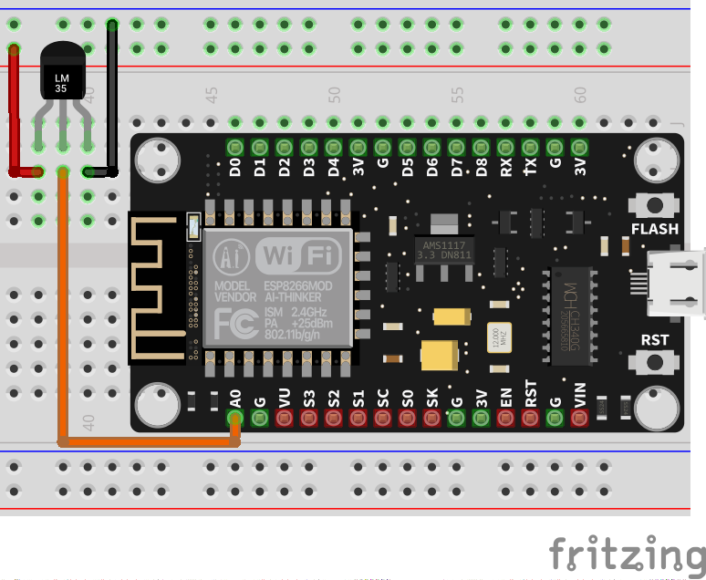

# Ejemplos con Sensores Analógicos

Un sistema digital por default no puede leer señales analógicas, rangos u oscilaciones de voltajes. Entonces cómo se hace la medición?. Se utiliza un componente llamado **ADC (Analogue to Digital Converter)**, el cual hace la conversión de la señal analógica a un código binario, entonces en lugar de percibir un nivel de voltaje, estaremos viendo un código binario equivalente.

El ADC que trae incorporado el ESP8266 tiene una resolución de 10 bits, es decir, tiene 1024 códigos binarios que son equivalentes son:

Voltaje|Binario|Decimal|Micropython
:-:|:-:|:-:|:-:
0V|0b|0|0
5V|0b11 1111 1111|1023|1024

!!! warning
    Recordar que el ADC del microcontrolador ESP8266 tiene una entrada de 1V, pero en la placa NodeMCU cuenta con un **divisor de tension** que acopla la señal y pueda ser de 0V a 3V. Pero puede existir variaciones físicas en las resistencias por lo tanto puede llegar a existir un pequeño rango de error al leer la señal.

## Sensor de Luz 

Existen varios sensores de luz, aquí estamos abarcando el mas sencillo y básico, el cual implementa una LDR (Resistencia dependiente de Luz) en una configuración de divisor de tension.




<figcaption>Modulo de Sensor de luz</figcaption>

!!! example "Sensor crepuscular"
    - **Descripción:** Se debe configurar el nivel en el código para la activación del led con cierta cantidad de luz que reciba el sensor
    - **Material:** 
        - 1 LDR
        - 1 R10k
        - 1 LED
        - 1 R330
    - **Diagrama:** <br>
    - **Código:** 
        ```python
        from machine import Pin, ADC # importo el modulo para ADC y para el control de Pines
        from time import sleep, sleep_ms

        valor_disparo = 100
        adc = ADC(0) # configuro el A0 como ADC o entrada analógica
        valor = adc.read() # esta función nos retorna el valor que existe en la entrada
        sleep(1)

        led = Pin(5, Pin.OUT, value = 0) # configuro el pin para el LED y pongo en 0

        while True:
            valor = adc.read() # esta función nos retorna el valor que existe en la entrada

            if valor > valor_disparo:
                led.on()
                sleep_ms(250) # doy un tiempo de estabilización
            else:
                led.off()

            sleep_ms(100) # Doy un tiempo de espera
        ```

!!! example "Luces del parque"
    - **Descripción:** Cuando el sensor detecte que ha obscurecido debe mandar a encender de manera secuencial 5 lamparas, las cuales están ubicadas en el parque, es decir, se irán prendiendo una a una hasta quedar todas encendidas. A la salida del sol las luces se deben apagar de la misma manera hasta que se apaguen todas
    - **Material:** 
        - 1 LDR
        - 1 R10k
        - 5 LED
        - 5 R330
    - **Diagrama:** <br>
    - **Código:** 
        ```python
        ```

## Sensor de Temperatura LM35 

Existe una enorme variedad de sensores de temperatura, estaremos viendo el **[LM35](https://www.ti.com/lit/ds/symlink/lm35.pdf)**, sensor de temperatura lineal.

**Nos da una respuesta de 10mV/ºC**



!!! example "Termómetro básico"
    - **Descripción:**     Vamos a realizar un termómetro con el LM35. La temperatura se mandará a la terminal. Debe mandar la temperatura en grados Celsius.
    - **Material:** 
        - 1 Sensor LM35
    - **Diagrama:** <br>
    - **Código:** 
        ```python
        from machine import ADC # importo el modulo para control y configuración de pines
        from time import sleep
        from dht import DHT11

        adc = ADC(0) # configuro el GPIO0 como ADC o entrada analógica
        sleep(1) # esperamos un tiempo de estabilización

        while True:
            value = adc.read() # esta función nos retorna el valor que existe en la entrada
            temp = (value/1024) * 300
            
            print("Temp:",temp,"C") # mando a la terminal el valor del ADC
            sleep(1) # espero un segundo
        ```
!!! example "Termómetro Celsius/Fahrenheit"
    - **Descripción:**     Vamos a realizar un termómetro con el LM35. La temperatura se mandará a la terminal. Debe mandar la temperatura en grados Celsius y grados Fahrenheit
    - **Material:** 
        - 1 Sensor LM35
    - **Diagrama:** <br>
    - **Código:** 
        ```python
        from machine import ADC # importo el modulo para control y configuración de pines
        from time import sleep

        adc = ADC(0) # configuro el GPIO0 como ADC o entrada analógica
        sleep(1) # esperamos un tiempo de estabilización

        while True:
            
            value = adc.read() # esta función nos retorna el valor que existe en la entrada
            celsius = (value/1024) * 300
            fahrenheit = (value * 1.8) + 32
            
            print("Temp Celsius:", celsius, " C") # mando a la terminal la temp en Celsius
            print("Temp Fahrenheit:", fahrenheit, " F") # mando a la terminal la temp en Fahrenheit
            sleep(1) # espero un segundo
        ```