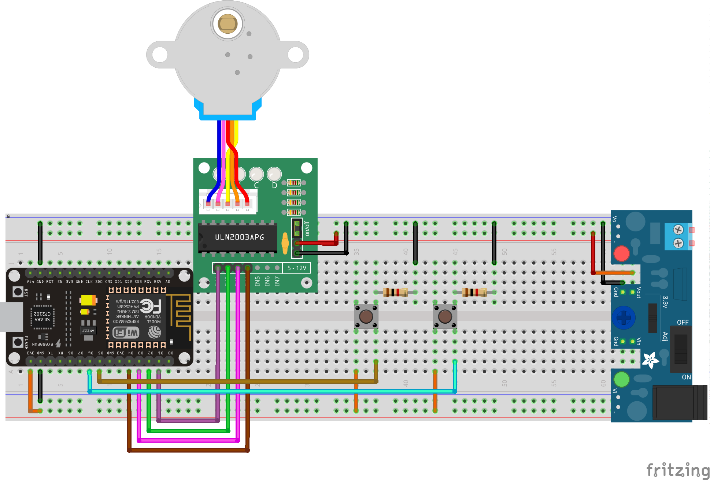
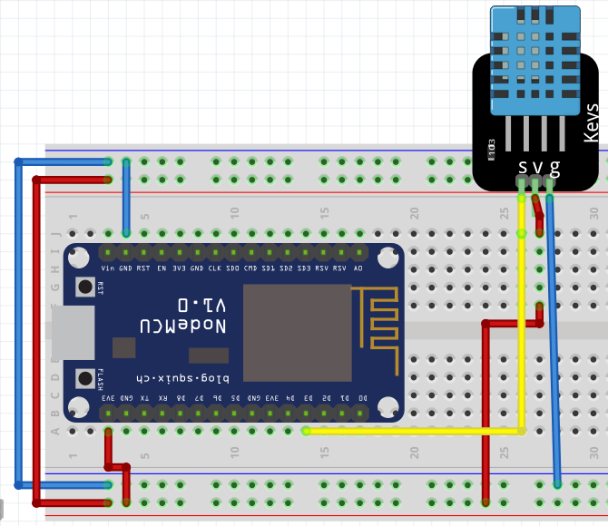

# Prácticas

!!! example "Encender LEDs"
    - **Descripción:** Hacer parpadear los leds, encendidos deben estar 2 segundos, y apagados un segundo, esto debe repetirse 5 veces
    - **Material:** 
        - 1 Led
        - 1 R330 
    - **Diagrama:**   

!!! example "Parpadear un led 3 veces"
    - **Descripción:** Se debe lograr que parpadee un led 3 veces, en un intervalo de tiempo de medio segundo
    - **Material:** 
        - 1 Led
        - 1 R330 
    - **Diagrama:**   

!!! example "Parpadear leds de manera indefinida"
    - **Descripción:** Deben quedar 2 leds parpadeando de manera indefinida, encendidos 2 segundos y apagados un segundo
    - **Material:** 
        - 2 Led
        - 2 R330 
    - **Diagrama:**   

!!! example "Semáforo de crucero"
    - **Descripción:** Realizar dos semáforos en una intersección, deben trabajar de manera complementaria.
    - **Material:** 
        - 6 Leds (rojo,verde y ámbar)
        - 6 R330 
    - **Diagrama:**   
    - **Ejemplo:**

!!! example "Controlando 2 leds con sus botones"
    - **Descripción:** Control de 2 leds, cada uno con su propio push button, mientras sea presionado el push button debe mantenerse encendido su respectivo LED, de lo contrario se deben apagar
    - **Material:** 
        - 2 Led
        - 2 R330 
        - 2 Push button
        - 2 R1k
    - **Diagrama:**   

!!! example "Controlando 2 leds blink, con sus botones"
    - **Descripción:** Control de 2 leds, cada uno con su propio push button, mientras sea presionado el push button debe parpadear a 1/4 de segundo, encendido su respectivo LED
    - **Material:** 
        - 2 Led
        - 2 R330 
        - 2 Push button
        - 2 R1k
    - **Diagrama:**   

!!! example "Toggle 2"
    - **Descripción:** Hay 2 leds con sus respectivos botones. Al presionar el push button se debe encender el led y mantenerse en ese estado; hasta que se vuelva a presionar el led regresará a su estado anterior
    - **Material:** 
        - 2 Led
        - 2 R330 
        - 2 Push button
        - 2 R1k
    - **Diagrama:**   

!!! example "Secuencia de luces"
    - **Descripción:** Realizar una secuencia de leds básica, se deben ir encendiendo en secuencia, el tiempo lo decide el programador, primero enciende el primero, unos instantes después el segundo, un instante, después el ultimo, quedan encendido todos y unos segundos después se apagan y vuelve a comenzar la secuencia.
    - **Material:** 
        - 2 Led
        - 2 R330 
        - 2 Push button
        - 2 R1k
    - **Diagrama:**   

!!! example "Tren"
    - **Descripción:** Simular las luces de alto en un cruce de ferrocarril, como se muestra en la imagen animada. Se debe simular con un botón el paso del ferrocarril, que si se presiona haga los parpadeos de las luces, mientras no este presionado el botón, las luces deben quedar encendidas; es decir, que no estaría pasando el tren. 
    - **Material:** 
        - 4 Led
        - 4 R330 
        - 1 Push button
        - 1 R1k
    - **Diagrama:**   

!!! example "Display de 7 segmentos"
    - **Descripción:** Crear un mensaje que se vaya leyendo en el display de 7 segmentos, *tu elijes la palabra o frase*, el intervalo de cada letra será de medio segundo
    - **Material:** 
        - 1 Display 7 segmentos, cátodo común
        - 7 R330 
    - **Diagrama:**   

!!! example "Frases con display 7-seg"
    - **Descripción:** Realizar el control de un display de 7 segmentos, mandando un mensaje. Es decir, mandará una palabra la cual el programador elegía, esta palabra se debe poder escribir con los segmentos con los que cuenta el display. 
    Desplegará su palabra, después desplegará la palabra "cbtis" y terminará con "85", todas las palabras deben ser separadas por un guion. *Ejemplo: HOLA-Cbtis-85*
    Debe quedar de manera indefinida la frase.
    - **Material:** 
        - 1 Display 7 segmentos cátodo común
        - 7 R330 
        - 1 Push button
        - 1 R1k
    - **Diagrama:**   

!!! example "Frases con display 7-seg"
    - **Descripción:** Utilizando el problema anterior, pero se agregará un botón; es decir, se mantendrá la palabra repitiéndose infinitamente hasta que se presione el botón, para hacer el cambio de palabra. Ejemplos, desplegará la palabra "HOLA", cuando se presione el botón se desplegará la siguiente frase "Cbtis-85", se vuelve a presionar el botón y regresa a la palabra anterior, y esto se repetirá
    - **Material:** 
        - 1 Display 7 segmentos cátodo común
        - 7 R330 
        - 1 Push button
        - 1 R1k
    - **Diagrama:**   

!!! example "Motor PAP medio y paso completo"
    - **Descripción:** Cuando se presione un boton el motor debe girar en un sentido a medio paso, y cuando se suelte debe detenerse, en caso que presione el otro boton debe girar a paso completo y cuando se deje de presionar que se detenga, en caso que se presionen ambos botones, no debe girar en ningún sentido.
    - **Material:** 
        - 1 Motor PAP
        - 1 Driver ULN2003
        - 2 Push button
        - 2 R1k
        - Fuente externa
    - **Diagrama:**  

!!! example "Invertir Motor PAP"
    - **Descripción:** Cuando se presione un botón el motor debe girar hacia un sentido, y cuando se suelte debe detenerse, en caso que presione el otro botón debe girar en sentido contrario y cuando se deje de presionar que se detenga, en caso que se presionen ambos botones, no debe girar en ningún sentido.
    - **Material:** 
        - 1 Motor PAP
        - 1 Driver ULN2003
        - 2 Push button
        - 2 R1k
        - Fuente externa
    - **Diagrama:**  

!!! example "Encendido secuencial de luces"
    - **Descripción:** Utilizar el divisor de tension con la LDR, para ir encendiendo 5 leds en un punto de disparo, es decir, que se elija un valor como indicativo de que hace falta encender las lamparas porque esta oscureciendo, al detectar este punto los leds se deben encender de manera secuencial, uno por uno hasta quedar todos los leds encendidos, y se baja ese punto de referencia, se deben ir apagando secuencialmente, parecido a como se fueron encendiendo.
    - **Material:** 
        - 1 Potenciómetro
        - 5 leds
        - 5 R330
    - **Diagrama:**  

## Entradas analógicas - ADC

!!! example "Carrito seguido de luz"
    - **Descripción:** El carrito debe reaccionar a la estimulación de la luz. El carrito debe seguir la dirección de la luz. Por ende, las llantas deben activarse para lograr dicho efecto.
    - **Material:** 
        - 2 LDR
        - 2 R10k
        - 2 Motor DC
        - 1 L293D
    - **Esquema:**  

## Salidas analógicas (PWM)

!!! example "Colores al azar"
    - **Descripción:** Genera colores de manera ramdon
    - **Material:** 
        - 3 R330
        - 1 Led RGB (cátodo común)
    - **Diagrama:**  

!!! example "Viendo los 16 millones de colores con Pot"
    - **Descripción:** Realizar un barrido de los colores con un led RGB, se tendrá un botón para seleccionar el color que sera modificado, y este sera variado con un potenciómetro.
    - **Material:** 
        - 3 R330
        - 1 Led RGB
        - 1 Push button
        - 1 R1k
        - 1 Potenciómetro
    - **Diagrama:**  

- Control de un motor DC
  - Regulador de velocidad motor DC
  - Giro de un motor DC
- Servo
## Sensores Digitales

!!! example "Sensor Temperatura y Humedad"
    - **Descripción:** Leer los valores de Temperatura y humedad relativa en la terminal 1 DTH11
    - **Material:** 
        - 2 DTH11
    - **Esquema:**  

- Control de velocidad de un motor DC, se controlara la velocidad del motor a traves de un potenciómetro. Si el potenciómetro esta en 0 el motor debe estar apagado, si esta al 50% el motor girara a la mitad de su velocidad, cuando llegue a 100% el motor debe girar a su maxima velocidad.
- Control de la intensidad de varias luces, se tendrán 3 leds cada uno controlado con su respectivo potenciómetro para hacer variar la intensidad de la luz de cada uno. Todos de manera independiente.
- Control de la intensidad de varias luces, se tendrán 3 luces. 2 leds cada uno controlado con su respectivo potenciómetro para hacer variar la intensidad de la luz de cada uno, un tercero controlado con botones, uno para incrementar y otro para decrementar la intensidad. Todos de manera independiente.
- Utilizando un servomotor que se utilizara para controlar la pluma de la entrada de estacionamiento. Se simula un sensor infrarrojo para detectar el auto y se levante la pluma (180°), cuando no detecte el auto, bajara la pluma (0°)

### sensores Analógicos

Simular un sensor de luz junto con un sensor de presencia (digital). Dicho sensores trabajan a la par, si hay poca luz y existe presencia en el cuarto se debe encender un foco. En caso que no exista presencia sin importar la intensidad de la luz, el foco no enciende.
3. Simular un sensor infrarrojo para accionar el movimiento de un servomotor, entre mas luz incida debe incrementar el angulo del servomotor. Es decir, entre mas cerca se incrementa el angulo, entre mas lejos es menor el angulo.

