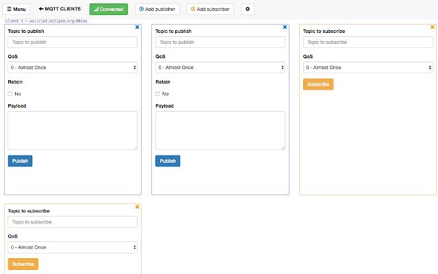
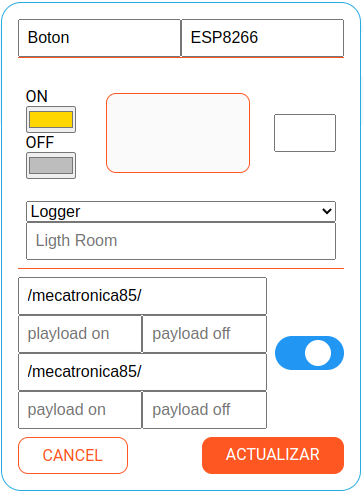
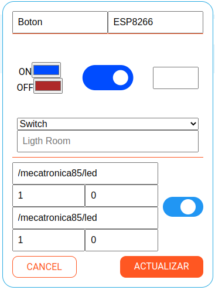
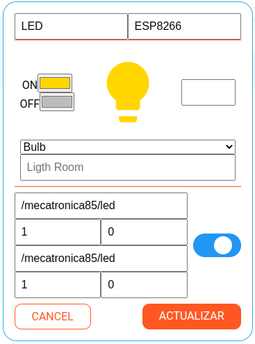
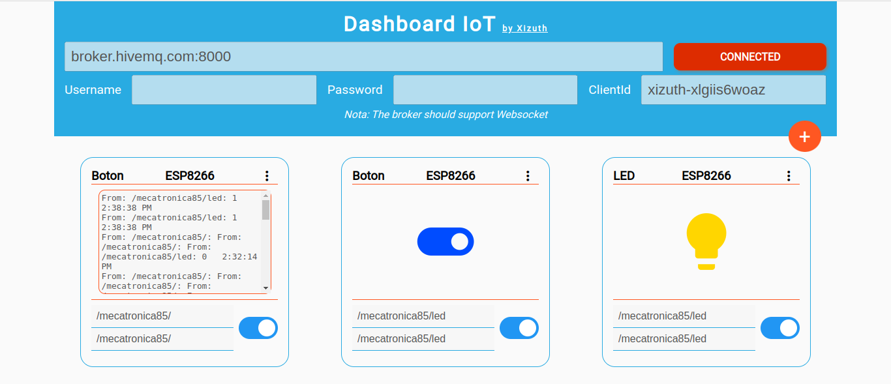

# Conectando dispositivos MQTT

Para la conexión de dispositivos MQTT necesitamos 3 cosas en mente:

- **Subscriptor**: Dashboard o quien recibe el dato
- **Publicador** - Sensor
- **Broker** - El servidor que se encarga de conectarlos a todos y rediccionar la información mandada por el publicador a los subscriptores


## Preparando todo


## Broker

Vamos a utilizar en este ejemplo un broker publico de [HiveMQ](https://www.hivemq.com/), vamos al

[](https://www.hivemq.com/public-mqtt-broker/)

Los datos que nos dan para conectarnos son:

|Nombre|Dato|
|-|-|
|Broker| broker.hivemq.com|
|TCP Port | 1883|
|Websocket Port |8000|

---

### Cliente o Dashboard

Ahora vamos a necesitar un cliente que reciba la información (Subscriber), para ello vamos a utilizar la extension mostrada previamente

[MQTT Box](https://chrome.google.com/webstore/detail/mqttbox/kaajoficamnjijhkeomgfljpicifbkaf)



**Cliente Dashboard IoT**

[Ir al cliente](http://www.alejandro-leyva.com/dashboard-iot/)

[](http://www.alejandro-leyva.com/dashboard-iot/)


### Node MCU (Micropython) como dispositivo IoT

Esta sera la parte con mas detalles, necesitamos un modulo adicional que no viene en el `core` de Micropython, la cual hará la conexión de mqtt hacia el broker. El modulo se encuentra en la siguiente [url de github](https://github.com/micropython/micropython-lib/blob/master/micropython/umqtt.simple/umqtt/simple.py)
Pero, también te la comparto minificada, es decir, la misma pero con mucho menor peso (poco legible para el ser humano) [Descargar](imgs/mqtt.py)

**Recuerda que hay que almacenar toda librería dentro de la tarjeta para que la podamos utilizar.**

**Pasos para conectarte al broker en Micropython**

1. Conectarte a un Router WiFi para obtener internet
2. Conectarte al broker
3. Suscribirte a un topic o publicar un dato en algún topic

**Función para conectarse a un router o modem**

```python
def connect():
    import network
    sta_if = network.WLAN(network.STA_IF)

    if not sta_if.isconnected():
        print('connecting to network...')
        sta_if.active(True)
        sta_if.connect('ESSD', 'PASSWORD') #colocar datos de tu modem
        while not sta_if.isconnected():
            pass

    print('network config:', sta_if.ifconfig())
    sleep(1)
```

**Proceso para publicar**

1. Una vez conectado a internet
2. Crear un cliente MQTT
3. Conectarse al broker
4. Publicar el dato hacia el topic deseado

Ejemplo:

```python
from mqtt import MQTTClient
from machine import Pin
from time import sleep_ms, sleep
def connect():
    import network
    sta_if = network.WLAN(network.STA_IF)

    if not sta_if.isconnected():
        print('connecting to network...')
        sta_if.active(True)
        sta_if.connect('ESSD', 'PASSWORD') #colocar datos de tu modem
        while not sta_if.isconnected():
            pass

    print('network config:', sta_if.ifconfig())
    sleep(1)

btn = Pin(5, Pin.IN)

connect()

SERVER = "ip servidor"

c = MQTTClient(client_id="ESP8266", server=SERVER)
con = c.connect()
print("connected")

while True:

    if btn.value():
        c.publish(b"/btn", b"{\"btn\":\"pressed\"}")
        print("btn presionado")
        sleep_ms(250) # tiempo de antirebote
```

**Proceso para subscribirse**

1. Una vez conectado a internet
2. Crear un cliente MQTT
3. Crear una función callback (que se dispara cuando recibe el mensaje)
4. Conectarse al broker
5. Subscribirse al topic deseado
6. Esperar mensaje del topic (función `wait.msg()`)

Ejemplo:


```python
from mqtt import MQTTClient
from machine import Pin
from time import sleep_ms, sleep

def connect():
    import network
    sta_if = network.WLAN(network.STA_IF)

    if not sta_if.isconnected():
        print('connecting to network...')
        sta_if.active(True)
        sta_if.connect('ESSD', 'PASSWORD') #colocar datos de tu modem
        while not sta_if.isconnected():
            pass

    print('network config:', sta_if.ifconfig())
    sleep(1)

def sub_cb(topic, msg):
    print(topic, msg)

    if msg == b"0":
        led.value(0)
    elif msg == b"1":
        led.value(1)
    elif msg == b"toggle":
        led.value(not led.value())
    sleep_ms(100)


led = Pin(4, Pin.OUT)

connect()

SERVER = "ip del servidor"

c = MQTTClient(client_id="ESP8266", server=SERVER)
con = c.connect()
print("connected")

c.set_callback(sub_cb) # asigno la función que se dispara cuando llega el mensaje

TOPIC = b"/led"
c.subscribe(TOPIC)
print("Subscribed to",TOPIC)

while True:
    c.wait_msg() # espero a recibir el mensaje del topic
    sleep(1) # tiempo de espera para consumir menos energía y procesamiento

c.disconnect()
```

---


## Conectando Todo

Vamos a conectar un led y un botón, todo controlado de manera local y remota desde un cliente


!!! warning Topic Raíz /mecatronica85/*
    Siempre que uses un broker publico, debes colocar un topic raíz único, dado que existe miles de topics conectados al broker que puedes saturar tus dispositivos porque puedes llegar a coincidir con algún topic existente.
    En nuestro caso sera `/mecatronica85/topic_a_conectarte`

!!! warning Nombre del dispositivo
    Si usas un nombre que ya esta registrado en el broker, te mandara error, entonces usa un nombre único para evitar conflictos en el servidor por el nombre.

**Código que se carga a la placa NodeMCU**

```python
from mqtt import MQTTClient
from machine import Pin
from time import sleep_ms

def connect():
    import network
    sta_if = network.WLAN(network.STA_IF)

    if not sta_if.isconnected():
        print('connecting to network...')
        sta_if.active(True)
        sta_if.connect('ESSD', 'PASSWORD')
        while not sta_if.isconnected():
            pass

    print('network config:', sta_if.ifconfig())
    sleep_ms(1000)

def sub_cb(topic, msg):
    print(topic, msg)

    if msg == b"0":
        led.value(0)
    elif msg == b"1":
        led.value(1)
    elif msg == b"toggle":
        led.value(not led.value())
    sleep_ms(100)


led = Pin(4, Pin.OUT)
btn = Pin(5, Pin.IN)

connect()

SERVER = "broker.hivemq.com"
PORT = 1883

c = MQTTClient(client_id="ESP8266-xlgiis6woaz", server=SERVER, port=PORT)
con = c.connect()
print("connected")

c.set_callback(sub_cb)

TOPIC_S = b"/mecatronica85/led"
c.subscribe(TOPIC_S)
print("Subscribe to",TOPIC_S)

status = 0

while True:

    if btn.value():
        led.value(not led.value())
        c.publish(b'/mecatronica85/led',str(led.value()))
        print("btn pressed")
        sleep_ms(250)

    c.check_msg() # esta funcion es igual a wait_mgs() pero es bloqueante
    sleep_ms(250)

c.disconnect()
```

**Configuración en el Dashboard**

Para obtener los mismo elementos que se muestran se debe colocar:

**Logger**

Es para ver todos los datos que salen y entran a nuestro dashboard



**Switch**

Ver el estado del led, y también para controlarlo



**Bulb**

Ver el estado del led, y también para controlarlo



**Para este resultado**

La url debe ser **broker.hivemq.com:8000**, el client ID se genera en automático. Como no estamos configurando usuario y contraseña, se deja vació.


