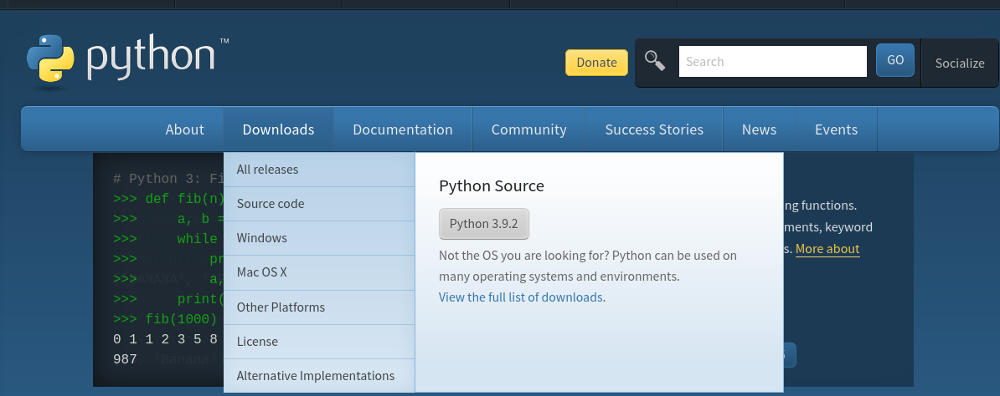
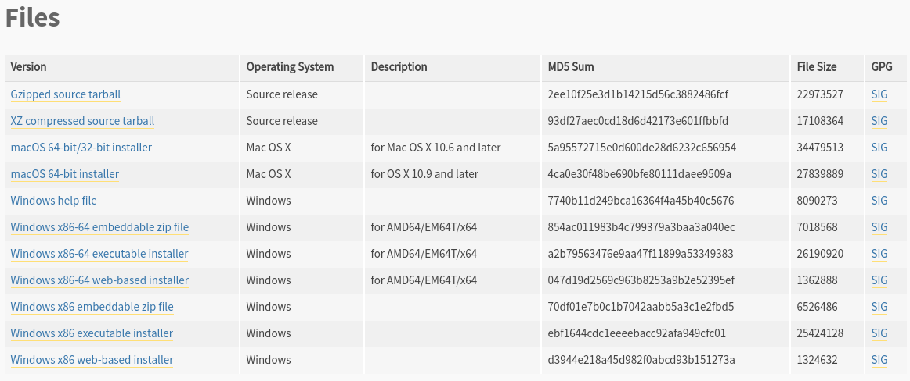

#  Introducción a Python

Python es un lenguaje de programación interpretado de propósito general, es dinamicamente tipado.

Estamos hablando de un lenguaje de programación dinamicamente tipado. Como tal si existen los tipos pero no se definen explicitamente y pueden ir cambiando en cualquier momento.

## Instalación de Python

Para instalar Python se entra a su sitio oficial https://www.python.org/

Al momento de realizar esta documentación estamos en la versión 3.9.2

**Pero usaremos una versión estable de [Python 3.7.3](https://www.python.org/downloads/release/python-373/).**

## Instalación de Python en Windows

Se elige para la versión del sistema operativo. En esta caso vamos a suponer que tenemos una versión de Windows a 64 bits (x64). 
Elegimos la versión [Windows x86-64 executable installer](https://www.python.org/ftp/python/3.7.3/python-3.7.3-amd64.exe)

Al ejecutar el instalador se debe activar la creación del PATH (variable de entorno), para que se agregue de forma automática y se pueda ocupar en la linea de comando (CMD) de Windows.

## Tipos de lenguajes de programación

- Lenguaje **COMPILADO**
- Lenguaje **INTERPRETADO**

## Ventajas de Python

- Python es multiplaforma
- Python es Open Source

---

Realizado por Docente: [Alejandro Leyva](https://www.alejandro-leyva.com/)

[Mecatrónica 85](https://mecatronica85.com/)

[fb/mecatronica85](https://www.facebook.com/mecatronica85)
