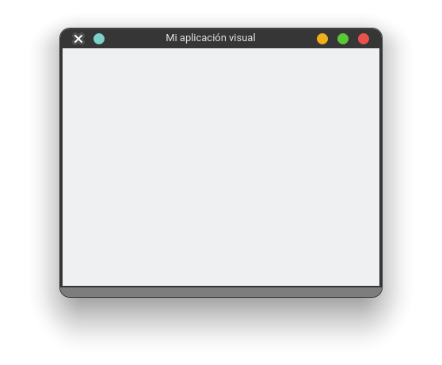

# Tk - Ventana principal

El `objeto` `Tk` es el contenedor principal de la aplicación visual, o en otras palabras es la ventana principal de nuestro programa. Por ende, debe ser lo primero, ademas que contendrá todos los widgets que declaremos.

Este widget se le pasa a todos los widgets como contenedor padre, normalmente se le llama `root` (es una convención); por ende, no tiene a ningún widget por encima de él.

Ejemplo de como seria la jerarquía:

```python
root = Tk() # Ventana principal
content = ttk.Frame(root) # Frame que se le pasa el widget padre o que lo contendrá
button = ttk.Button(content) # Se le pasa el widget content que seria su padre del botón
```

Para crear una simple ventana, lo realizamos con el siguiente código:

```python
from tkinter import Tk

root = Tk() # Crea la ventana con sus parámetros por default

root.mainloop() # Siempre se debe llamar a su método mainloop y se debe colocar hasta el final, hace que la ventana se mantenga en ejecución, hasta que el usuario cierre la ventana
``` 
## Métodos relevantes de Tk

El `objeto` `Tk` tiene muchos métodos, pero solo mencionare los que considere más relevantes para manipular

- `title`: Coloca un titulo a la ventana
- `geometry`: Se le da la dimensión a la ventana. Ejemplo: "800x600" lo tomara en automáticamente en pixels.
- `config`: Este metodo permite realizar todo tipo de configuracion al widget. Ejemplo: Se le pasan dos argumentos para definir el tamaño de la ventana, ancho y alto, `width=400`, `height=300`, fondo `bg="blue"`
- `iconbitmap`: Es la función para colocar un icon a la aplicación, debe ser tipo `.ico`. Ejemplo: `'hola.ico'`
- `resizable`: Con esta funcion podemos evitar que la ventana se pueda redimencionar. Ejemplo: `(0,0)` significa que en `x` y en `y` no se pueda redimencionar.

Ejemplo de como configuraríamos una ventana con su titulo y dimensiones:

```python
from  tkinter import Tk

root = Tk() # Creo la ventana

root.title("Mi aplicación visual") # Le doy un titulo a mi ventana
root.geometry("400x300") # Defino un ancho de 800px y 600px de alto
# root.config(width=400, height=300) # Este sería otra manera

root.mainloop()
```


*No vemos nada mas, porque no hemos agregado nada a ella.*