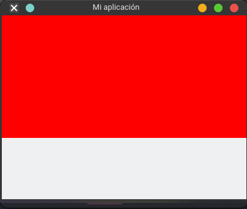

# Frames - Marcos

> Marco contenedor de widgets.
> 
El `objeto` `frame` es un `widget` contenedor parar widgets, nos ayuda a organizar y contener widgets o secciones de widgets.
Este objeto viene del modulo `tkinter`. Sin embargo, no puede existir sin un objeto `Tk`. Ademas, un `Frame` puede contener uno o mas `Frame`.

Para crear una simple ventana, lo realizamos con el siguiente código:

```python
from tkinter import Tk, Frame

root = Tk() # Crea la ventana con sus parámetros por default
root.title("Mi aplicación")
root.geometry("400x300")

frame = Frame(root) # Creamos el widget Frame y necesita recibir quien es su padre, en ese caso es la ventana principal
frame.config(bg="red", width=400, height=200) #Le configuro algunos parámetros al Frame, como no tiene nada dentro el tamaño seria 0x0px
frame.pack() # Agrega el frame a root

root.mainloop() # Siempre se debe llamar a su método mainloop y se debe colocar hasta el final, hace que la ventana se mantenga en ejecución
```



Se pueden preguntar si es necesariamente siempre ocupar un frame para contener los widgets de la aplicación, en esencia, no; pero es una buena practica para hacer aplicaciones mas organizadas y mantenibles.