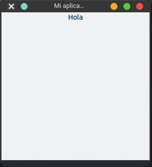
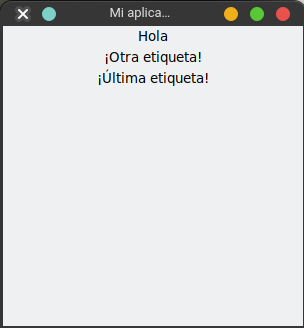
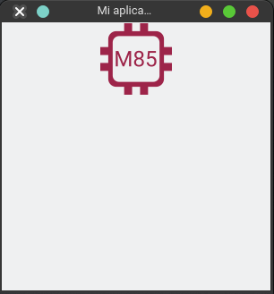

# Etiqueta de Texto - Label

Es un `widget` que no ayuda a desplegar texto o etiquetas que queramos mostrar en la aplicación, etc.

Para utilizar una `label` se debe importar del módulo `tkinter`. El primer parámetro debe ser el widget padre, después pasamos el parámetro `text` que sera lo que desplegara por pantalla.

```python
from tkinter import Tk, Label # import el objeto label

root = Tk() # Crea la ventana con sus parámetros por default
root.title("Mi aplicación")
root.geometry("300x300")

label = Label(root,text="Hola") # indico donde estará contenido
label.pack() # lo agrego a widget padre

root.mainloop() # Siempre se debe llamar a su método mainloop y se debe colocar hasta el final, hace que la ventana se mantenga en ejecución
```


Agregando varias etiquetas:

```python
from tkinter import PhotoImage, Tk, Label

root = Tk() # Crea la ventana con sus parámetros por default
root.title("Mi aplicación")
root.geometry("300x300")

label = Label(root,text="Hola")
label.pack()

Label(root, text="¡Otra etiqueta!").pack()
Label(root, text="¡Última etiqueta!").pack()

root.mainloop() # Siempre se debe llamar a su método mainloop y se debe colocar hasta el final, hace que la ventana se mantenga en ejecución
```



## Imágenes

El objeto `label` podemos usarla para colocar imágenes, pero se tiene que agregar otro modulo que nos ayude a colocarla dentro de `label`:

```python
from tkinter import PhotoImage, Tk, Label

root = Tk() # Crea la ventana con sus parámetros por default
root.title("Mi aplicación")
root.geometry("300x300")

imagen = PhotoImage(file="img/logo_m85_80px.png") #indico la ruta de la imagen

label = Label(root,image=imagen) # agrego la imagen a la etiqueta
label.pack() # lo agrego a widget padre

root.mainloop() # Siempre se debe llamar a su método mainloop y se debe colocar hasta el final, hace que la ventana se mantenga en ejecución
```

