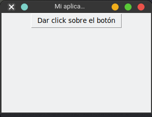
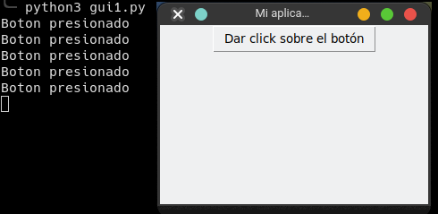

# Botón - Button

El botón es el widget que seguramente vamos a utlizar mas, para hacerlo primero debemos importar el objeto `Button` del módulo `tkinter`. Como todo widget primero debemos pasarle su widget padre y después el texto con el contenido que tendrá.


```python
from tkinter import Tk, Button

root = Tk() # Crea la ventana con sus parámetros por default
root.title("Mi aplicación")
root.geometry("300x200")

boton = Button(root, text="Dar click sobre el botón") #creo el boton
boton.pack() # agrego el botón a la ventana

root.mainloop() # Siempre se debe llamar a su método mainloop y se debe colocar hasta el final, hace que la ventana se mantenga en ejecución
```



Pero si nos damos cuenta, al presionar el boton no sucede nada, para ello debemos agregar un evento o una acción que debe ejecutar al momento de ser presionado el boton, ademas debemos generar una función la cual contendrá la contenido de la acción.

```python
from tkinter import Tk, Button

def evento_boton(): # funcion que se ejecutará al presionar el botón
    print("Boton presionado")

root = Tk() # Crea la ventana con sus parámetros por default
root.title("Mi aplicación")
root.geometry("300x200")

boton = Button(root, text="Dar click sobre el botón", command=evento_boton) #creo el boton y agrego el evento
boton.pack() # agrego el botón a la ventana

root.mainloop() # Siempre se debe llamar a su método mainloop y se debe colocar hasta el final, hace que la ventana se mantenga en ejecución
```

