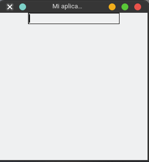

# Entry - Entrada de texto

Este widget es un campo de texto de entrada. En el cual podremos escribir cualquier texto, normalmente un mensaje corto, sin importar si son número o letras.

```python
from tkinter import Tk, Entry
root = Tk() # Creo mi ventana principal
root.title("Mi aplicación")
root.geometry("300x300")

entry = Entry(root) # creo un entry y le pasamos su padre
entry.pack() # agregamos el entry a la ventana

root.mainloop()
```



## Funciones importantes

- Obtener el texto que este escrito `get()`
- Borrando el texto `delete()`
- Insertar el texto `insert()`