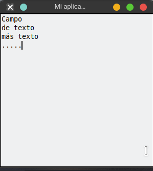
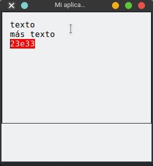

# Text - Área de texto

Un área de texto es una zona para ingresar una cantidad de texto densa, en la cual esta hecha para que podamos escribir todo lo que necesitemos.

```python
from tkinter import Tk, Text
root = Tk() # Creo mi ventana principal
root.title("Mi aplicación")
root.geometry("300x300")

texto = Text(root) # Creo el Text y le paso su padre
texto.pack() # se agrega al padre

root.mainloop()
``` 


## Parámetros interesantes que podemos configurar

- `width`: Ancho del Text
- `height`: Ancho del Text
- `font`: Fuente y tamaño de fuente
- `padx`: padding en el eje X
- `pady`: padding en el eje Y
- `selectbackground`: color al seleccionar el texto

```python
from tkinter import Tk, Text
root = Tk() # Creo mi ventana principal
root.title("Mi aplicación")
root.geometry("300x300")

texto = Text(root,) # Creo el Text y le paso su padre
texto.config(width=30, height=10, font=("Consolas",12), padx=15, pady=15, selectbackground="red") # agrego configuraciones a mi campo de texto

texto.pack() # se agrega al padre

root.mainloop()
``` 

