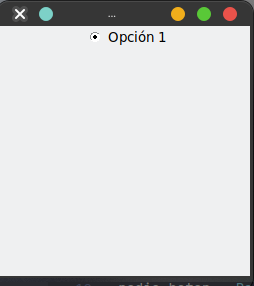

# Radio Button 

Este tipo de widget en general lo usamos cuando queremos dar opciones, pero solo una puede ser elegida.
Tenemos que agregar la clase `Radiobutton`. Pasandole como argumento `text` para el texto que mostrar en la interfaz.

```python
from tkinter import Tk, Radiobutton

root = Tk()
root.title("Mi aplicación")
root.geometry("250x250")

radio_boton = Radiobutton(root, text="Opción 1")
radio_boton.pack()

root.mainloop()
```



## Parámetros de Radio Button

Pero en aplicación no vamos a tener solo un radio botón, tendremos mas de uno, ademas que necesitaremos conocer cual de las opciones tomamos. 
Para ello veremos mas parámetros que podemos utilizar en este tipo de widget.

- `variable`: Es la variable que gestiona el contenido del radio seleccionado
- `value`:  Es un valor único que se le da y es el vamos a recibir en caso que ese radio este seleccionado
- `command`: La función que se ejecutara cada vez que se de click al radio button

```python
from tkinter import Tk, Radiobutton, IntVar, Label

def select():
    print("Opción {}".format(opcion.get())) 

root = Tk()
root.title("Mi aplicación")
root.geometry("250x250")
root.config(bd=15)

opcion = IntVar() # Es un objeto que almacena un entero venido de la GUI

Radiobutton(root, text="Opción 1", variable=opcion, value=1, command=select).pack()
Radiobutton(root, text="Opción 2", variable=opcion,value=2, command=select).pack()
Radiobutton(root, text="Opción 3", variable=opcion, value=3, command=select).pack()

root.mainloop()
```

