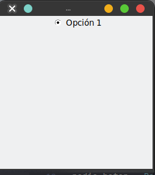
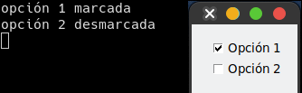
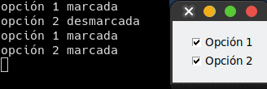

# Checkbutton - Botón de chequeo

Este tipo de widget para cuando el usuario puede elegir varias opciones que le damos. Habitualmente es conocido como `checkbox`, sin embargo, aquí se conocerá como `checkbutton`.

```python
from tkinter import Tk, Checkbutton

root = Tk() # Creo mi ventana principal
root.title("Mi aplicación")
root.geometry("300x300")

Checkbutton(root, text="Opción a elegir").pack() 

root.mainloop()
```


## Parámetros de Radio Button

Pero en aplicación no vamos a tener solo un botón de chequeo, tendremos mas de uno, ademas que necesitaremos conocer cual o cuales fueron las opciones marcadas. 
Para ello veremos mas parámetros que podemos utilizar en este tipo de widget.

- `variable`: La variable que va a gestionar el contenido
- `onvalue`: El valor que devuelve en caso de que sea marcado
- `offvalue`: El valor que devuelve en caso que no este marcada la casilla
- `command`: La función que se ejecutara cada vez que se de click

```python
from tkinter import *

def seleccionar():    
    if (opcion_1.get()):
        print("opción 1 marcada")
    else:
        print("opción 1 desmarcada")
        
    if (opcion_2.get()):
        print("opción 2 marcada")
    else:
        print("opción 2 desmarcada")

# Configuración de la raíz
root = Tk()
root.title("Mi aplicación")
root.config(bd=15) 

opcion_1 = IntVar()    # 1 si, 0 no
opcion_2 = IntVar()   # 1 si, 0 no

Checkbutton(root, text="Opción 1", variable=opcion_1, onvalue=1, offvalue=0, command=seleccionar).pack()

Checkbutton(root, text="Opción 2", variable=opcion_2, onvalue=1, offvalue=0, command=seleccionar).pack()

root.mainloop()
```


