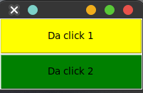

# Manejador `Pack`

Con forme se van agregando los widget al contenedor padre, estos se irán apilando. Por default se van ordenando de arriba hacia abajo, pero se puede modificar este posición.

## Sintaxis

```python
widget.pack( pack_options... )
```

Los argumentos que puede recibe la función `pack` son:

- `side`: La posición en la que se agregará, después de ejecutar el método `pack()`
    - `TOP`: (default), Se agrega de arriaba hacia abajo
    - `BOTTOM`: Se acomoda de abajo hacia arriba
    - `LEFT`: Se acomoda de izquierda a derecha
    - `RIGHT`: Se acomoda de derecha a izquierda
- `fill`: Indica que se expanda todo el ancho posible o el alto, dependiendo si existe algún elemento al lado de él.
    - `X`: Horizontal
    - `Y`: Vertical
    - `BOTH`: Ambos, tanto `x` como `y`
- `padx`/`pady`: Margen en `x` y `y`. Es la distancia entre widget y widget. Padding externo.
- `ipadx`/`ipady`: Padding en `x` y `y`. Es la distancia entre el contenido y la pared del widget. Padding interno.
- `expand`: Ocupa todo el espacio posible, pero sin crecer el widget, vendría siendo como un margen, Recibe un valor booleano: `True`, `False`
- `anchor`: Se le puede dar la posición con referencia a un punto; de en donde quedara el widget. Los atributos pueden ser:
    - `NW`: `northwest`, arriaba a la izquierda
    - `N`: `North`: Norte, arriba
    - `NE`: arriaba a la derecha
    - `W`: A la derecha
    - `CENTER`: Centrado horizontalmente y verticalmente
    - `E`: Derecha
    - `SW`: Abajo a la izquierda
    - `S`: Abajo
    - `SE`: Abajo a la derecha
    - 

## Ejemplos

```python
from tkinter import *

root = Tk()
root.title ("Normal Settings Control")
root.geometry("200x100")

Label(root, text="Electronica", bg="lightyellow").pack(padx=10,pady=10)
Label(root, text="Mecatrónica", bg="lightgreen").pack()
Label(root, text="Programación", bg="lightblue").pack()

root.mainloop()
```


```python
from tkinter import *
root = Tk()
root.title("ch7.py")
root.geometry("300x180")

okbtn = Button(root, text="OK", font="Times 20 bold",fg="white", bg="blue")
okbtn.pack(anchor=S, side=RIGHT,padx=10, pady=10)
nobtn = Button(root, text = "NO",font="Times 20 bold",fg="white", bg="red")
nobtn.pack(anchor=S, side=RIGHT,pady=10)

root.mainloop()
```


```python
from tkinter import Tk, Frame, Button, BOTH

root = Tk()
root.title ("Botonera")
root.geometry("200x100")

# Crear un Frame y se expande para tomar el tamaño de la ventana padre
pane = Frame(root)
pane.pack(fill = BOTH, expand = True)

# Se crea un botón y se expande a toda la pantalla
b1 = Button(pane, text = "Da click 1", bg="yellow")
b1.pack(fill = BOTH, expand = True)

# Se crea un botón y se expande a toda la pantalla
b2 = Button(pane, text = "Da click 2", bg="green")
b2.pack(fill = BOTH, expand = True)

root.mainloop()
```


> Cuando asignas la propiedad `expand` como `True` a todos los widgets, el pack manager permite distribuir el espacio entre todos, equitativamente.


```python
from tkinter import Tk, Frame, Button, LEFT, BOTH

root = Tk()
root.title ("Botonera")
root.geometry("300x100")

# Crear un Frame y se expande para tomar el tamaño de la ventana padre
pane = Frame(root)
pane.pack(fill = BOTH, expand = True)

# Se crea un botón y se expande a toda la pantalla y se coloca a de izquierda a derecha
b1 = Button(pane, text = "Opción 1",
            background = "red", fg = "white")
b1.pack(side = LEFT, expand = True, fill = BOTH)

# Se crea un botón y se expande a toda la pantalla y se coloca a de izquierda a derecha
b2 = Button(pane, text = "Opción 2",
            background = "blue", fg = "white")
b2.pack(side = LEFT, expand = True, fill = BOTH)

# Se crea un botón y se expande a toda la pantalla y se coloca a de izquierda a derecha
b3 = Button(pane, text = "Opción 3",
            background = "green", fg = "white")
b3.pack(side = LEFT, expand = True, fill = BOTH)

root.mainloop()

```


```python
from tkinter import Tk, Frame, Button, LEFT, BOTTOM

root = Tk()
root.title ("Botonera")

frame = Frame(root)
frame.pack()

bottomframe = Frame(root)
bottomframe.pack( side = BOTTOM )

redbutton = Button(frame, text="Rojo", fg="red")
redbutton.pack( side = LEFT)

greenbutton = Button(frame, text="Verde", fg="green")
greenbutton.pack( side = LEFT )

bluebutton = Button(frame, text="Azul", fg="blue")
bluebutton.pack( side = LEFT )

blackbutton = Button(bottomframe, text="Negro", fg="black")
blackbutton.pack( )

root.mainloop()

```


```python
from tkinter import Tk, Label

root = Tk()
root.title ("Normal Settings Control")
root.geometry("200x100")

Label(root, text="Electronica", bg="lightyellow").pack(padx=10,pady=10)
Label(root, text="Mecatrónica", bg="lightgreen").pack(ipadx=10, ipady=10)
Label(root, text="Programación", bg="lightblue").pack()

root.mainloop()
```


```python
import tkinter as tk
from tkinter import ttk

root = tk.Tk()
root.title('Pack Demo')
root.geometry("300x200")

# place widgets top down
label1 = tk.Label(
    root,
    text='Box 1',
    bg="red",
    fg="white"
)

label1.pack(
    ipadx=10,
    ipady=10,
    fill='x'
)

label2 = tk.Label(
    root,
    text='Box 2',
    bg="green",
    fg="white"
)
label2.pack(
    ipadx=10,
    ipady=10,
    fill='x'
)

label3 = tk.Label(
    root,
    text='Box 3',
    bg="blue",
    fg="white"
)

label3.pack(
    ipadx=10,
    ipady=10,
    fill='x'
)

# place widgets side by side

label4 = tk.Label(
    root,
    text='Left',
    bg="cyan",
    fg="black"
)

label4.pack(
    ipadx=10,
    ipady=10,
    expand=True,
    fill='both',
    side='left'
)

label5 = tk.Label(
    root,
    text='Center',
    bg="magenta",
    fg="black"
)
label5.pack(
    ipadx=10,
    ipady=10,
    expand=True,
    fill='both',
    side='left'
)

label6 = tk.Label(
    root,
    text='Right',
    bg="yellow",
    fg="black"
)

label6.pack(
    ipadx=10,
    ipady=10,
    expand=True,
    fill='both',
    side='left'
)

root.mainloop()
```


---

https://www.youtube.com/watch?v=y69rqjEfwYI&list=PLqlQ2-9ypflQQEepQJvGQ6RJ8llnzk6Kj&index=3

https://www.tutorialspoint.com/python/tk_pack.htm

https://python-commandments.org/tkinter-pack/

https://www.pythontutorial.net/tkinter/tkinter-pack/
