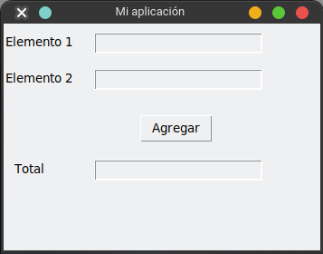
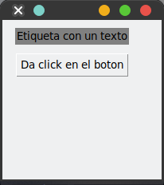

# Manejador `Place`

Este manejador de geometría permite ubicar widgets indicando su posición exacta (`x` e `y`) respecto a su contenedor padre.

> Este manager de geometría es muy versátil y flexible para ir posicionando los elementos de manera libre.

## Sintaxis

```python
widget.place( place_options... )
```
Los argumentos que puede recibe la función `place` son:

- `anchor`: El lugar exacto donde se va a posicionar el widget, las opciones que puede recibir son:- `NW`: `northwest`, arriaba a la izquierda
  - `N`: `North`: Norte, arriba
  - `NE`: arriaba a la derecha
  - `W`: A la derecha
  - `CENTER`: Centrado horizontalmente y verticalmente
  - `E`: Derecha
  - `SW`: Abajo a la izquierda
  - `S`: Abajo
  - `SE`: Abajo a la derecha
  - 
- `bordermode`: Modo del border del widget, por default es `INSIDE`, el otro valor puede ser `OUTSIDE`.

## Posicionamiento absoluto 

- `x`: Offset (desplazamiento) en **eje x**, en pixels.
- `y`: Offset (desplazamiento) en **eje y**, en pixels.
- `width`: Ancho del widget en pixels.
- `height`: Alto del widget en pixels.

> Todas estos valores son en pixels.

## Posicionamiento relativo

Todas estas propiedades son con respecto a las dimensiones del widget padre.

- `relx`: Offset en `horizontal` con respecto al padre, en proporción, los valores van de `0.0` (**0%**) hasta `1.0` (**100%**)
- `rely`: Offset en `vertical` con respecto al padre, en proporción, los valores van de `0.0` (**0%**) hasta `1.0` (**100%**)
- `relwidth`: Ancho del widget en proporción al padre,  los valores van de `0.0` (**0%**) hasta `1.0` (**100%**).
- `relheight`: Alto del widget en proporción al padre,  los valores van de `0.0` (**0%**) hasta `1.0` (**100%**).

> Se pueden combinar todos los parámetros, es decir, puede contener un parámetros relativo y el otro parámetro absoluto.

## Ejemplos

```python
from tkinter import Tk, Label, Entry, Button

root = Tk()
root.title ("Mi aplicación")

L1 = Label(root, text = "Elemento 1")
L1.place(x = 0,y = 10)
E1 = Entry(root)
E1.place(x = 100,y = 10)

L2 = Label(root,text = "Elemento 2")
L2.place(x = 0,y = 50)
E2 = Entry(root)
E2.place(x = 100,y = 50)

L3 = Label(root,text = "Total")
L3.place(x = 10,y = 150)
E3 = Entry(root)
E3.place(x = 100,y = 150)

B = Button(root, text = "Agregar")
B.place(x = 150, y = 100)

root.geometry("350x250")
root.mainloop()
```




```python
from tkinter import *

root = Tk()
root.geometry("200x200")

etiqueta = Label(root, text="Etiqueta con un texto", background="gray")

position_x = 16 # le doy un espaciado (margen) izquierdo de 16px

position_y = 10  # le doy un espaciado (margen) superior de 10px

etiqueta.place(x=position_x, y=position_y )

boton = Button(text="Da click en el boton")

boton_width = etiqueta.winfo_reqwidth() # quiero que el boton tenga el mismo ancho que el contenido de la etiqueta
boton_position_y = position_y + etiqueta.winfo_reqheight() + 10 # sumo el alto de la etiqueta, con el margen que tiene la misma, mas 10px de separación entre la etiqueta y el boton

boton.place(x=position_x, y=boton_position_y, width=boton_width)

mainloop()

```



## Referencias:

- https://www.tutorialspoint.com/python3/tk_place.htm