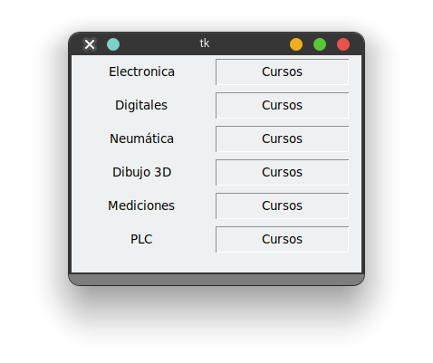
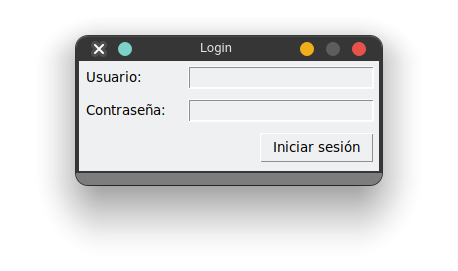

# Manejador `Grid`

Este manejador de geometría es una especie de **tabla** o **rejilla** donde se irán colocando los elementos dentro del contenedor padre. 


Podemos ajustar cuantos secciones (celdas) abarcará un widget


## Sintaxis

```python
widget.grid( **grid_options... )
```
Los argumentos que puede recibe la función `grid` son:

- `column`: La columna donde se colocara el widget, por default es 0.
- `row`: Los renglones que ocupara el widget, por default es el primer renglón que este vació.
- `columnspan`: Cuantas columnas va a ocupar el widget, por default es 1.
- `rowspan`: La cantidad de renglones que va a ocupar el widget; por default es 1.
- `padx`/`pady`: Margen en `x` y `y`. Es la distancia entre widget y widget. Padding externo.
- `padx`/`ipady`: Padding en `x` y `y`. Es la distancia entre el contenido y la pared del widget. Padding interno.
- `sticky`: Por si necesitas que el widget abarque mas de una celda. By default, with sticky='', widget is centered in its cell. sticky may be the string concatenation of zero or more of N, E, S, W, NE, NW, SE, and SW, compass directions indicating the sides and corners of the cell to which widget sticks.
- `rowconfigure`:  con el parámetro **`weight=1`** indicamos que la fila se expanden o contrae
- `columnconfigure`: con el parámetro **`weight=1`** indicamos que la columna se expanden o contrae


## Ejemplos

```python
from tkinter import Tk, Label, RIDGE

root = Tk()
root.geometry("320x240")

courses = ['Electronica','Digitales','Neumática','Dibujo 3D','Mediciones','PLC'] 
r = 'Cursos' 


for i, c in enumerate(courses):
    Label(root,text=c, width=15).grid(column=0, row=i, ipadx=4, ipady=4, padx=4, pady=4)
    Label(root,text=r, relief=RIDGE, width=15).grid(column=1, row=i, ipadx=4, ipady=4, padx=4, pady=4)

root.mainloop()
``` 



Se tiene le diseño que se quiere obtener:


```python
from tkinter import Tk, Label, Entry, Button, W, E

# root window
root = Tk()
root.geometry("300x110")
root.title('Login')
root.resizable(0, 0) # se evita que se pueda cambiar el tamaño de la ventana

# se configura el grid, cada columna con un peso distinto para que midan en proporcion, se definen 2 columnas
root.columnconfigure(0, weight=1)
root.columnconfigure(1, weight=3)
# en total seria 4, es decir, el de peso de 1 tendria un 1/4 y el de 3 tendria 3/4 del espacio


# usuario
username_label = Label(root, text="Usuario:")
username_label.grid(column=0, row=0, sticky=W, padx=5, pady=5)

username_entry = Entry(root)
username_entry.grid(column=1, row=0, sticky=E, padx=5, pady=5)

# contraseña
password_label = Label(root, text="Contraseña:")
password_label.grid(column=0, row=1, sticky=W, padx=5, pady=5)

password_entry = Entry(root,  show="*")
password_entry.grid(column=1, row=1, sticky=E, padx=5, pady=5)

# boton de iniciar sesión
login_button = Button(root, text="Iniciar sesión")
login_button.grid(column=1, row=3, sticky=E, padx=5, pady=5)


root.mainloop()
```



### Referencias

https://pythonguides.com/python-tkinter-grid/
https://www.pythontutorial.net/tkinter/tkinter-grid/