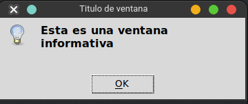
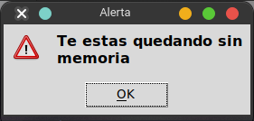
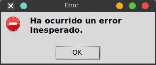
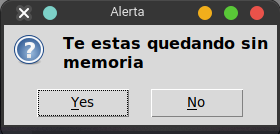
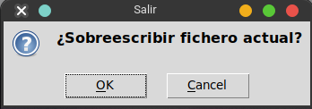
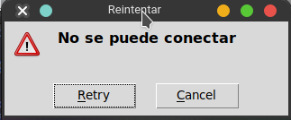

# Ventanas de Diálogo - Message box

Las ventanas emergentes, ventanas de diálogo o simplemente Pop Ups, son ventanas que te ayudan a guiar al usuario o para indicarle ciertas situaciones, tenemos varias opciones que vienen integradas en el paquete.

- `ShowInfo`: Ventana genérica para mostrar un aviso
- `ShowWarning`: Ventana para mostrar warnings
- `ShowError`: Ventana para mostrar errores.
- `AskQuestion`: Ventana para preguntar y tener una respuesta `si` o `no`
- `AskOkCancel`: Ventana para obtener la respuesta `ok` o `cancelar`
- `AskRetryCancel`: Ventana para obtener `reintento` o `cancelar`

No se puede crear una ventana sin que antes exista una ventana `Tk`.

## Show Info

```python
from tkinter import messagebox

messagebox.showinfo("Titulo de ventana",
                        "Esta es una ventana informativa")
```


## Show Warning

```python
from tkinter import messagebox

messagebox.showwarning("Alerta",
                        "Te estas quedando sin memoria")
```


## Show Error

```python
from tkinter import messagebox

messagebox.showerror("Error",
                        "Ha ocurrido un error inesperado.")
```


## Ask Question

```python
from tkinter import messagebox

messagebox.askquestion("Descarga",
                        "Cancelar descarga?")
```



## Ask Ok Cancel

```python
from tkinter import messagebox

messagebox.askokcancel("Salir",
                        "¿Sobreescribir fichero actual?")
```


## Ask Retry Cancel

```python
from tkinter import messagebox

messagebox.askretrycancel("Reintentar",
                            "No se puede conectar")
```


## Referencias

- https://docs.hektorprofe.net/python/interfaces-graficas-con-tkinter/dialogs-dialogos/
