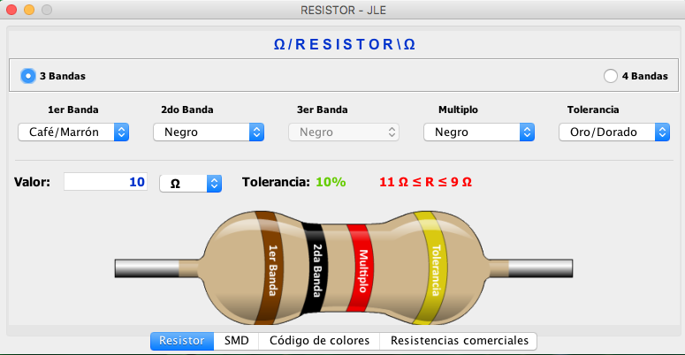
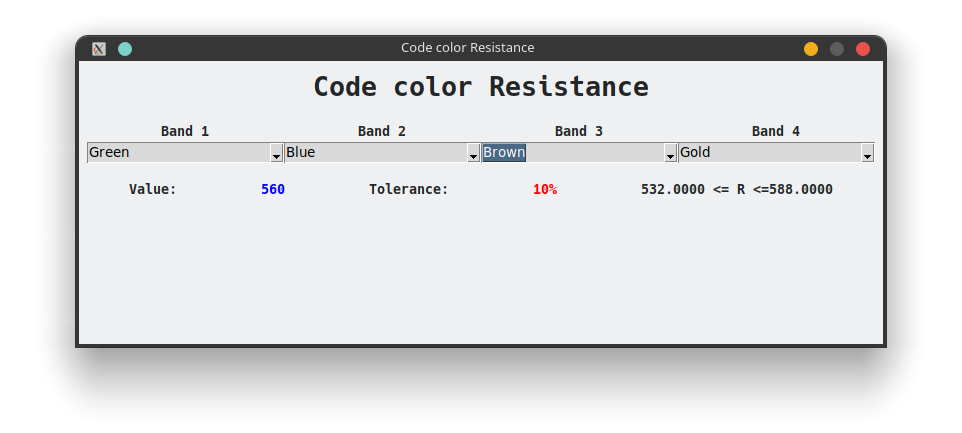
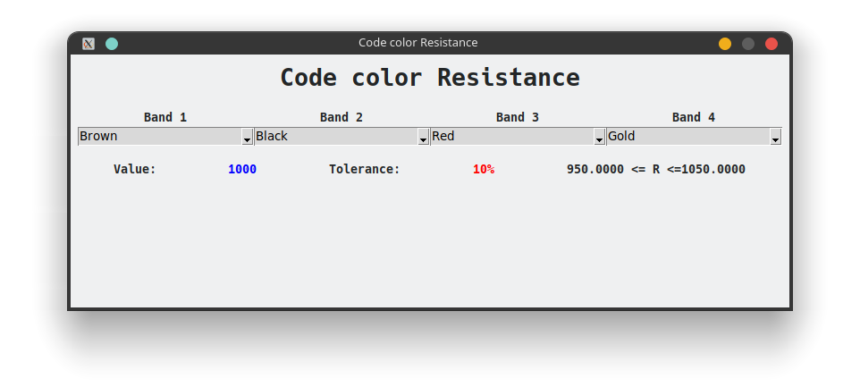

# Aplicación de código de colores

Vamos a realizar, solo con las funcionalidades básicas que se marcan:

Características:

- Calculo para resistencias de 4 bandas
- Debe indicar el valor resistivo correspondiente
- Indicar el valor de la tolerancia
- Debe indicar el valor que seria con su maxima y minima tolerancia




## Analizando la interfaz

Vamos a marcar las secciones que tenemos en nuestra propuesta de aplicación, podemos notar las secciones con las que esta construida la aplicación, recordemos que esta imagen es solo una guía para construir de nuevo la ui. 

En esta ocasión vamos a aplicar diferente geometry managers para construir nuestra app.


## Estructura del proyecto

```
├── assets
│   └── resistencia.png
├── gui.py
├── __init__.py
├── main.py
└── ohm_color.py
```

## Desarrollo

### Librería o Módulo

El siguiente código realiza el calculo del valor de resistencia basándose en las bandas ya sea por el color o el numero.

```python
"""Module for calculate the value of resistance taking the number of band
    
    Example:
    valor = get_value(band_1_num=2, band_2_num=2, multiplier_num=6)
    print(valor)
    print(get_range_tolerance(valor, "gold"))

    print("======================")
    valor = get_value(band_1_name="red", band_2_name="red", multiplier_name="silver")
    print(valor)
"""


def get_tolerance(**value: str) -> dict:
    """Return a dict with the information about tolerance from resistace

    Returns:
        dict: all information about the tolerance: color, percentage and number
    """
    tolerances = [
        {"color": "brown", "percentage": 1, "number": 1},
        {"color": "red", "percentage": 2, "number": 2},
        {"color": "green", "percentage": 0.5, "number": 5},
        {"color": "blue", "percentage": 0.25, "number": 6},
        {"color": "violet", "percentage": 0.1, "number": 7},
        {"color": "gray", "percentage": 0.05, "number": 8},
        {"color": "gold", "percentage": 5, "number": 10},
        {"color": "silver", "percentage": 10, "number": 11},
    ]

    if value.get("color"):
        for tolerance in tolerances:
            if tolerance.get("color") == value.get("color"):
                return tolerance

    if value.get("number"):
        for tolerance in tolerances:
            if tolerance.get("number") == value.get("number"):
                return tolerance

    return None


def get_band(**value) -> dict:
    """Generate a dict with all information of color band

    Returns:
        dict: Return a dict with color, number and multiplier of color
    """
    bands = [
        {"color": "black", "number": 0, "multiplier": 1},
        {"color": "brown", "number": 1, "multiplier": 10},
        {"color": "red", "number": 2, "multiplier": 100},
        {"color": "orange", "number": 3, "multiplier": 1000},
        {"color": "yellow", "number": 4, "multiplier": 10000},
        {"color": "green", "number": 5, "multiplier": 100000},
        {"color": "blue", "number": 6, "multiplier": 1000000},
        {"color": "violet", "number": 7, "multiplier": 10000000},
        {"color": "gray", "number": 8, "multiplier": 0},
        {"color": "white", "number": 9, "multiplier": 0},
        {"color": "gold", "number": 10, "multiplier": 0.1},
        {"color": "silver", "number": 11, "multiplier": 0.01},
    ]

    if value.get("color"):
        for band in bands:
            if band.get("color") == value.get("color"):
                return band

    if value.get("number") >= 0 and value.get("number") <= 11:
        for band in bands:
            if band.get("number") == value.get("number"):
                return band

    return None


def get_value(
    band_1_num=-1,
    band_2_num=-1,
    multiplier_num=-1,
    band_1_name="",
    band_2_name="",
    multiplier_name="",
) -> float:
    """Get the value of the resistance, taking the value of each band and multiplier

    Args:
        band_1_num (int, optional):  Band one with number. Defaults to -1.
        band_2_num (int, optional): Band two with number. Defaults to -1.
        multiplier_num (int, optional): Band tree or multiplier with number. Defaults to -1.
        band_1_name (str, optional): Band one with name. Defaults to "".
        band_2_name (str, optional): Band two with name. Defaults to "".
        multiplier_name (str, optional): Band tree or multiplier with name. Defaults to "".

    Returns:
        float: Value of resistance
    """
    if band_1_num > -1 and band_2_num > -1 and multiplier_num > -1:
        value_1 = get_band(number=band_1_num)["number"]
        value_2 = get_band(number=band_2_num)["number"]
        multiplier = get_band(number=multiplier_num)["multiplier"]

        value_base = int(f"{value_1}{value_2}")
        return value_base * multiplier

    elif band_1_name and band_2_name and multiplier_name:
        value_1 = get_band(color=band_1_name)["number"]
        value_2 = get_band(color=band_2_name)["number"]
        multiplier = get_band(color=multiplier_name)["multiplier"]

        value_base = int(f"{value_1}{value_2}")
        return value_base * multiplier

    return None


def get_range_tolerance(value: float, tolerance: str):
    """Get two values of tolerance, value down and up

    Args:
        value (float): Value of resistance
        tolerance (str): name of color from tolerance

    Returns:
        tuple: first value from down, second value from up of range
    """
    value_tolerance = get_tolerance(color=tolerance)["percentage"]

    value_down = value - ((value * value_tolerance) / 100)
    value_up = value + ((value * value_tolerance) / 100)
    return (value_down, value_up)
```

### GUI

El siguiente código corresponde exclusivamente a la interfaz, sin interacción. Hay algunos valores que irán cambiando, solo se colocaron para referencia.

```python
from tkinter import *
from tkinter.ttk import Combobox
from tkinter import messagebox # import all widgets from module tkinter

def build_gui():
    """Function to build all widgets and position

    Returns:
        Tk: Return the main window
    """    
    root = Tk()
    root.title("Code color Resistance")
    root.resizable(0,0)
    
    Label(root, text="Code color Resistance", font=("Hack", 20)).pack(expand=True, fill=BOTH, padx=8, pady=8)
    
    container_bands = Frame(root)
    Label(container_bands, text="Band 1").grid(row=0, column=0)
    band_1 = Combobox(container_bands, values=("Cafe","Rojo"), state="readonly").grid(row=1, column=0)
    Label(container_bands, text="Band 2").grid(row=0, column=1)
    band_2 = Combobox(container_bands, values=("Naranja","Morado"), state="readonly").grid(row=1, column=1)
    Label(container_bands, text="Band 3").grid(row=0, column=2)
    band_3 = Combobox(container_bands, values=("Azul","Amarillo"), state="readonly").grid(row=1, column=2)
    Label(container_bands, text="Band 4").grid(row=0, column=3)
    band_4 = Combobox(container_bands, values=("Blanco","Gris"), state="readonly").grid(row=1, column=3)
        
    container_bands.pack(expand=True, fill=BOTH,padx=8, pady=8)
    
    container_result = Frame(root)
    Label(container_result, text="Value:").pack(expand=True, side=LEFT)
    label_result = Label(container_result, text="10 ohms")
    label_result.pack(side=LEFT, expand=True)
    
    Label(container_result, text="Tolerance:").pack(side=LEFT, expand=True)
    label_tolerance = Label(container_result, text="10%")
    label_tolerance.pack(expand=True, side=LEFT)
    
    label_range = Label(container_result, text="11 <= R <= 20")
    label_range.pack(expand=True, side=LEFT)
    
    container_result.pack(expand=True, fill=BOTH, padx=8, pady=8)
    
    img = PhotoImage(file="assets/resistencia.png")
    Label(root, image=img).pack()
       
    return root
    

def init_app():
    """Function main to invoke the build guid
    """
    build_gui().mainloop()
```


### App Final 

Ahora vamos a hacer las modificaciones pertinentes para que la aplicación realice sus funciones

```python
# import all widgets from module tkinter
from tkinter import *
from tkinter.ttk import Combobox
from tkinter import messagebox

# All importation from the module to calculate the value of resistance
from ohm_color import (
    get_value as get_value_resistance,
    get_range_tolerance,
    get_tolerance,
)

"""Data for the first combo box, band one
    """
colors_band1 = (
    "Black",
    "Brown",
    "Red",
    "Orange",
    "Yellow",
    "Green",
    "Blue",
    "Violet",
    "Gray",
    "White",
)

"""Data for the second combo box, band two
    """
colors_band2 = (
    "Black",
    "Brown",
    "Red",
    "Orange",
    "Yellow",
    "Green",
    "Blue",
    "Violet",
    "Gray",
    "White",
)

"""Data for the third combo box, band three
    """
multiplier_band = (
    "Black",
    "Brown",
    "Red",
    "Orange",
    "Yellow",
    "Green",
    "Blue",
    "Violet",
    "Gray",
    "White",
    "Gold",
    "Silver",
)

"""Data for the fourth combo box, band four
    """
tolerances = ("Brown", "Red", "Green", "Blue", "Violet", "Gray", "Gold", "Silver")


def create_range_str(down=0.0, up=0.0):
    """Generate the str with format for the range of error from resistance

    Args:
        down (float, optional): Value down for range. Defaults to 0.0.
        up (float, optional): Value raise for range. Defaults to 0.0.

    Returns:
        str: String for label range
    """

    return "{0:1.4f}Ω <= R <={1:1.4f}Ω".format(down, up)


def calculate_to_ui():
    """Update all widgets in the UI"""
    print(band_1_str.get().lower())
    print(band_2_str.get().lower())
    print(band_multiplier_str.get().lower())
    print(band_tolerance_str.get().lower())

    value_ohm = get_value_resistance(
        band_1_name=band_1_str.get().lower(),
        band_2_name=band_2_str.get().lower(),
        multiplier_name=band_multiplier_str.get().lower(),
    )

    result_str.set(f"{value_ohm}Ω")

    color_tolerance = band_tolerance_str.get().lower()
    range_down, range_up = get_range_tolerance(value_ohm, color_tolerance)

    range_str.set(create_range_str(range_down, range_up))

    percentage = get_tolerance(color=color_tolerance)["percentage"]
    tolerance_str.set(f"{percentage}%")


def event_change_band(ev):
    """Function to trigger when some combo box change the value

    Args:
        ev (event): Nothing
    """
    calculate_to_ui()


def build_gui():
    """Function to build all widgets and position

    Returns:
        Tk: Return the main window
    """
    root = Tk()
    root.title("Code color Resistance")
    root.resizable(0, 0)

    Label(root, text="Code color Resistance", font=("Hack", 20, "bold")).pack(
        expand=True, fill=BOTH, padx=8, pady=8
    )

    container_bands = Frame(root)

    Label(container_bands, text="Band 1", font=("Hack", 10, "bold")).grid(
        row=0, column=0
    )

    global band_1_str
    band_1_str = StringVar()

    band_1 = Combobox(
        container_bands, values=colors_band1, state="readonly", textvariable=band_1_str
    )
    band_1.grid(row=1, column=0)
    band_1.current(1)

    band_1.bind("<<ComboboxSelected>>", event_change_band)

    Label(container_bands, text="Band 2", font=("Hack", 10, "bold")).grid(
        row=0, column=1
    )
    global band_2_str
    band_2_str = StringVar()
    band_2 = Combobox(
        container_bands, values=colors_band2, state="readonly", textvariable=band_2_str
    )
    band_2.grid(row=1, column=1)
    band_2.current(0)

    band_2.bind("<<ComboboxSelected>>", event_change_band)

    Label(container_bands, text="Band 3", font=("Hack", 10, "bold")).grid(
        row=0, column=2
    )
    global band_multiplier_str
    band_multiplier_str = StringVar()
    band_3 = Combobox(
        container_bands,
        values=multiplier_band,
        state="readonly",
        textvariable=band_multiplier_str,
    )
    band_3.grid(row=1, column=2)
    band_3.current(2)
    band_3.bind("<<ComboboxSelected>>", event_change_band)

    Label(container_bands, text="Band 4", font=("Hack", 10, "bold")).grid(
        row=0, column=3
    )
    global band_tolerance_str
    band_tolerance_str = StringVar()
    band_4 = Combobox(
        container_bands,
        values=tolerances,
        state="readonly",
        textvariable=band_tolerance_str,
    )
    band_4.grid(row=1, column=3)
    band_4.current(6)
    band_4.bind("<<ComboboxSelected>>", event_change_band)

    container_bands.pack(expand=True, fill=BOTH, padx=8, pady=8)

    container_result = Frame(root)
    Label(container_result, text="Value:", font=("Hack", 10, "bold")).pack(
        expand=True, side=LEFT
    )

    global result_str
    result_str = StringVar()

    label_result = Label(
        container_result, font=("Hack", 10, "bold"), fg="blue", textvariable=result_str
    )
    label_result.pack(side=LEFT, expand=True)

    Label(container_result, text="Tolerance:", font=("Hack", 10, "bold")).pack(
        side=LEFT, expand=True
    )

    global tolerance_str
    tolerance_str = StringVar()

    Label(
        container_result,
        textvariable=tolerance_str,
        font=("Hack", 10, "bold"),
        fg="red",
    ).pack(expand=True, side=LEFT)

    global range_str
    range_str = StringVar()

    label_range = Label(
        container_result, textvariable=range_str, font=("Hack", 10, "bold")
    )
    label_range.pack(expand=True, side=LEFT)

    container_result.pack(expand=True, fill=BOTH, padx=8, pady=8)

    img = PhotoImage(
        file="assets/resistencia.png"
    )
    Label(root, image=img).pack()

    calculate_to_ui()

    return root


def init_app():
    """Function main to invoke the build gui"""
    build_gui().mainloop()


if __name__ == "__main__":
    """Function to the the app"""
    init_app()
```




> Nota: En teoría carga la imagen de la resistencia, puede ser un bug de tkinter

Descargar archivos:

- [generator](ohm_color.py)
- [gui](gui.py)
- [main](main.py)
