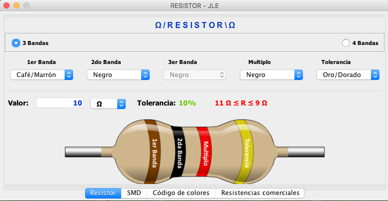

# Practicas
Ahora vamos a poner en practica las bases para la generación de aplicaciones

La estructura que vamos a manejar para los proyectos es la siguiente:

```
└── carpeta_proyecto
    ├── assets
    ├── gui.py
    ├── __init__.py
    ├── main.py
    └── librería.py
```

- `carpeta_proyecto`: contendrá todos los archivos de nuestro proyecto
- `assets`: Es la carpeta que contendrá todo lo multimedia, es decir, imágenes, sonidos, etc. No siempre sera necesaria.
- `gui.py`: Sera el código de la interfaz gráfica
- `__init__.py`: SIEMPRE hay que ponerlo (no se abarcara el motivo)
- `main.py`: Archivo donde probaremos la librería que hagamos
- `librería.py`: Es el archivo que tiene la lógica de lo que deb realizar el proyecto

Como medidas vamos a tomar una ==separación base de **8px**==, todo sera en función de `8px` o ya mínimo `4px`.

## Generador de contraseñas seguras

[](./password_generator)

## Ley de Ohm


## Convertidor de Temp


## Capacitor 


## Código de colores de Resistencia



