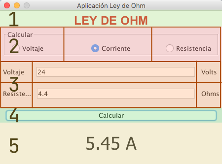

# Ley de Ohm

Debemos desarrollar una aplicación como esta, la que se muestra fue desarrollada con JAVA, pero ahora debe ser hecha con Python

Realizar una aplicación para la creación de una contraseña segura, con los siguientes solicitudes:

- Aplicación que realice todas las operaciones básica de ley de ohm
- En caso de introducir algún dato erróneo, mandar un mensaje de error
- Replicar la interfaz que se muestra
   
La aplicación debe ser muy parecida a la que se muestra:


## Analizando la interfaz

Tenemos 5 secciones en la interfaz, podemos aplicar con pack, porque se irán apilando todas las secciones:




La sección 2 y 3  podemos aplicar aplicar pack dentro de un frame.

## Estructura

```
├── law_ohm.py
├── gui.py
├── index.md
├── __init__.py
└── main.py
```
## Desarrollo

### Librería o Módulo

Tenemos el modulo que hace el calculo de todas las funciones ley de ohm.

```python
"""Module to calculate all functions to ohm law
    """

def current(volt=0.0,resistance=0.0 )-> float:
    """The function calculate the current from ohm law

    Args:
        volt (float, optional): Value of volts. Defaults to 0.0.
        resistance (float, optional): Value of resistance. Defaults to 0.0.

    Returns:
        float: the value of current
    """    
    return volt / resistance

def resistance(volt=0.0, current=0.0)-> float:
    """The function calculate the resistance from ohm law

    Args:
        volt (float, optional): Value of resistance. Defaults to 0.0.
        current (float, optional): Value of current. Defaults to 0.0.

    Returns:
        float: _description_
    """    
    return volt/current

def volt(resistance=0.0, current=0.0) -> float:
    """The function calculate the value of volts from ohm law

    Args:
        resistance (float, optional): Value of resistance. Defaults to 0.0.
        current (float, optional): Value of currente. Defaults to 0.0.

    Returns:
        float: _description_
    """    
    return resistance * current

def ohm_law()-> None:
    """Retrun a dict with all functions from ohm law

    Returns:
        dict: Functions of ohm law
    """    
    return {
        "volt":volt,
        "resistance": resistance,
        "current": current
    }
```

### GUI

Descargar archivos:

- [generator](law_ohm.py)
- [gui](gui.py)
- [main](main.py)