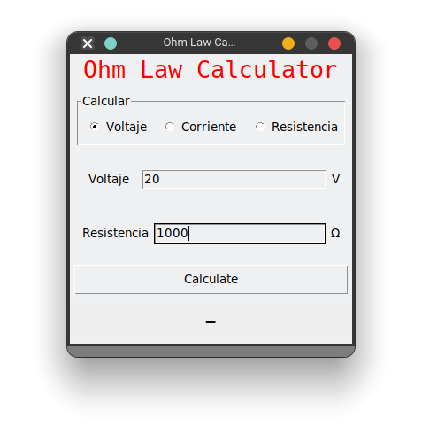
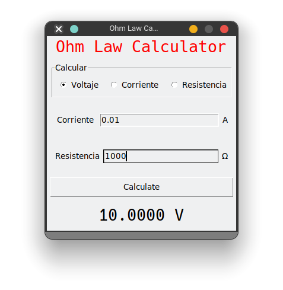
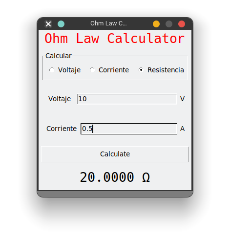
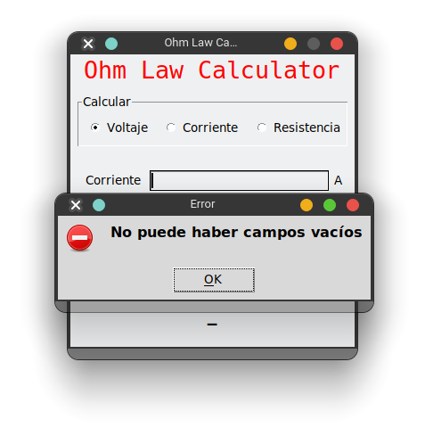

# Ley de Ohm

Debemos desarrollar una aplicación como esta, la que se muestra fue desarrollada con JAVA, pero ahora debe ser hecha con Python

Realizar una aplicación para la creación de una contraseña segura, con los siguientes solicitudes:

- Aplicación que realice todas las operaciones básica de ley de ohm
- En caso de introducir algún dato erróneo, mandar un mensaje de error
- Replicar la interfaz que se muestra
   
La aplicación debe ser muy parecida a la que se muestra:


## Analizando la interfaz

Tenemos 5 secciones en la interfaz, podemos aplicar con pack, porque se irán apilando todas las secciones:


La sección 2 y 3  podemos aplicar aplicar pack dentro de un frame.

## Estructura

```
├── law_ohm.py
├── gui.py
├── index.md
├── __init__.py
└── main.py
```
## Desarrollo

### Librería o Módulo

Tenemos el modulo que hace el calculo de todas las funciones ley de ohm.

```python
"""Module to calculate all functions to ohm law
    """

def current(volt=0.0,resistance=0.0 )-> float:
    """The function calculate the current from ohm law

    Args:
        volt (float, optional): Value of volts. Defaults to 0.0.
        resistance (float, optional): Value of resistance. Defaults to 0.0.

    Returns:
        float: the value of current
    """    
    return volt / resistance

def resistance(volt=0.0, current=0.0)-> float:
    """The function calculate the resistance from ohm law

    Args:
        volt (float, optional): Value of resistance. Defaults to 0.0.
        current (float, optional): Value of current. Defaults to 0.0.

    Returns:
        float: _description_
    """    
    return volt/current

def volt(resistance=0.0, current=0.0) -> float:
    """The function calculate the value of volts from ohm law

    Args:
        resistance (float, optional): Value of resistance. Defaults to 0.0.
        current (float, optional): Value of currente. Defaults to 0.0.

    Returns:
        float: _description_
    """    
    return resistance * current

def ohm_law()-> None:
    """Retrun a dict with all functions from ohm law

    Returns:
        dict: Functions of ohm law
    """    
    return {
        "volt":volt,
        "resistance": resistance,
        "current": current
    }
```

### GUI

El siguiente código corresponde exclusivamente a la interfaz, sin interacción

```python
from tkinter import *

menu_list = ["Voltaje", "Corriente", "Resistencia"]
unit_list = ["V", "A", "Ω"]


def build_gui():
    root = Tk()
    root.title("Ohm Law Calculator")
    root.resizable(0, 0)

    Label(root, text="Ohm Law Calculator", font=("Hack", 20), fg="red").pack(
        expand=True, fill=BOTH
    )

    container_options = LabelFrame(root, text="Calcular", bd=1, relief="sunken")
    container_options.pack(expand=True, fill=BOTH, padx=8, pady=8, ipadx=8, ipady=8)

    option_selected = IntVar()
    option_selected.set(1)

    option_volt = Radiobutton(
        container_options, text=menu_list[0], variable=option_selected, value=1
    )
    option_volt.pack(side=LEFT, expand=True, fill=BOTH)
    option_volt.select()
    option_current = Radiobutton(
        container_options, text=menu_list[1], variable=option_selected, value=2
    )
    option_current.pack(side=LEFT, expand=True, fill=BOTH)
    option_resistance = Radiobutton(
        container_options, text=menu_list[2], variable=option_selected, value=3
    )
    option_resistance.pack(side=LEFT, expand=True, fill=BOTH)

    container_input_one = Frame(root)
    container_input_one.pack(expand=True, fill=BOTH, padx=8, pady=8, ipadx=8, ipady=8)
    label_one_line = Label(container_input_one, text=menu_list[0])
    label_one_line.pack(side=LEFT, expand=True, fill=X)
    input_one_line = Entry(container_input_one)
    input_one_line.pack(side=LEFT, expand=True, fill=X)
    unit_one_line = Label(container_input_one, text=unit_list[0])
    unit_one_line.pack(side=LEFT, ipadx=4, ipady=4)

    container_input_two = Frame(root)
    container_input_two.pack(expand=True, fill=BOTH, padx=8, pady=8, ipadx=8, ipady=8)
    label_two_line = Label(container_input_two, text=menu_list[2])
    label_two_line.pack(side=LEFT, expand=True, fill=X)
    input_two_line = Entry(container_input_two)
    input_two_line.pack(side=LEFT, expand=True, fill=X)
    unit_two_line = Label(container_input_two, text=unit_list[2])
    unit_two_line.pack(side=LEFT, ipadx=4, ipady=4)

    btn_calculate = Button(root, text="Calculate")
    btn_calculate.pack(expand=True, fill=X, padx=4, pady=4, ipadx=2, ipady=2)

    label_result = Label(root, text="-", font=("Hack", 20), background="#eee")
    label_result.pack(expand=True, fill=BOTH, pady=8)

    return root


def init_app():
    build_gui().mainloop()


if __name__ == "__main__":
    init_app()

```
Este el resultado de la construcción de la gui de la app, aun no implementamos los elementos necesarios para su funcionamiento.




### App Final 

Ahora vamos a hacer las modificaciones pertinentes para que la aplicación realice sus funciones

```python
from tkinter import *
from tkinter import messagebox

from uritemplate import variables
import law_ohm

VOLT_OPTION = 0
CURRENT_OPTION = 1
RESISTANCE_OPTION = 2

menu_list = ["Voltaje", "Corriente", "Resistencia"]
unit_list = ["V", "A", "Ω"]

def change_ui():
    option = option_selected.get()
    if option == VOLT_OPTION:
        label_str_one.set(menu_list[CURRENT_OPTION])
        label_unit_one.set(unit_list[CURRENT_OPTION])
        label_str_two.set(menu_list[RESISTANCE_OPTION])
        label_unit_two.set(unit_list[RESISTANCE_OPTION])
    elif option == CURRENT_OPTION:
        label_str_one.set(menu_list[VOLT_OPTION])
        label_unit_one.set(unit_list[VOLT_OPTION])
        label_str_two.set(menu_list[RESISTANCE_OPTION])
        label_unit_two.set(unit_list[RESISTANCE_OPTION])
    elif option == RESISTANCE_OPTION:
        label_str_one.set(menu_list[VOLT_OPTION])
        label_unit_one.set(unit_list[VOLT_OPTION])
        label_str_two.set(menu_list[CURRENT_OPTION])
        label_unit_two.set(unit_list[CURRENT_OPTION])
    

def calculate():
    option = option_selected.get()
    value = 0.0
    
    value_one = value_entry_one.get()
    value_two = value_entry_two.get()
    
    if not len(value_one) or not len(value_two):
        messagebox.showerror("Error", "No puede haber campos vacíos")
        return
    # if  not value_one.isnumeric() or not value_two.isnumeric():
    #     messagebox.showerror("Error", "No puede ser una letra")
    #     return
    
    value_one = float(value_one)
    value_two = float(value_two)
    
    if option == VOLT_OPTION:
        value = law_ohm.volt(value_one,value_two)
    elif option == CURRENT_OPTION:
        value = law_ohm.current(value_one,value_two)
    elif option == RESISTANCE_OPTION:
        value = law_ohm.resistance(value_one,value_two)
        
    value = "{0:1.4f} {1}".format(value, unit_list[option])
    value_label_result.set(value)

def build_gui():
    """Function to build de the gui of app

    Returns:
        Tk: Main windows from app
    """    
    root = Tk()
    root.title("Ohm Law Calculator")
    root.resizable(0, 0)

    Label(root, text="Ohm Law Calculator", font=("Hack", 20), fg="red").pack(
        expand=True, fill=BOTH
    )

    container_options = LabelFrame(root, text="Calcular", bd=1, relief=SUNKEN)
    container_options.pack(expand=True, fill=BOTH, padx=8, pady=8, ipadx=8, ipady=8)

    global option_selected
    option_selected = IntVar()
    option_selected.set(VOLT_OPTION)

    option_volt = Radiobutton(
        container_options, text=menu_list[VOLT_OPTION], variable=option_selected, value=VOLT_OPTION, command=change_ui
    )
    option_volt.pack(side=LEFT, expand=True, fill=BOTH)
    option_volt.select()
    option_current = Radiobutton(
        container_options, text=menu_list[CURRENT_OPTION], variable=option_selected, value=CURRENT_OPTION, command=change_ui
    )
    option_current.pack(side=LEFT, expand=True, fill=BOTH)
    option_resistance = Radiobutton(
        container_options, text=menu_list[RESISTANCE_OPTION], variable=option_selected, value=RESISTANCE_OPTION, command=change_ui
    )
    option_resistance.pack(side=LEFT, expand=True, fill=BOTH)

    global label_str_one
    label_str_one= StringVar()
    label_str_one.set(menu_list[CURRENT_OPTION])
    global label_unit_one
    label_unit_one= StringVar()
    label_unit_one.set(unit_list[CURRENT_OPTION])
    
    global value_entry_one
    value_entry_one = StringVar()
    value_entry_one.set("0.0") 
   
    container_input_one = Frame(root)
    container_input_one.pack(expand=True, fill=BOTH, padx=8, pady=8, ipadx=8, ipady=8)
    label_one_line = Label(container_input_one, textvariable=label_str_one)
    label_one_line.pack(side=LEFT, expand=True, fill=X)
    input_one_line = Entry(container_input_one, textvariable=value_entry_one)
    input_one_line.pack(side=LEFT, expand=True, fill=X)
    unit_one_line = Label(container_input_one, textvariable=label_unit_one)
    unit_one_line.pack(side=LEFT, ipadx=4, ipady=4)

    global label_str_two
    label_str_two= StringVar()
    label_str_two.set(menu_list[RESISTANCE_OPTION])
    global label_unit_two
    label_unit_two= StringVar()
    label_unit_two.set(unit_list[RESISTANCE_OPTION])
    global value_entry_two
    value_entry_two = StringVar()
    value_entry_two.set("0.0") 
    container_input_two = Frame(root)
    container_input_two.pack(expand=True, fill=BOTH, padx=8, pady=8, ipadx=8, ipady=8)
    label_two_line = Label(container_input_two, textvariable=label_str_two)
    label_two_line.pack(side=LEFT, expand=True, fill=X)
    input_two_line = Entry(container_input_two,textvariable=value_entry_two)
    input_two_line.pack(side=LEFT, expand=True, fill=X)
    unit_two_line = Label(container_input_two, textvariable=label_unit_two)
    unit_two_line.pack(side=LEFT, ipadx=4, ipady=4)

    btn_calculate = Button(root, text="Calculate", command=calculate)
    btn_calculate.pack(expand=True, fill=X, padx=4, pady=4, ipadx=2, ipady=2)

    global value_label_result
    value_label_result=StringVar()
    value_label_result.set("-")
    label_result = Label(root, font=("Hack", 20), textvariable=value_label_result)
    label_result.pack(expand=True, fill=BOTH, pady=8)

    return root


def init_app():
    """Function to exec the app
    """    
    build_gui().mainloop()


if __name__ == "__main__":
    """function main to exec the app in test
    """    
    init_app()

```





Descargar archivos:

- [generator](law_ohm.py)
- [gui](gui.py)
- [main](main.py)