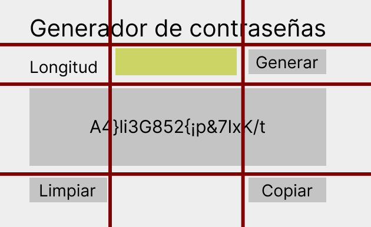
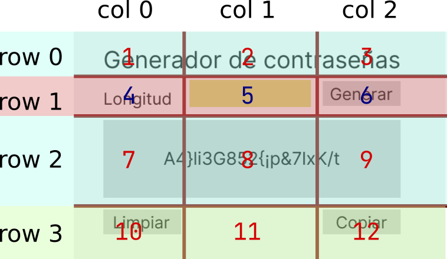
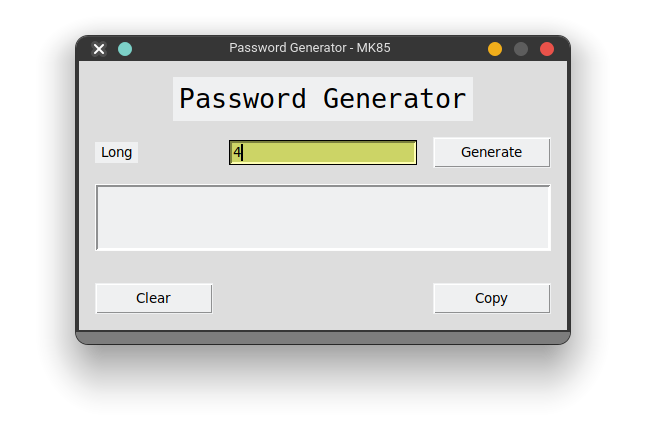
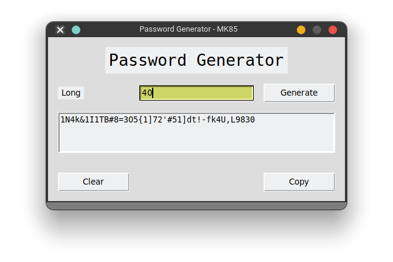

# Generador de contraseñas seguras

Realizar una aplicación para la creación de una contraseña segura, con los siguientes solicitudes:

- Se debe poder ingresar el largo de la contraseña
- Por default debe generar una contraseña de 8 dígitos
- En caso de que no coloquen ninguna cantidad, debe mandar un mensaje de error, indicando que no colocaron la longitud
- En caso de ingresar una letra, indicar un error de que no se pueden ingresar letras.
- Se necesita un botón para limpiar el campo de la contraseña
- Al presionar el botón de generar, se cree la nueva contraseña
- La contraseña se debe desplegar en un `Text`, es decir, un campo de texto
- La contraseña debe tener números, letras mayúsculas, minúsculas y símbolos.
- No se debe poder redimensionar la ventana
- Dbe haber un botón para que la contraseña se copie al portapapeles (este se puede quitar)
   
La aplicación debe ser muy parecida a la que se muestra:


## Analizando la interfaz

Vamos a marcar las secciones que tenemos en nuestra propuesta de aplicación, podemos notar claramente que se forma una grilla con cada elemento repartido en sus renglones y columnas



Ahora que ya tenemos definida la distribución, vamos nombrando cada una y con ello sabremos donde y como colocar cada widget y cada propiedad de la geometría que aplica.



## Estructura

```
├── generator.py
├── gui.py
├── index.md
├── __init__.py
└── main.py
```

## Desarrollo

### Librería o Módulo

El siguiente código genera contraseñas de cualquier longitud indicada

```python
from random import choice

""" Module to generate secure password 
"""

def generate_numbers()-> list:
    """Generate a list of numbers, from 0 to 9

    Returns:
        list: list of numbers from 0 to 9
    """    
    numbers = []
    
    for i in range(0,10):
        numbers.append(str(i))
    
    return numbers

def generate_symbols(length=4)->str():
    password = ""
    symbols = "!\"#$%&/()=?¿¡'`+',.-_}{[]<>"
    
    while len(password) < length:
        password += choice( symbols )
    
    return password

def generate_password_numbers(length=4)-> str:
    """Generate a password with only numbers

    Args:
        length (int, optional): This is the long to be the password. Defaults to 4.

    Returns:
        str: Return the password with only numbers 
    """    
    password = ""
    numbers = generate_numbers()
    while len(password) < length:
        password += choice( numbers )
    
    return password

def generate_password_letters(length=4)-> str:
    """Generare a password with letter lowercase and uppercase

    Args:
        length (int, optional): The long to be the password. Defaults to 4.

    Returns:
        str: A password with only letters
    """    
    password = ""
    letters_low = "abcdefghijklmnopqtstuvwxyz"
    letter_up = letters_low.upper()
    
    while len(password) < length:
        password += choice( letters_low + letter_up )
    
    return password
    
def generate_password(length=4)-> str:
    
    password = ""
    while len(password) < length:
        password += choice( generate_password_letters(1) + generate_password_numbers(1) + generate_symbols(1))

    return password

def main():
    print(generate_password(20))
    
if __name__ == "__main__":
    main()
```

### GUI

El siguiente código corresponde exclusivamente a la interfaz, sin interacción

```python
from tkinter import * # import all widgets from module tkinter

def build_gui():
    """Function to build all widgets and position

    Returns:
        Tk: Return the main window
    """    
    root = Tk()
    root.resizable(0,0)
    root.title("Password Generator - MK85")
    root["background"]="#dddddd"
    
    btn_width = 10
    
    root.columnconfigure(3)
    root.rowconfigure(4)
    
    ## Config the font size and the font
    Label(root, text="Password Generator", font =("Hack", 20)).grid(column=0, row=0, ipadx=4, ipady=4, padx=16, pady=16, columnspan=3)
    
    Label(root, text="Long").grid(row=1, column=0,  sticky=W, ipadx=4, padx=16)
    
    input_long = Entry(root, borderwidth=2)
    input_long.grid(row=1, column=1,sticky=W)
    input_long.focus()
    input_long.insert(END,"4")
    
    btn_generate = Button(root,text="Generate", width=btn_width)
    btn_generate.grid(row=1, column=2, padx=16, sticky=W)
        
    text_password = Text(root, height=3, width=56, borderwidth=2)
    text_password.grid(row=2, column=0, columnspan=3, sticky=W, ipady=4, padx=16, pady=16)
    text_password["state"]=DISABLED
    
    btn_clear = Button(root, text="Clear", width=btn_width)
    btn_clear.grid(row=3, column=0, padx=16, pady=16, sticky=E)
    
    btn_copy = Button(root, text="Copy", width=btn_width)
    btn_copy.grid(row=3, column=2,padx=16, pady=16, sticky=W)
    
    return root
    

def init_app():
    """Function main to invoke the build gui
    """    
    build_gui().mainloop()
    

if __name__ == "__main__":
    init_app()
```

Este el resultado de la construcción de la gui de la app, aun no implementamos los elementos necesarios para su funcionamiento.



### App Final 

Ahora vamos a hacer las modificaciones pertinentes para que la aplicación realice sus funciones

```python
from tkinter import * # import all widgets from module tkinter

from generator import generate_password

def put_password():
    password = generate_password(long.get())
    clear_password()
    text_password.insert(END,password)

def clear_password():
    text_password.delete("1.0",END)

def build_gui():
    """Function to build all widgets and position

    Returns:
        Tk: Return the main window
    """    
    root = Tk()
    root.resizable(0,0)
    root.title("Password Generator - MK85")
    root["background"] = "#dddddd"
    
    btn_width = 10
    
    root.columnconfigure(3)
    root.rowconfigure(4)
    
    ## Config the font size and the font
    Label(root, text="Password Generator", font =("Hack", 20)).grid(column=0, row=0, ipadx=4, ipady=4, padx=16, pady=16, columnspan=3)
    
    Label(root, text="Long").grid(row=1, column=0,  sticky=W, ipadx=4, padx=16)
    
    global long
    long = IntVar()
    long.set(4)
    input_long = Entry(root, borderwidth=2, bg="#ccd466", textvariable=long)
    input_long.grid(row=1, column=1,sticky=W)
    input_long.focus() # al iniciar la app que este activo
    # input_long.insert(END,"4") # coloca el numero 4 en el entry
    
    btn_generate = Button(root,text="Generate", width=btn_width, command=put_password)
    btn_generate.grid(row=1, column=2, padx=16, sticky=W)
    
    global text_password
    text_password = Text(root, height=3, width=56, borderwidth=2)
    text_password.grid(row=2, column=0, columnspan=3, sticky=W, ipady=4, padx=16, pady=16)
    # text_password["state"]=DISABLED
    
    btn_clear = Button(root, text="Clear", width=btn_width, command=clear_password)
    btn_clear.grid(row=3, column=0, padx=16, pady=16, sticky=E)
    
    btn_copy = Button(root, text="Copy", width=btn_width)
    btn_copy.grid(row=3, column=2,padx=16, pady=16, sticky=W)
    
    return root
    

def init_app():
    """Function main to invoke the build gui
    """    
    # print(generate_password(20) )
    build_gui().mainloop()
    

if __name__ == "__main__":
    init_app()
    
# https://realpython.com/python-gui-tkinter/
```


