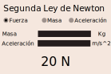
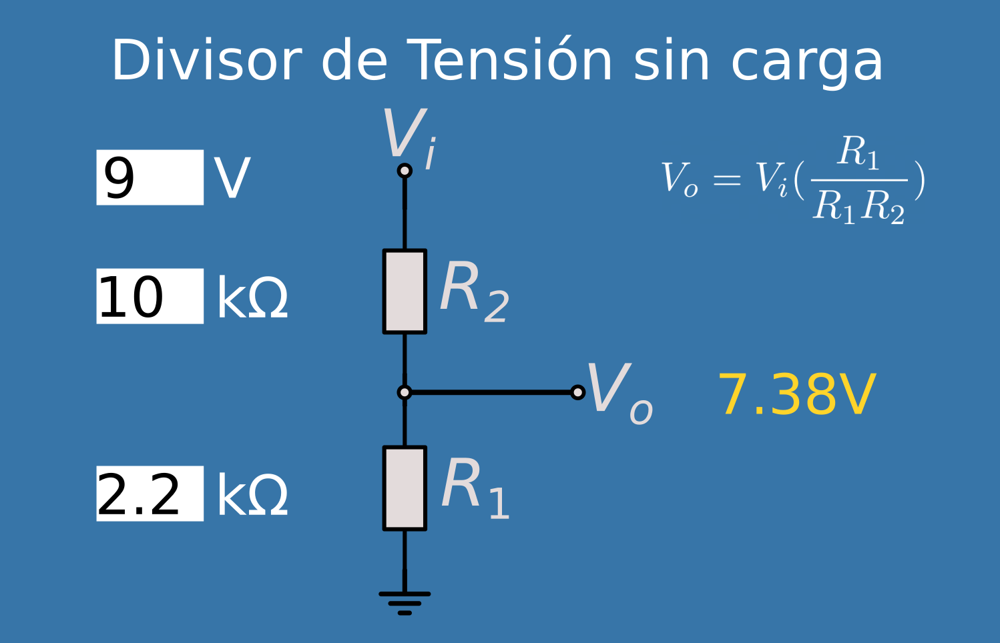

# Prácticas GUI

Los siguientes ejemplos son para practicar, se busca que se parezcan o sean iguales. También le puedes dar tu toque personal, agregando mas características para mejorar las aplicaciones propuestas.

## Convertidor de Temperatura

La intension de esta aplicación es hacer la conversion de temperatura de grados Fahrenheit a grados Celsius, Como se muestra en la imagen.

**Puntos de mejora**, es que se pueda elegir distintas variables de temperatura; es decir, calcular de Celsius a Fahrenheit, o Celsius a Kelvin, etc. Aplicar todos los cambios necesario en la interfaz.

## Capacitor App

Con esta aplicación se busca hacer una calculadora para conocer el valor de los capacitores cerámicos.

**Forma de funcionamiento:**

- Colocar los dígitos que vienen en el cuerpo del capacitor y conocer su valor capacitivo, ejemplo: en el cuerpo viene el valor **103**, pues debe desplegar la aplicación el valor de **0.010uF**
- La unidad por default que debe entregar el valor sera en *microfaradios*
- Se puede elegir en que unidad se quiere conocer el valor; es decir, en *picofaradios*, *microfaradios* y *nanofaradios*, que son las unidades mas comunes de capacitores

Esta interfaz que se muestra es una propuesta, es totalmente libre la creación de la interfaz.

Como información de apoyo te comparto el siguiente sitio [https://www.inventable.eu](https://www.inventable.eu/calculadora-codigos-capacitores/), donde es una calculadora web en la que te puedes apoyar.

Puntos de mejora: Que indique el valor de la tolerancia, es decir, el rango en el que puede variar el capacitor, la tension maxima que soporta el capacitor.

## Segunda Ley Newton ($F=ma$)

Realizar la aplicación de la segunda ley newton, en la cual se pueda elegir la variable a calcular con base a los datos den entrada.

*La imagen siguiente es un diseño propuesto, eres libre de hacerle cambios a la aplicación.*

## Divisor de Tensión

Realizar una aplicación para el calculo de salida generado en un divisor de tensión por sus respectivas resistencias.

Recordar que la el calculo es:

<figcaption>propuesta de app</figcaption>

*La imagen siguiente es un diseño propuesto, eres libre de hacerle cambios a la aplicación.*

Referencia de una app en linea [https://www.herramientasingenieria.com/onlinecalc/spa/divisor-tension/divisor-tension.html](https://www.herramientasingenieria.com/onlinecalc/spa/divisor-tension/divisor-tension.html)

[Descargar el archivo fuente de la imagen](../img/divisor_app.svg), la imagen fue hecha con [inkscape](https://inkscape.org/)
