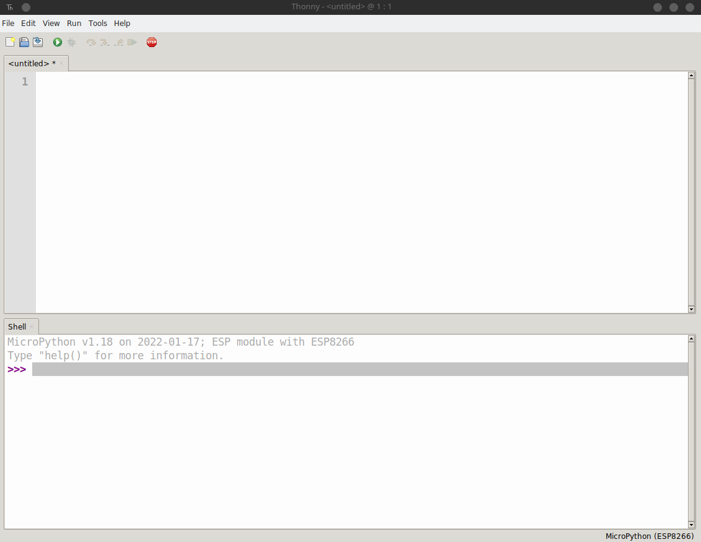

# Instalación y Configuración

## El firmware

Primero que nada se tiene que descargar el firmware que utilizara el ESP8266 ([ir a la pagina](https://micropython.org/download/esp8266/)) en este caso vamos a manejar la ultima version de **ESP8266 with 2MiB+ flash**.

### Que es el Firmware?

Esto es un pedazo de software que se instala en el microcontrolador para que sea capas de leer los archivos de python que vamos a cargar y con ello poder realizar todas las acciones que necesitemos. Dentro del firmware vienen las [librerías nucleo](http://docs.micropython.org/en/latest/library/index.html) que serán las que podremos utilizar para manipular todas las entradas y salidas fisicas y virtuales, en otras palabras _**vendría siendo el interprete de python que va dentro del chip**_.

## Cargando el Firmware

Para cargar el firmware tenemos varias maneras.

- [esptool.py](https://github.com/espressif/esptool): Libreria de hecha en python para preparar al microcontrolador (Win/Linux/Mac)
- [PyFlasher](https://github.com/marcelstoer/nodemcu-pyflasher): Herramienta visual que utiliza `esptool.py` (Win/Mac)
- [Thonny IDE](https://thonny.org): Entorno de desarrollo para python, incluido placas de desarrollo para ser programados con python, micropython, circuitpython, y todo lo que termine en python (Win/Linux/Mac)


### esptoo.py

Para comenzar necesitamos utilizar el modulo, previamente debemos tener instalado Python en nuestra computadora. Con el comando siguiente

```bash
pip install esptool
```

Comprobamos que se haya instalado correctamente con el siguiente comando.

```bash
esptool.py --help
```

Nos debe mostrar un menu con los parámetros

```
esptool.py v3.2
usage: esptool [-h] [--chip {auto,esp8266,esp32,esp32s2,esp32s3beta2,esp32s3,esp32c3,esp32c6beta,esp32h2,esp8684}] [--port PORT] [--baud BAUD]
               [--before {default_reset,usb_reset,no_reset,no_reset_no_sync}] [--after {hard_reset,soft_reset,no_reset,no_reset_stub}] [--no-stub] [--trace]
               [--override-vddsdio [{1.8V,1.9V,OFF}]] [--connect-attempts CONNECT_ATTEMPTS]
               {load_ram,dump_mem,read_mem,write_mem,write_flash,run,image_info,make_image,elf2image,read_mac,chip_id,flash_id,read_flash_status,write_flash_status,read_flash,verify_flash,erase_flash,erase_region,merge_bin,version,get_security_info}
               ...
```

Ahora necesitamos el [firmware](#el-firmware), descargado previamente. Abrimos la terminal de nuestro sistema operativo y colocamos el siguiente comando, *recordar la ruta del firmware para poder indicarlo correctamente, junto con el puerto en donde se encuentre nuestra tarjeta*. 

**Windows**

```
esptool.py --port COM0 --baud 460800 write_flash --flash_size=detect 0 esp8266-20170108-v1.8.7.bin
```

**Mac/Linux**

```bash
esptool.py --port /dev/ttyUSB0 --baud 460800 write_flash --flash_size=detect 0 esp8266-20170108-v1.8.7.bin
```

> Nota: Si tienes algún problema acudir a la [documentación oficial](http://docs.micropython.org/en/latest/esp8266/tutorial/intro.html#deploying-the-firmware)

### PyFlasher

Esta herramienta es lo mismo que [esptool.py](#esptoopy) pero con una interfaz visual la cual nos facilita y nos evita usar la terminal, pero al final utiliza esptool.py por detrás para realizar la carga del firmware.

- [Descargar PyFlasher](https://github.com/marcelstoer/nodemcu-pyflasher/releases/)
- [Tutorial para descargar e instalar](https://youtu.be/vCJuVQGwDYw)


### Thonny IDE

Entorno de desarrollo para python, incluido placas de desarrollo para ser programados con python. Con este entorno ya incluye todo lo necesario para la configuración, control, gestión, comunicación y programación para placas que utilizan el lenguaje python para funcionar.


#### Proceso de instalación

Abrir el editor [Thonny](#thonny-ide)



Vamos al menu superior `Tools` a la opcion `Options...`


Se nos abrirá la siguiente ventana


Ahora en los *tabs* superiores elegimos la opción de Interprete


Una vez seleccionada ese *tab*, se nos mostraran las nuevas opciones


En la primera sección vamos a elegir el interprete que vamos a usar, en este caso sera `Micropython (ESP8266)` (*en su defecto si vas a usar otro elige el que necesitas*)


Ahora se nos mostrar otra sección en la parte inferior. Y damos click en la opción de `install or update firmware`


Se nos mostrar la siguiente ventana, en la cual debemos elegir el *puerto* en donde se encuentra conectada nuestra placa y en el siguiente buscar el `firmware` que bajamos


Con ambos seleccionados, procedemos a dar click en el botón `Install`


Después de esto, comenzara de manera automática a cargar el firmware dentro del chip


Comienza a cargarse


Esperemos hasta que veamos la frase `Done`


Una vez terminado esto, esta lista nuestra tarjeta.

### Configurar Thonny para comenzar a trabajar

Tenemos todos los interpretes que podemos usar


Elegimos el interprete que vamos a usar o tenemos cargada en la tarjeta


Se nos carga otra sección


Ahora elegimos el puerto en donde esta nuestra tarjeta y damos `Ok`


> Esta listo el editor para trabajar, en caso que marque error verificar el puerto, probar con cerrar el programar y desconectar la placa; posteriormente conectar la placa y después, abrir el programa.

## Especificaciones técnicas del SoC ESP8266

Especificaciones técnicas del microcontrolador obtenidas del datasheet. Este microcontrolador cuenta con un modulo WiFi integrado.

- Architecture: Xtensa lx106
- CPU frequency: 80MHz overclockable to 160MHz
- Total RAM available: 96KB (part of it reserved for system)
- BootROM: 64KB
- Internal FlashROM: None
- External FlashROM: code and data, via SPI Flash. Normal sizes 512KB-4MB.
- GPIO: 16 + 1 (GPIOs are multiplexed with other functions, including external FlashROM, UART, deep sleep wake-up, etc.)
- UART: One RX/TX UART (no hardware handshaking), one TX-only UART.
- SPI: 2 SPI interfaces (one used for FlashROM).
- I2C: No native external I2C (bitbang implementation available on any pins).
- I2S: 1.
- Programming: using BootROM bootloader from UART. Due to external FlashROM and always-available BootROM bootloader, ESP8266 is not brickable.


<!-- http://docs.micropython.org/en/latest/esp8266/general.html -->