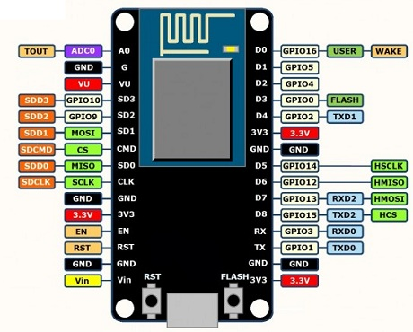

# ESP8266

## Pin out

Primero debemos conocer el *pinout* de nuestra tarjeta, existen alguna variantes de esta placa, pero en general son muy similares.

De base puede traer un LED que esta en el pin 2 (no siempre viene) y 2 botones, uno a cada costado de la entrada USB.

- `RST`: Reset, para reiniciar la placa o la comunicación con la computadora
- `FLASH`: Flasheo de la placa. Es para cargar el firmware, en ocasiones se necesita.

