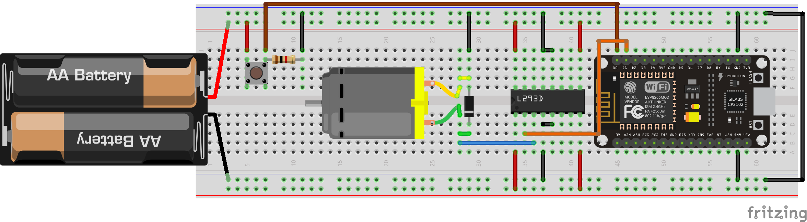

# Ejemplos control de entradas y salida digitales

## Control de salidas
   
!!! example "Encender de LED básico"
    - **Descripción:** Encender el led configurando un pin como salida D1
    - **Material:** 
        - 1 Led
        - 1 R330 
    - **Diagrama:** <br>
    - **Código:** 
        ```python
        
        import machine #Importo el modulo para manejo de pines

        pin = machine.Pin(5, machine.Pin.OUT) #configuro el pin D1 como salida

        pin.on() # Mando un 1 a la salida del pin 0
        ```

!!! example "Encender más LEDs"
    - **Descripción:** Control de más salidas y su configuración, activar D1 y D2
    - **Material:** 
        - 2 Led
        - 2 R330 
    - **Diagrama:** <br> 
    **Código:** 
        ```python
        
        import machine #Importo el modulo para manejo de pines

        pin1 = machine.Pin(5, machine.Pin.OUT) #configuro el pin D1 como salida
        pin2 = machine.Pin(4, machine.Pin.OUT) #configuro el pin D2 como salida
        
        pin1.value(1) # Mando un 1 a la salida del pin D1
        pin2.on() # Mando un 1 a la salida del pin D2
        ```

!!! example "Parpadear un led 3 veces"
    - **Descripción:** Se debe lograr que parpadee un led 3 veces, en un intervalo de tiempo de medio segundo
    - **Material:** 
        - 2 Led
        - 2 R330 
    - **Diagrama:** <br> 
    - **Código:** 
        ```python
        import machine #Importo el modulo para manejo de pines
        import time # importa el modulo para los retardos

        time_wait = 1 # declaro una variable que usare para los retardos
        pin1 = machine.Pin(5, machine.Pin.OUT, value=0) #configuro el pin 0 como salida y lo pongo en bajo

        time.sleep(time_wait) #espero un segundo
        pin1.value(1) # Mando un 1 a la salida del pin D1
        time.sleep(time_wait) #espero un segundo
        pin1.value(0) # Mando un 0 a la salida del pin D1
        time.sleep(time_wait) #espero un segundo
        pin1.value(1) # Mando un 1 a la salida del pin D1
        time.sleep(time_wait) #espero un segundo
        pin1.value(0) # Mando un 0 a la salida del pin D1
        time.sleep(time_wait) #espero un segundo
        pin1.on() # Mando un 1 a la salida del pin D1
        time.sleep(time_wait) #espero un segundo
        pin1.off()# Mando un 0 a la salida del pin D1
        time.sleep(time_wait) #espero un segundo
        ```
!!! example "Blink"
    - **Descripción:** Debe quedar parpadeando un Led por tiempo indefinido, el intervalo sera de 2 segundos.
    - **Material:** 
        - 1 Leds (rojo,verde y ámbar)
        - 1 R330 
    - **Diagrama:** <br> 
    - **Código:** 
        ```python
        import machine #Importo el modulo para manejo de pines
        import time # importa el modulo para los retardos

        time_wait = 2 # declaro una variable que usare para los retardos
        pin1 = machine.Pin(5, machine.Pin.OUT, value=0) #configuro el pin 0 como salida y lo pongo en bajo

        while True: #ciclo infinito
            
            pin1.value(1) # Mando un 1 a la salida del pin D1
            time.sleep(time_wait) #espero un segundo
            pin1.value(0) # Mando un 0 a la salida del pin D1
            time.sleep(time_wait) #espero un segundo
        ```


!!! example "Semáforo"
    - **Descripción:** Se debe lograr que parpadee un led 3 veces, en un intervalo de tiempo de medio segundo
    - **Material:** 
        - 3 Leds (rojo,verde y ambar)
        - 3 R330 
    - **Diagrama:** <br> 
    - **Código:** 
        ```python
        from machine import Pin #Importo el modulo para manejo de pines
        from time import sleep # importa el modulo para los retardos

        time_wait_long = 4 # declaro una variable que usare para los retardos de la luz mas largo
        time_wait_a = 2 # declaro una variable que usare para los retardos para el amarillo
        time_wait_blink = 0.5 # declaro una variable que usare para los retardos para el blink del verde
        led_rojo = machine.Pin(5, machine.Pin.OUT, value=0) #D1 configuro el pin 0 como salida y lo pongo en bajo
        led_ambar = machine.Pin(4, machine.Pin.OUT, value=0) #D2 configuro el pin 0 como salida y lo pongo en bajo
        led_verde = machine.Pin(0, machine.Pin.OUT, value=0) #D3 configuro el pin 0 como salida y lo pongo en bajo

        while True: #ciclo infinito
            
            led_rojo.on() # enciendo el led rojo
            led_ambar.off()  # apago el led ambar
            led_verde.off()  # apago el led verde
            sleep(time_wait_long) #espero un segundo
            
            led_rojo.off() # apago el led rojo
            led_ambar.on()  # enciendo el led ambar
            sleep(time_wait_a) #espero un segundo
            
            led_ambar.off()  # apago el led ambar
            led_verde.on()  # enciendo el led verde
            sleep(time_wait_a) #espero un segundo
            led_verde.off()  # apago el led verde
            
            # Hago el parpadeo de la luz verde
            sleep(time_wait_blink) # hago el primer parpadeo del verde
            led_verde.on()  # enciendo el led verde
            sleep(time_wait_blink) # hago el primer parpadeo del verde
            led_verde.off()  # apago el led verde
            sleep(time_wait_blink) # hago el primer parpadeo del verde
            led_verde.on()  # enciendo el led verde
            sleep(time_wait_blink) # hago el primer parpadeo del verde
            led_verde.off()  # apago el led verde
            sleep(time_wait_blink) # hago el primer parpadeo del verde
            led_verde.on()  # enciendo el led verde
            sleep(time_wait_blink) # hago el primer parpadeo del verde
        ```

## Leyendo entradas

!!! example "Leyendo entrada"
    - **Descripción:** Leer una entrada digital, encenderá el LED mientras se mantenga presionado el push button
    - **Material:** 
        - 1 Led
        - 3 R330 
        - 1 Push button
        - 1 R1k
    - **Diagrama:** <br> 
    - **Código:** 
        ```python
        from machine import Pin
        from time import sleep_ms # importo la función sleep_ms 

        pin1 = Pin(5, Pin.OUT,value=0) #configuro D1 como salida
        boton = Pin(16, Pin.IN) # configuro D0 como entrada

        while True: # ciclo infinito
                
            if boton.value() == 1: # leo el valor del botón, si es 1 entro al bloque de código
                pin1.on() #enciendo mi led
                sleep_ms(10) #doy un tiempo mínimo para no saturar al micro
                
            pin1.off() # apago el led 
        ```

!!! example "Leyendo entrada con blick led"
    - **Descripción:** Mientras se presione el botón los LEDs deben parpadear medio segundo
    - **Material:** 
        - 1 Led
        - 3 R330 
        - 1 Push button
        - 1 R1k
    - **Diagrama:** <br> 
    - **Código:** 
        ```python
        from machine import Pin
        from time import sleep_ms # importo la función sleep_ms 

        pin1 = Pin(5, Pin.OUT,value=0) #configuro D1 como salida
        boton = Pin(16, Pin.IN) # configuro D0 como entrada

        while True: # ciclo infinito
                
            if boton.value() == 1: # leo el valor del botón, si es 1 entro al bloque de código
                pin1.on() #enciendo el led
                sleep_ms(500) #doy un tiempo mínimo para no saturar al micro
                pin1.off() #apago el led
                sleep_ms(500) #doy un tiempo mínimo para no saturar al micro
                
            pin1.off() # apago el led 
        ```

!!! example "Leyendo 2 entradas y blink de 2 leds"
    - **Descripción:** Control de 2 leds, cada uno con su propio push button, mientras sea presionado el push button debe parpadear a 1/4 de segundo, encendido su respectivo LED; en caso que sean presionados ambos push button al mismo tiempo los leds van a parpadear juntos cada 200mS
    - **Material:** 
        - 2 Led
        - 2 R330 
        - 2 Push button
        - 2 R1k
    - **Diagrama:** <br> 
    - **Código:** 
        ```python
        from machine import Pin
        from time import sleep_ms # importo la función sleep_ms 

        pin1 = Pin(4, Pin.OUT, value=0) #configuro D1 como salida
        boton1 = Pin(5, Pin.IN) # configuro D2 como salida
        pin2 = Pin(0, Pin.OUT, value=0) #configuro D3 como salida y lo pongo en bajo
        boton2 = Pin(2, Pin.IN) # configuro D4 como entrada

        while True: # ciclo infinito
            
            if boton1.value() == 1 and boton2.value() == 1:
                pin1.on() #enciendo el led
                pin2.on() #enciendo el led
                sleep_ms(200) #doy los 200mS
                pin1.off() #apago el led
                pin2.off() #apago el led
                sleep_ms(200) #doy los 200mS
            elif boton1.value() == 1: # leo el valor del botón 1, si es 1 entro al bloque de código
                pin1.on() #enciendo el led
                sleep_ms(250) #enciendo 1/4 de segundo
                pin1.off() #apago el led
                sleep_ms(250) #apago 1/4 de segundo
            elif boton2.value() == 1: # leo el valor del botón 1, si es 1 entro al bloque de código
                pin2.on() #enciendo el led
                sleep_ms(250) #enciendo 1/4 de segundo
                pin2.off() #apago el led
                sleep_ms(250) #apago 1/4 de segundo
            else:            
                pin1.off() # apago el led 1
                pin2.off() # apago el led 2
        ```

!!! example "Toggle"
    - **Descripción:** Al presionar el push button se debe encender el led y mantenerse en ese estado; hasta que se vuelva a presionar el led regresará a su estado anterior; es decir, que se apague
    - **Material:** 
        - 1 Led
        - 3 R330 
        - 1 Push button
        - 1 R1k
    - **Diagrama:** <br> 
    - **Código:** 
        ```python
        # Version de código V1, version fea y larga
        from machine import Pin
        from time import sleep_ms # importo la función sleep_ms 

        pin1 = Pin(4, Pin.OUT, value=0) #configuro D1 como salida
        boton1 = Pin(5, Pin.IN) # configuro D2 como salida

        status = 0

        while True: # ciclo infinito
            
            if boton1.value() and status == 0 : # leo el valor del botón 1, si es 1 entro al bloque de código
                sleep_ms(100) #le doy un tiempo para no saturar 
                pin1.on() #enciendo el led
                status = 1 # cambio el estado de mi variable, con ella se si fue o no presionado el boton
                
            if boton1.value and status == 1: # leo el valor del botón 1, si es 1 entro al bloque de código
                sleep_ms(100) #le doy un tiempo para no saturar 
                pin1.off() # apago el led
                status = 0 # cambio el estado de mi variable, con ella se si fue o no presionado el boton
        ```
        ---

        ```python
        # Version de código V2, version Hacker pro
        from machine import Pin
        from time import sleep_ms # importo la función sleep_ms 

        pin1 = Pin(4, Pin.OUT, value=0) #configuro D1 como salida
        boton1 = Pin(5, Pin.IN) # configuro D2 como entrada

        while True: # ciclo infinito
            
            if boton1.value(): # leo el valor del botón 1, si es 1 entro al bloque de código
                sleep_ms(200) #le doy un tiempo por el rebote del boton
                pin1.value( not pin1.value() ) #tomo el valor actual del pin e invierto su estado y lo asigno al pin, es decir,
                # si esta encendido, invierto ese valor, por ende; se apaga el led, y viceversa
        ```

## Display 7 segmentos

Display de 7 segmentos puede ser de ánodo o cátodo común; existen displays con mayores segmentos, hasta una matriz de puntos de diferentes resoluciones.


!!! example "Display de 7 segmentos"
    - **Descripción:** Creación de un contador básico con un display de 7 segmentos, el cual comenzará en 0 y terminará en F, haciendo un conteo hexadecimal, el intervalo de tiempo será de un segundo, una vez que termine se reinicia automáticamente
    - **Material:** 
        - 1 Display 7 segmentos cátodo común
        - 7 R330 
    - **Diagrama:** <br> 
    - **Código:** 
        ```python
        ```

!!! example "Mensaje con Display de 7-seg"
    - **Descripción:** Crear un mensaje que se vaya leyendo en el display de 7 segmentos que diga "HOLA", el intervalo de cada letra será de medio segundo; debe quedar de manera indefinida.
    - **Material:** 
        - 1 Display 7 segmentos cátodo común
        - 7 R330 
    - **Diagrama:** <br> 
    - **Código:** 
        ```python
        ```
!!! example "Display de 7 segmentos por botón"
    - **Descripción:** Creación de un contador básico con un display de 7 segmentos, el cual comenzará en 0 y terminará en F, el cambio se hará cada vez que sea presionado un push button
    - **Material:** 
        - 1 Display 7 segmentos cátodo común
        - 7 R330 
        - 1 Push button
        - 1 R1k
    - **Diagrama:** <br> 
    - **Código:** 
        ```python
        ```

## Control básico de Motor DC

En esta primera sección vamos realizar un control básico de un motor DC de 5V DC. Recuerda que la salida de señal del ESP8266 en alto es de `3.3V`, por lo tanto, se necesita una fuente adicional.
 
### Driver L293D (Controlador)

Puesto que los microcontroladores son elementos de control, no son capaces para alimentar cargas altas o cargas especiales (como inductivas), debemos utilizar algún elemento que nos ayude a realizar esta tarea. En este caso vamos a usar el Driver L293D por ser el mas común, no es el único (puedes usar el que quieras o necesites en función de tu carga).

Aqui coloco un esquemático de conexión obtenido del [datasheet](https://www.ti.com/lit/ds/slrs008c/slrs008c.pdf)


!!! example "Control ON/OFF para motor DC"
    - **Descripción:** Con un push boton debes encender el motor, y cuando se vuelva a pulsar el motor se debe apagar
    - **Material:** 
        - 1 Push button
        - 1 R1k
        - 1 Motor DC de 5V
        - 1 Puente H L293
        - 1 Fuente de 5V externa
    - **Diagrama:** <br> 
    - **Código:** 
        ```python
        from machine import Pin
        from time import sleep_ms # importo la función sleep_ms 

        motor = Pin(4, Pin.OUT, value=0) #configuro D1 como salida y el motor comienza apagado
        boton = Pin(5, Pin.IN) # configuro D2 como entrada

        while True: # ciclo infinito
            
            if boton.value(): # leo el valor del botón 1, si es 1 entro al bloque de código
                sleep_ms(200) #le doy un tiempo por el rebote del boton
                motor.value( not motor.value() ) #tomo el valor actual del pin e invierto su estado y lo asigno al pin, es decir,
                # si esta encendido, invierto ese valor, por ende; se apaga el led, y viceversa
        ```
