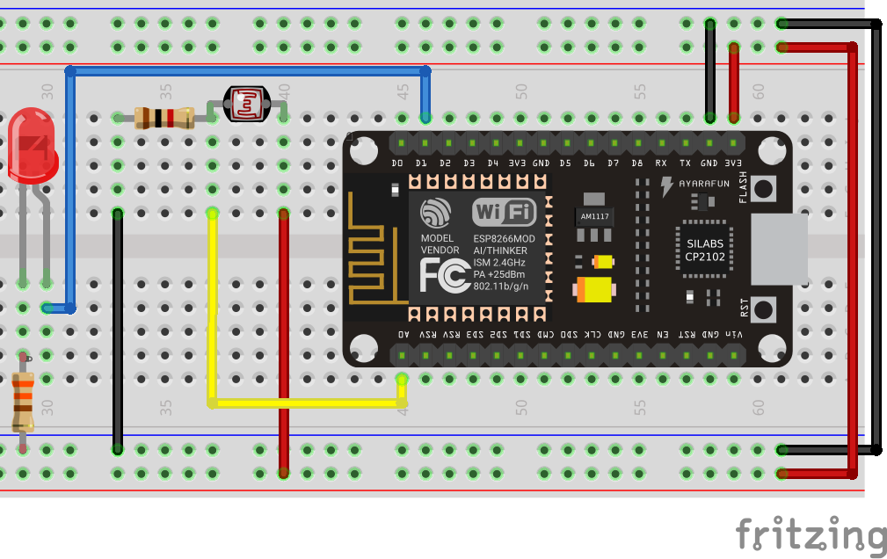

# Ejercicios con ADC

En esta sección estaremos utilizando el ADC del microcontrolador.

## Ejemplos control de entradas analógicas

!!! example "Ver el valor del ADC por la terminal"
    - **Descripción:** Encender el led configurando un pin como salida D1
    - **Material:** 
        - 1 Potenciómetro
    - **Diagrama:** <br>
    - **Código:** 
        ```python
        import machine # importo el modulo para control y configuración de pines
        from time import sleep

        adc = machine.ADC(0) # configuro el GPIO0 como ADC o entrada analógica
        
        while True:
            valor = adc.read() # esta función nos retorna el valor que existe en la entrada

            print(valor) # mando a la terminal el valor del ADC
            sleep(2) # espero un segundo
        ```

!!! example "Sensor de luz en la terminal"
    - **Descripción:** Mandar el valor que esta recibiendo el sensor de Luz a la terminal
    - **Material:** 
        - 1 LDR
        - 1 R10k
        - 1 LED
        - 1 R330
    - **Diagrama:** <br>
    - **Código:** 
        ```python
        import machine # importo el modulo para control y configuración de pines
        from time import sleep

        adc = machine.ADC(0) # configuro el GPIO0 como ADC o entrada analógica
        
        while True:
            valor = adc.read() # esta función nos retorna el valor que existe en la entrada

            print(valor) # mando a la terminal el valor del ADC
            sleep(2) # espero un segundo
        ```
!!! example "Sensor crepuscular"
    - **Descripción:** Se debe configurar el nivel en el código para la activación del led con cierta cantidad de luz que reciba el sensor
    - **Material:** 
        - 1 LDR
        - 1 R10k
        - 1 LED
        - 1 R330
    - **Diagrama:** <br>
    - **Código:** 
        ```python
        from machine import Pin, ADC # importo el modulo para ADC y para el control de Pines
        from time import sleep, sleep_ms

        valor_disparo = 100
        adc = ADC(0) # configuro el A0 como ADC o entrada analógica
        valor = adc.read() # esta función nos retorna el valor que existe en la entrada
        sleep(1)

        led = Pin(5, Pin.OUT, value = 0) # configuro el pin para el LED y pongo en 0

        while True:
            valor = adc.read() # esta función nos retorna el valor que existe en la entrada

            if valor > valor_disparo:
                led.on()
                sleep_ms(250) # doy un tiempo de estabilización
            else:
                led.off()

            sleep_ms(100) # Doy un tiempo de espera
        ```