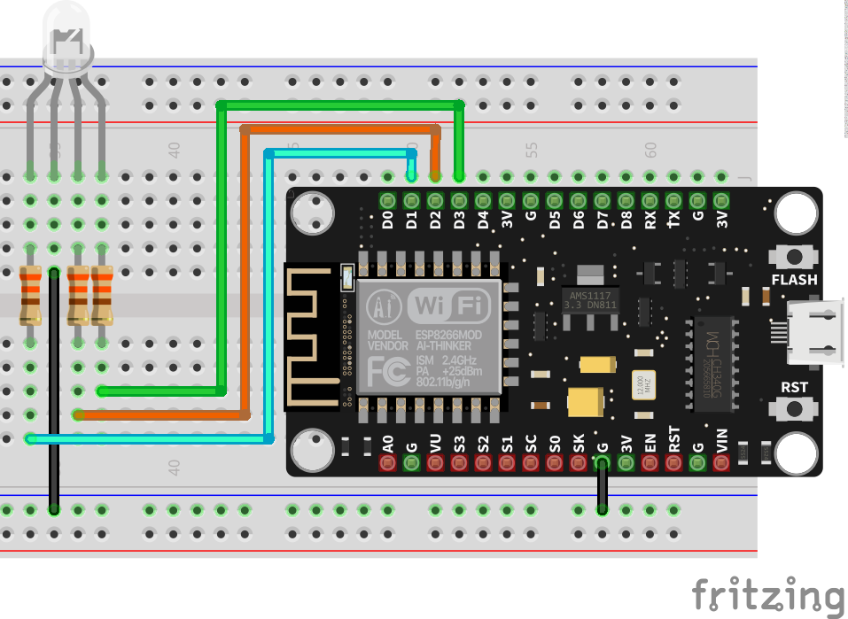
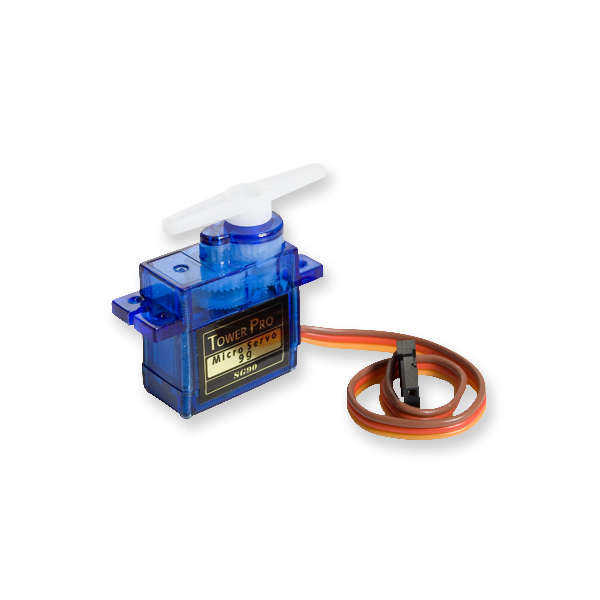
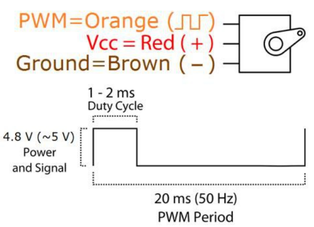

# Ejercicios con PWM

El servomotor se mueve con base a una señal PWM, pero la librería nos ahorra el trabajo para generar el desplazamiento.

## Control básico

!!! example "Cambiando el brillo de un LED automáticamente"
    - **Descripción:** Vamos a controlar la intensidad de un LED con una salida PWM
    - **Material:** 
        - 1 R330
        - 1 Led
    - **Diagrama:** <br>
    - **Código:** 
        ```python
        from machine import Pin, PWM # importo el modulo para PWM y configuración de pines
        from time import sleep

        pin = Pin(5) #Creo el pin 
        led = PWM(pin) # configuro el pin como salida PWM
        
        while True:
            for i in range(0,1024):
                led.duty(i) # cargo el valor de 0 a 1023
                print(i) # mando a la terminal el valor
                sleep(0.5) # espero medio segundo
        ```

!!! example "Cambiando el brillo de un LED con botones"
    - **Descripción:** Vamos a controlar el intensidad de un LED con 2 botones, uno que incremente y con otro que decremente la intensidad
    - **Material:** 
        - 1 R330
        - 1 Led
        - 2 Push button
        - 2 R1k
    - **Diagrama:** <br>
    - **Código:** 
        ```python
        from machine import Pin, PWM # importo el modulo para PWM y configuración de pines
        from time import sleep

        pin = Pin(5) #Creo el pin 
        led = PWM(pin) # configuro el pin como salida PWM
        
        while True:
            for i in range(0,1024):
                led.duty(i) # cargo el valor de 0 a 1023
                print(i) # mando a la terminal el valor
                sleep(0.5) # espero medio segundo
        ```

!!! example "Cambiando el brillo de un LED con Potenciómetro"
    - **Descripción:** Vamos a controlar el intensidad de un LED con potenciómetro la variar su intensidad.
    - **Material:** 
        - 1 Potenciómetro
        - 1 R330
        - 1 Led
    - **Diagrama:** <br>
    - **Código:** 
        ```python
        from machine import Pin, PWM # importo el modulo para PWM y configuración de pines
        from time import sleep

        pin = Pin(5) #Creo el pin 
        led = PWM(pin) # configuro el pin como salida PWM
        
        while True:
            for i in range(0,1024):
                led.duty(i) # cargo el valor de 0 a 1023
                print(i) # mando a la terminal el valor
                sleep(0.5) # espero medio segundo
        ```

## LED RGB

Para conocer mas detalles de los Leds RGB [ir a esta documentación](https://www.alejandro-leyva.com/analogica/capitulo2/06_leds_propocito_especial/#led-rgb).

!!! example "Viendo los 16 millones de colores automáticamente"
    - **Descripción:** Realizar un barrido de los colores con un led RGB. 
    - **Material:** 
        - 1 R330
        - 1 Led RGB
        - 2 Push button
        - 2 R1k
    - **Diagrama:** <br>
    - **Código:** 
        ```python
        from machine import Pin, PWM # importo el modulo para PWM y configuración de pines
        from time import sleep

        led_r = Pin(5) #Creo el pin 
        led_g = Pin(4) #Creo el pin 
        led_b = Pin(0) #Creo el pin 
        red = PWM(led_r) # configuro el pin como salida PWM
        green = PWM(led_g) # configuro el pin como salida PWM
        blue = PWM(led_b) # configuro el pin como salida PWM
        
        while True:
            for r in range(0,255):
                red.duty(r) # cargo el valor de 0 a 1023
                for g in range(0,255):
                    green.duty(g) # cargo el valor de 0 a 1023
                    for b in range(0,255):
                        blue.duty(b) # cargo el valor de 0 a 1023
                        sleep(0.25) # espero medio segundo
        ```

!!! example "Viendo los 16 millones de colores con Pot"
    - **Descripción:** Realizar un barrido de los colores con un led RGB, se tendrá un botón para seleccionar el color que sera modificado, y este sera variado con un potenciómetro
    - **Material:** 
        - 3 R330
        - 1 Led RGB
        - 1 Push button
        - 1 R1k
        - 1 Potenciómetro
    - **Diagrama:** <br>
    - **Código:** 
        ```python
        ```

## Control de velocidad de Motor DC

!!! example "Regulador de velocidad motor DC con botones"
    - **Descripción:** Regulador de velocidad motor DC con botones, es decir, con un botón incrementamos y con otro decrementamos su velocidad.
    - **Material:** 
        - 1 R330
        - 1 Led
        - 2 Push button
        - 2 R1k
    - **Diagrama:** <br>
    - **Código:** 
        ```python
        from machine import Pin, PWM # importo el modulo para PWM y configuración de pines
        from time import sleep

        pin = Pin(5) #Creo el pin 
        led = PWM(pin) # configuro el pin como salida PWM
        
        while True:
            for i in range(0,1024):
                led.duty(i) # cargo el valor de 0 a 1023
                print(i) # mando a la terminal el valor
                sleep(0.5) # espero medio segundo
        ```

!!! example "Regulador de velocidad motor DC con Potenciometro"
    - **Descripción:** Vamos a controlar la velocidad de un motor con un potenciómetro.
    - **Material:** 
        - 1 Potenciómetro
        - 1 R330
        - 1 Led
    - **Diagrama:** <br>
    - **Código:** 
        ```python
        from machine import Pin, PWM # importo el modulo para PWM y configuración de pines
        from time import sleep

        pin = Pin(5) #Creo el pin 
        led = PWM(pin) # configuro el pin como salida PWM
        
        while True:
            for i in range(0,1024):
                led.duty(i) # cargo el valor de 0 a 1023
                print(i) # mando a la terminal el valor
                sleep(0.5) # espero medio segundo
        ```

## Servomotor

El servomotor que utilizaremos el SG-90, es un servomotor básico.



Este motor necesita la siguiente señal para poder generar su desplazamiento:



!!! Warning "Atención"
    Un servomotor solo se puede desplazar desde 0° hasta 180°. Por default siempre esta en 90°. Pero, comúnmente se considera 0°, dado que gira hasta 90° y -90°.

```python
#verificar código
from machine import Pin, PWM
from time import sleep

servo=PWM(pin 0,frequency)
frequency=5000

while True:
    for duty_cycle in range(0,1023)
        servo.duty(duty_cycle)
        sleep(5)
```

!!! example "Giro del Servomotor automáticamente"
    - **Descripción:** Controlar un Servomotor, se debe colocar en diversos ángulos y repetir de manera indefinida. Los ángulos a los que se desplazar son 0°,30°,60°,90°,120°,160°,180° y volver al inicio.
    - **Material:** 
        - 1 Servomotor
    - **Diagrama:** <br>
    - **Código:** 
        ```python
        from machine import Pin, PWM
        from time import sleep
        ```
!!! example "Giro del Servomotor con botones"
    - **Descripción:** Cambiar el angulo de un servomotor con botones, es decir, con uno incrementa su angulo y con el segundo la decrementar.
    - **Material:** 
        - 1 Servomotor
        - 2 Push button
        - 2 R1k
    - **Diagrama:** <br>
    - **Código:** 
        ```python
        from machine import Pin, PWM
        from time import sleep
        ```

!!! example "Giro del Servomotor con potenciómetro"
    - **Descripción:**Hacer girar un servomotor en función de la posición de un potenciómetro. Es decir, si esta en 0 el potenciómetro, sera 0°; en 0.5 sera 90° y al 100% serán 180°.
    - **Material:** 
        - 1 Potenciómetro
        - 1 Servomotor
    - **Diagrama:** <br>
    - **Código:** 
        ```python
        from machine import Pin, PWM
        from time import sleep
        ```

