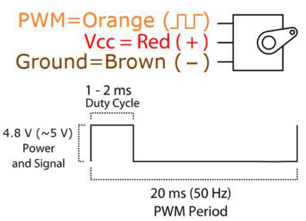

# Ejercicios con PWM

El servomotor se mueve con base a una señal PWM, pero la libreria nos ahorra el trabajo para generar el desplazamiento.

El servomotor que utilizaremos el SG-90, es un servomotor basico.

Este motor necesita la siguiente señal para poder generar su desplazamiento:

1. Control de velocidad de un motor DC, se controlara la velocidad del motor atraves de un potenciometro. Si el potenciometro esta en 0 el motor debe estar apagado, si esta al 50% el motor girara a la mitad de su velocidad, cuando llegue a 100% el motor debe girar a su maxima velocidad.
2. Control de la intesidad de varias luces, se tendran 3 leds cada uno controlado con su respectivo potenciometro para hacer variar la intensidad de la luz de cada uno. Todos de manera independiente.
3. Control de la intesidad de varias luces, se tendran 3 luces. 2 leds cada uno controlado con su respectivo potenciometro para hacer variar la intensidad de la luz de cada uno, un tercero controlado con botones, uno para incrementar y otro para decrementar la intensidad. Todos de manera independiente.
4. Utilizando un servomotor que se utilizara para controlar la pluma de la entrada de estacionamiento. Se simula un sensor infrarrojo para detectar el auto y se levante la pluma (180°), cuando no detecte el auto, bajara la pluma (0°)