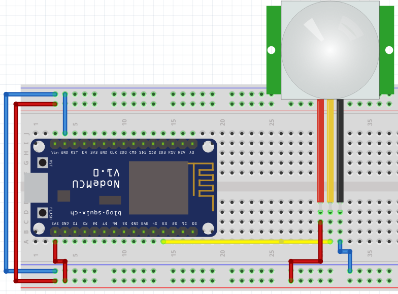

#  Ejemplos con Sensores Digitales

La simulación de sensores digitales básicos es muy sencillo aplicando la configuración pull-up o pull-down. Dado que la señal de un alto o bajo representa un estado u otro.

## Sensor PIR HC-SR501 (Sensor de presencia - Sensor Infrarrojo pasivo)

Este sensor nos manda una señal alta de 3.3V cuando existe presencia o recibe radiación infrarroja. Se puede alimentar entre 5V a 12V. Ver mas en su [datasheet](https://www.allelectronics.com/mas_assets/media/allelectronics2018/spec/PIR-7.pdf).


### Aplicando el Sensor PIR

!!! example "Ejemplo 1"
    **Descripción:**
    Tenemos un sensor PIR, que cuando exista presencia mande a activar un parpadeo de LEDs de forma rápida (medio segundo), mientras no exista presencia los LEDs deben parpadear de manera lenta (2seg)
    **Materiales:**
    **Circuito:** <br> 
    **Código:**


!!! example "Ejemplo 2"
    **Descripción:**
    Ahora tenemos un sensor de presencia junto a un switch en una habitación. Lo que queremos es que si existe presencia y el switch se presiona se encienda la luz del cuarto, pero si la persona deja la habitación pero no apago la luz se debe apagar el foco en un tiempo definido. Al salir del cuarto se presiona el switch se debe apagar el foco.
    **Materiales:**
    **Circuito:**  <br> 
    **Código:**

## Sensor de Temperatura y Humedad DTH11

[datasheet](https://www.mouser.com/datasheet//DHT11-Technical-Data-Sheet-Translated-Version-.pdf)

Distribución de pines del Sensor básico vs el formato de modulo


El controlador del sensor DHT es implementado por software y funciona en todos los pines:

```python
import dht
import machine

d = dht.DHT11(machine.Pin(4))
d.measure()
d.temperature() # eg. 23 (°C)
d.humidity()    # eg. 41 (% RH)

d = dht.DHT22(machine.Pin(4))
d.measure()
d.temperature() # eg. 23.6 (°C)
d.humidity()    # eg. 41.3 (% RH)
```

