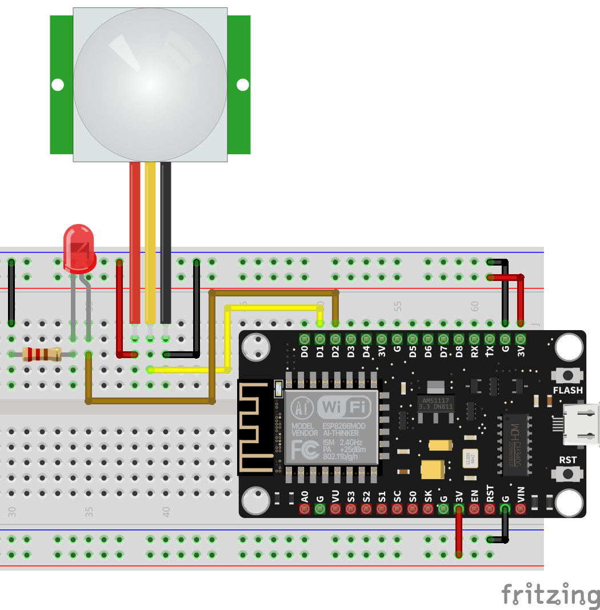

#  Ejemplos con Sensores Digitales

La simulación de sensores digitales básicos es muy sencillo aplicando la configuración pull-up o pull-down. Dado que la señal de un alto o bajo representa un estado u otro.

## Sensor PIR HC-SR501 (Sensor de presencia)

Este sensor nos manda una señal alta de 3.3V cuando existe presencia o recibe radiación infrarroja. Se puede alimentar entre 5V a 12V. Ver mas en su [datasheet](https://www.allelectronics.com/mas_assets/media/allelectronics2018/spec/PIR-7.pdf).


## Aplicando el Sensor PIR

!!! example "Alarma de presencia"
    - **Descripción:**
    Tenemos un sensor PIR, que cuando exista presencia mande a activar un parpadeo de LEDs de forma rápida (medio segundo), mientras no exista presencia los LEDs deben parpadear de manera lenta (2seg)
    - **Materiales:**
      - 1 Sensor PIR
      - 1 Led
      - 1 R330
    - **Circuito:** <br> 
    - **Código:**
        ```python
        from machine import Pin
        from time import sleep

        pir = Pin(5, Pin.IN)
        led = Pin(4, Pin.OUT)

        time_short = 0.5
        time_long = 2

        while True:

            if pir.value():
                led.on()
                sleep(time_short)
                led.off()
                sleep(time_short)
            else:
                led.on()
                sleep(time_long)
                led.off()
                sleep(time_long)
        ```

!!! example "Luz automática"
    - **Descripción:** Ahora tenemos un sensor de presencia junto a un push button en una habitación. Lo que queremos es que si existe presencia y el push button se presiona se encienda la luz del cuarto, pero si la persona deja la habitación pero no apago la luz se debe apagar el foco en un tiempo definido. Al salir del cuarto se presiona el push button se debe apagar el foco.
    - **Materiales:**
      - 1 Sensor PIR
      - 1 Led
      - 1 R330
      - 1 Push button
      - 1 R1k
    - **Circuito:**  <br> 
    - **Código:**
        ```python
        from machine import Pin
        from time import sleep

        pir = Pin(5, Pin.IN)
        light = Pin(4, Pin.OUT)
        switch = Pin(0, Pin.IN)

        status_light = False # Mi variable de estado para el foco

        count = 0 # contador del temporizador

        while True:
            status_pir = pir.value() # leo el valor del sensor PIR
            status_switch = switch.value() # Leo el valor del botón

            if status_pir and status_switch and not status_light : # Si hay presencia y también presionaron el botón y no esta encendido el foco, entro al bloque
                light.on()
                status_light = True
                sleep(0.25) # estabilizamos el presionar el botón
            elif status_switch and status_light: # de lo contrario si, presiono el botón y el foco esta encendido, apago el foco
                light.off()
                status_light = False
                sleep(1)

            # temporizador para apagar el foco en caso de que no exista presencia
            if status_light and not status_pir:
                if count >= 10:
                    light.off()
                    status_light = False
                    count = 0
                sleep(1)
                count += 1
            else:
                count = 0
        ```


## Sensor de Temperatura y Humedad DTH11

Distribución de pines del Sensor básico vs el formato de modulo. Ver [datasheet](https://www.mouser.com/datasheet//DHT11-Technical-Data-Sheet-Translated-Version-.pdf). El controlador del sensor DHT es implementado por software y funciona en todos los pines:


### Ejemplo de sus funcionalidades

En el siguiente código vemos las funciones con las que cuenta el modulo del sensor, que trae incorporado Micropython. Después de la creación del `objeto` debemos llamar a su método `measure()` la cual hace funcionar al sensor y obtener la información del ambiente en ese momento.

```python
import dht
import machine

d = dht.DHT11(machine.Pin(4))
d.measure()
d.temperature() # eg. 23 (°C)
d.humidity()    # eg. 41 (% RH)

d = dht.DHT22(machine.Pin(4))
d.measure()
d.temperature() # eg. 23.6 (°C)
d.humidity()    # eg. 41.3 (% RH)
```

!!! example "Obteniendo los datos del DTH11"
    - **Descripción:** Vamos a obtener los datos del sensor y mandarlos a la terminal, el invervalo sera de cada 1 segundo
    - **Materiales:**
      - 1 Sensor DTH11
    - **Circuito:** <br> 
    - **Código:**
        ```python
        from machine import Pin
        from time import sleep
        from dht import DHT11

        sensor = DHT11( Pin(0) )

        while True:
            sensor.measure()
            value_temperature = sensor.temperature() # se obtiene el valor de la temperatura
            value_humidity = sensor.humidity()    # se obtiene el valor de la humedad relativa
            
            print(value_temperature)
            print(value_humidity)
            
            sleep(1) #esperamos 1 seg para la siguiente lectura de las variables ambientales
        ```