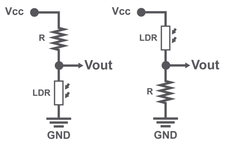
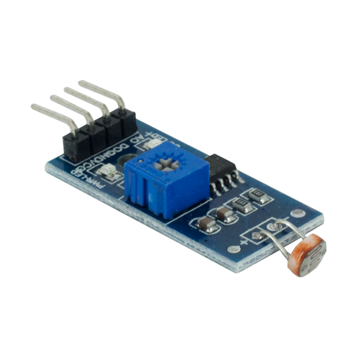

# Sensores Analógicos

Un sistema digital por default no puede leer señales analógicas, rangos u oscilaciones de voltajes. Entonces cómo se hace la medición?. Se utiliza un componente llamado **ADC (Analogue to Digital Converter)**, el cual hace la conversión de la señal analógica a un código binario, entonces en lugar de percibir un nivel de voltaje, estaremos viendo un código binario equivalente.

El ADC que trae incorporado el ESP8266 tiene una resolución de 10 bits, es decir, tiene 1024 códigos binarios que son equivalentes son:

Voltaje|Binario|Decimal|Micropython
:-:|:-:|:-:|:-:
0V|0b|0|0.0
5V|0b11 1111 1111|1023|1.0

## Sensor de Luz 

Existen varios sensores de luz, aquí estamos abarcando el mas sencillo y básico, el cual implementa una LDR (Resistencia dependiente de Luz) en una configuración de divisor de tension.

<figcaption>Modulo de Sensor de luz</figcaption>

## Sensor de Temperatura LM35 

Existe una enorme variedad de sensores de temperatura, estaremos viendo el **[LM35](https://www.ti.com/lit/ds/symlink/lm35.pdf)**, sensor de temperatura lineal.

**Nos da una respuesta de 10mV/ºC**

!!! example "Termómetro"
    Vamos a realizar un termómetro con el LM35. La temperatura se mandará a la terminal. Debe mandar la temperatura en grados Celsius y grados Fahrenheit
