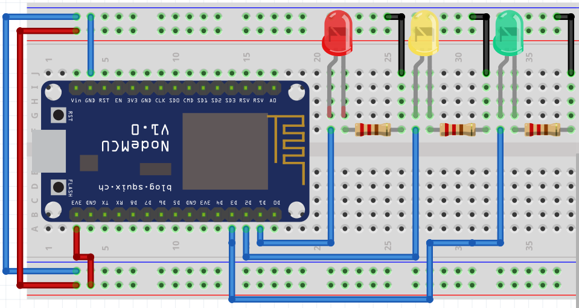
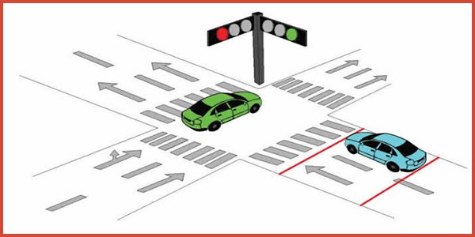
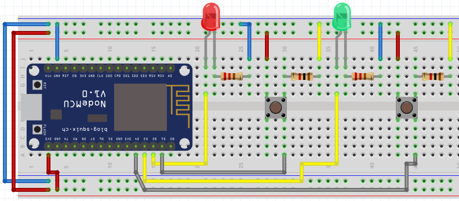
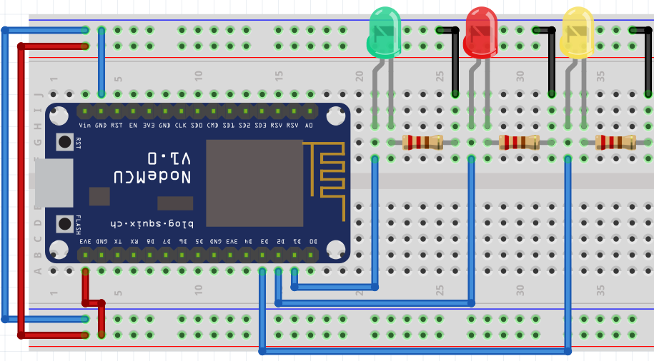
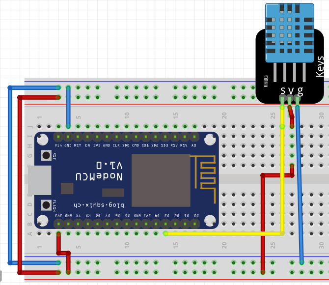
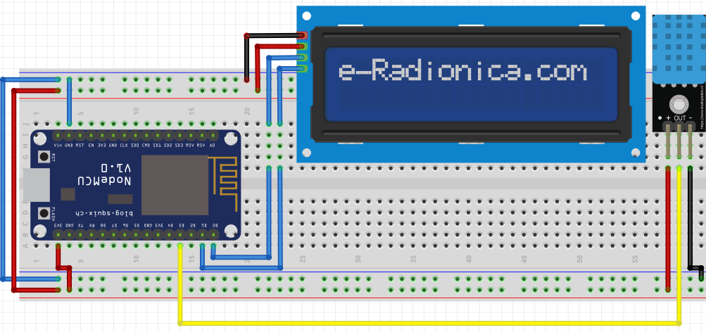

# Prácticas

!!! example "Encender LEDs"
    - **Descripción:** Hacer parpadear los leds, encendidos deben estar 2 segundos, y apagados un segundo, esto debe repetirse 5 veces
    - **Material:** 
        - 1 Led
        - 1 R330 
    - **Diagrama:**   

!!! example "Parpadear un led 3 veces"
    - **Descripción:** Se debe lograr que parpadee un led 3 veces, en un intervalo de tiempo de medio segundo
    - **Material:** 
        - 1 Led
        - 1 R330 
    - **Diagrama:**   

!!! example "Parpadear leds de manera indefinida"
    - **Descripción:** Deben quedar 2 leds parpadeando de manera indefinida, encendidos 2 segundos y apagados un segundo
    - **Material:** 
        - 2 Led
        - 2 R330 
    - **Diagrama:**   

!!! example "Semáforo de crucero"
    - **Descripción:** Realizar dos semáforos en una intersección, deben trabajar de manera complementaria.
    - **Material:** 
        - 6 Leds (rojo,verde y ámbar)
        - 6 R330 
    - **Diagrama:**   
    - **Ejemplo:**

!!! example "Controlando 2 leds con sus botones"
    - **Descripción:** Control de 2 leds, cada uno con su propio push button, mientras sea presionado el push button debe mantenerse encendido su respectivo LED, de lo contrario se deben apagar
    - **Material:** 
        - 2 Led
        - 2 R330 
        - 2 Push button
        - 2 R1k
    - **Diagrama:**   

!!! example "Controlando 2 leds blink, con sus botones"
    - **Descripción:** Control de 2 leds, cada uno con su propio push button, mientras sea presionado el push button debe parpadear a 1/4 de segundo, encendido su respectivo LED
    - **Material:** 
        - 2 Led
        - 2 R330 
        - 2 Push button
        - 2 R1k
    - **Diagrama:**   

!!! example "Toggle 2"
    - **Descripción:** Hay 2 leds con sus respectivos botones. Al presionar el push button se debe encender el led y mantenerse en ese estado; hasta que se vuelva a presionar el led regresará a su estado anterior
    - **Material:** 
        - 2 Led
        - 2 R330 
        - 2 Push button
        - 2 R1k
    - **Diagrama:**   

!!! example "Secuencia de luces"
    - **Descripción:** Realizar una secuencia de leds básica, se deben ir encendiendo en secuencia, el tiempo lo decide el programador, primero enciende el primero, unos instantes después el segundo, un instante, después el ultimo, quedan encendido todos y unos segundos después se apagan y vuelve a comenzar la secuencia.
    - **Material:** 
        - 2 Led
        - 2 R330 
        - 2 Push button
        - 2 R1k
    - **Diagrama:**   

!!! example "Tren"
    - **Descripción:** Simular las luces de alto en un cruce de ferrocarril, como se muestra en la imagen animada. Se debe simular con un botón el paso del ferrocarril, que si se presiona haga los parpadeos de las luces, mientras no este presionado el botón, las luces deben quedar encendidas; es decir, que no estaría pasando el tren. 
    - **Material:** 
        - 4 Led
        - 4 R330 
        - 1 Push button
        - 1 R1k
    - **Diagrama:**   

!!! example "Display de 7 segmentos"
    - **Descripción:** Crear un mensaje que se vaya leyendo en el display de 7 segmentos, *tu elijes la palabra o frase*, el intervalo de cada letra será de medio segundo
    - **Material:** 
        - 1 Display 7 segmentos, cátodo común
        - 7 R330 
    - **Diagrama:**   

!!! example "Frases con display 7-seg"
    - **Descripción:** Realizar el control de un display de 7 segmentos, mandando un mensaje. Es decir, mandará una palabra la cual el programador elegía, esta palabra se debe poder escribir con los segmentos con los que cuenta el display. 
    Desplegará su palabra, después desplegará la palabra "cbtis" y terminará con "85", todas las palabras deben ser separadas por un guion. *Ejemplo: HOLA-Cbtis-85*
    Debe quedar de manera indefinida la frase.
    - **Material:** 
        - 1 Display 7 segmentos cátodo común
        - 7 R330 
        - 1 Push button
        - 1 R1k
    - **Diagrama:**   

!!! example "Frases con display 7-seg"
    - **Descripción:** Utilizando el problema anterior, pero se agregará un botón; es decir, se mantendrá la palabra repitiéndose infinitamente hasta que se presione el botón, para hacer el cambio de palabra. Ejemplos, desplegará la palabra "HOLA", cuando se presione el botón se desplegará la siguiente frase "Cbtis-85", se vuelve a presionar el botón y regresa a la palabra anterior, y esto se repetirá
    - **Material:** 
        - 1 Display 7 segmentos cátodo común
        - 7 R330 
        - 1 Push button
        - 1 R1k
    - **Diagrama:**   

----

## Ignorar

## 4 Control de motores

- Control de un motor DC (ON-OFF)
  - Calcular la resistencia para el control del motor DC
- Motor PAP

### DTH11

Descripción| Materiales | Diagrama pictórico 
-|-|-
6.2.1 Leer los valores de Temperatura y humedad relativa en la terminal|1 DTH11 |
6.2.2 Leer los valores de Temperatura y humedad mostrandolo en la LCD|1 DTH11 1 LCD con I2C|
6.2.3 Leer los valores de Temperatura y humedad mostrandolo en la LCD, mostrar la temperatura en grados celsius y grados farenheit|1 DTH11 1 LCD con I2C|
6.2.4 Leer la temperatura,con forme vaya incrementando la temperatura vayán encendiendo los leds, y apagando en secuencia en función de la temperatura|1 LCD con I2C  3 LEDs 3 Resistencias|

## Salidas analógicas (PWM)

- Control de Led RGB
- Control de un motor DC
  - Regulador de velocidad motor DC
  - Giro de un motor DC
- Servo

## Sensores digitales

### Sensor PIR

## Sensores analógicos

## Varios

### Control de cargas de alta potencia (Relay)

### Ajustar estos ejercicios

### Sensores

#### Salidas digitales 
1. Simula un sensor de luz el cual haga encender un foco cuando incida poca luz (por debajo del 45%). En caso que supere esa cantidad de luz el foco se debe mantener apagado.
2. Simula un sensor de distancia (infrarrojo). Carrito seguido de luz. Se tendran 2 sensores infrarrojos, el derecho e izquierdo, cuando el sensor derecho detecte luz debe arrancar una llanta (motor DC izquierdo), cuando el sensor izquierdo reciba luz debe encender la llanta derecha (motor DC derecho). Cuando no reciba luz ningun sensor debe apagar ambos motores, si ambos reciben luz deben encender ambos motores.

### entrandas analogicas

1. Leer 2 potenciometros, cada uno controla una barra de leds, en el rango del 0 al 100% los leds iran encendiendo.
2. Leer un potenciometro e indicar por terminal el porcentaje equivalente, es decir, si se recibe 0.0 es equivalente al 0%, si recibes el 0.5 se imprime 50%, hasta llegar al 100%.

### sensores Analogicos

. Simular un sensor de luz junto con un sensor de presencia (digital). Dicho sensores trabajan a la par, si hay poca luz y existe presencia en el cuarto se debe encender un foco. En caso que no exista presencia sin importar la intensidad de la luz, el foco no enciende.
3. Simular un sensor infrarrojo para accionar el movimiento de un servomotor, entre mas luz incida debe incrementar el angulo del servomotor. Es decir, entre mas cerca se incrementa el angulo, entre mas lejos es menor el angulo.