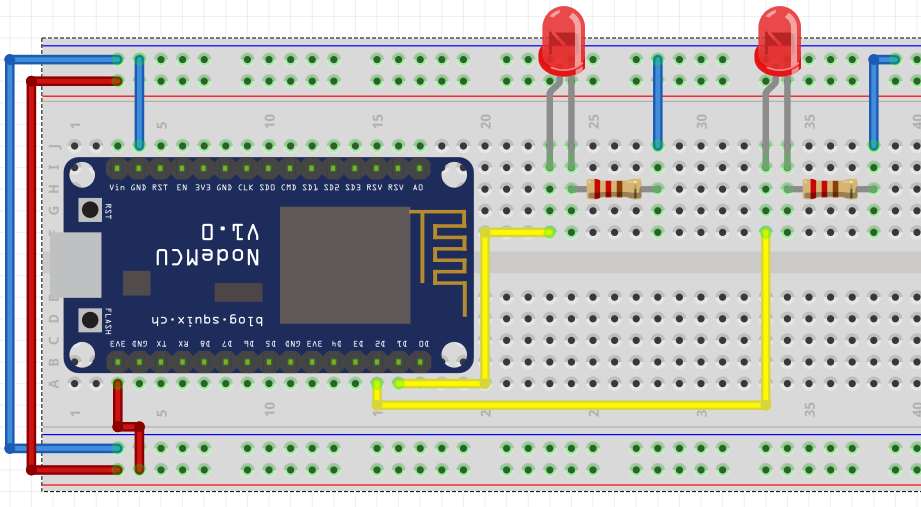
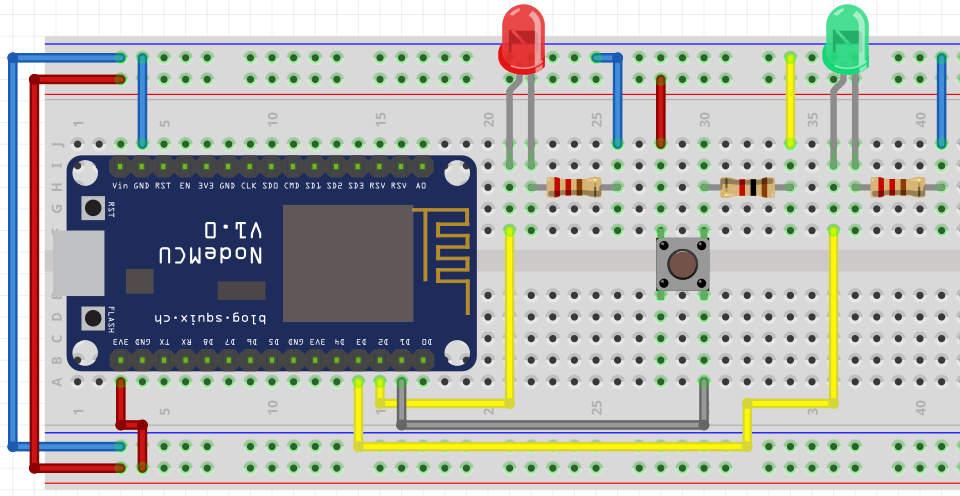

# Prácticas

## 1. Control de salidas
   
### 1.1. Encender LED

Descripción| Materiales | Diagrama pictórico 
-|-|-
1.1.1 Configuración de salidas desde archivo|1 Led 1 R220|
1.1.2 Manejo de terminal y configurando pines|1 Led 1 R220|

### 1.2 Encender más LEDs

Descripción| Materiales | Diagrama pictórico 
-|-|-
1.2.1 Control de más salidas y su configuración|2 Led 2 R220|
**1.2.2 Control de más salidas y su configuración**|x Led x R220|
1.2.3 Parpadear LED con un intervalo de un cuarto de segundo (**tmr**) |2 Led 2 R220|
**1.2.4 Parpadear LED con un intervalo de medio segundo y de un segundo** (**tmr**)|2 Led 2 R220|
1.2.5 Realizar un **semáforo** sencillo |3 Led 3 R220|
**1.2.6 Realizar dos semáforos en una intersección, deben trabajar complementariamente**|3 Led 3 R220|

## 2. Control I/O

### 2.1 Leer push button y encender led

Descripción| Materiales | Diagrama pictórico 
-|:-:|-
2.1.1 Leer una entrada digital, encenderá el LED mientras se mantenga presionado el push button|1 Led 1 R1k 1 R220 1 push button|
**2.1.2 Mientras se presione el botón los LEDs deben parpadear medio segundo**|1 Led 1 R1k 1 R220 1 push button|
2.1.3 Control de 2 leds por medio de un push button; mientras se mantiene presionado el push button deben estar encendidos los leds, de lo contrario estrán apagados |2 Led 2 R1k 1 push button|
2.1.4 Control de 2 leds, cada uno con su propio push button, mientras sea presionado el push button debe matenerse encendido su respectivo LED|2 Led 2 R1k 1 push button|
2.1.5 **Toggle**: Al presionar el push button se debe encender el led y mantenerce en ese estado; hasta que se vuelva a presionar el led regresará a su estado anterior|2 Led 2 R1k 1 push button|
2.1.6 **Toggle**: Control de 2 leds, cada uno con su propio push button, al presionar el push button se debe encender su respectivo led y mantenerce en ese estado; hasta que se vuelva a presionar el led regresará a su estado anterior|2 Led 2 R1k 1 push button|

### 2.2 Operadores lógicos

Descripción| Materiales | Diagrama pictórico 
-|:-:|-
2.2.1 Control de 2 leds, cada uno con su propio push button, mientras sea presionado el push button debe parpadear a 1/4 de segundo, encendido su respectivo LED|2 Led 2 R1k 1 push button | 
2.2.2 Control de 2 leds, cada uno con su propio push button, mientras sea presionado el push button debe parpadear a 1/4 de segundo, encendido su respectivo LED; en caso que sean presionados ambos push button al mismo tiempo los leds van a parpadear juntos cada 200mS|2 Led 2 R1k 1 push button|

## 3 Display de 7 segmentos

#### Display

Display de 7 segmentos puede ser de ánodo o cátodo común; existen displays con mayores segmentos, hasta una matriz de puntos de diferentes resoluciones.

Descripción| Materiales | Diagrama pictórico 
-|-|-
3.1.1 Creación de un contador básico con un display de 7 segmentos, el cual comenzará en 0 y terminará en F, haciendo un conteo hexadecimal, el intervalo de tiempo será de medio segundo|1 display de 7-segmentos, una vez que termine se reinicia automáticamente 7 R220|
**3.1.2 Creación de un contador básico con un display de 7 segmentos, el cual comenzará en 0 y terminará en F, haciendo un conteo hexadecimal, el intercambio de digito será atraves de un push button**|1 display de 7-segmentos 7 R220 1 push button 1 R1k|
**3.1.3 Crear un mensaje que se vaya leyendo en el display de 7 segmentos que diga "HOLA", el intervalor de cada letra será de medio segundo**|1 display de 7-segmentos 7 R220 1 push button 1 R1k|
**3.1.4 Crear un mensaje que se vaya leyendo en el display de 7 segmentos, *tu elijes la palabra o frase*, el intervalor de cada letra será de medio segundo**|1 display de 7-segmentos 7 R220 1 push button 1 R1k|
3.1.5 Creación de un contador básico con un display de 7 segmentos, el cual comenzará en 0 y terminará en F, el cambio se hará cada vez que sea presionado un push button|1 display de 7-segmentos 7 R220 1 push button 1 R1k|

## 4 Control de motores

- Control de un motor DC (ON-OFF)
  - Calcular la resistencia para el control del motor DC
- Motor PAP

## 5 Ciclos (while)

### LEDs

Descripción| Materiales | Diagrama pictórico 
-|-|-
5.1.1 Realizar una secuencia de leds básica, aplicando un ciclo |3 LEDs  3 Resistencias  |
**5.1.2 Simular las luces de alto en un cruce de ferrocarril, como se muestra en la imagén**|4 LEDs  4 Resistencias  |

### DTH11

Descripción| Materiales | Diagrama pictórico 
-|-|-
6.2.1 Leer los valores de Temperatura y humedad relativa en la terminal|1 DTH11 |
6.2.2 Leer los valores de Temperatura y humedad mostrandolo en la LCD|1 DTH11 1 LCD con I2C|
6.2.3 Leer los valores de Temperatura y humedad mostrandolo en la LCD, mostrar la temperatura en grados celsius y grados farenheit|1 DTH11 1 LCD con I2C|
6.2.4 Leer la temperatura,con forme vaya incrementando la temperatura vayán encendiendo los leds, y apagando en secuencia en función de la temperatura|1 LCD con I2C  3 LEDs 3 Resistencias|

## Entras y salidas analógicas

### Entradas analógicas (ADC)

- Leer un potenciómetro y mostrarlo en terminal
- Leer LDR

## Salidas analógicas (PWM)

- Control de Led RGB
- Control de un motor DC
  - Regulador de velocidad motor DC
  - Giro de un motor DC
- Servo

## Sensores digitales

### Sensor PIR

## Sensores analógicos

## Varios

### Control de cargas de alta potencia (Relay)
